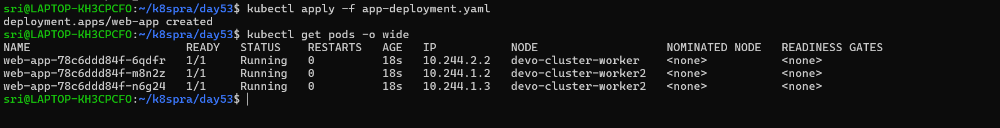
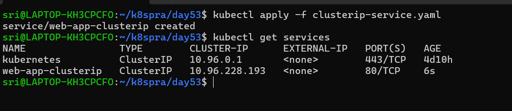
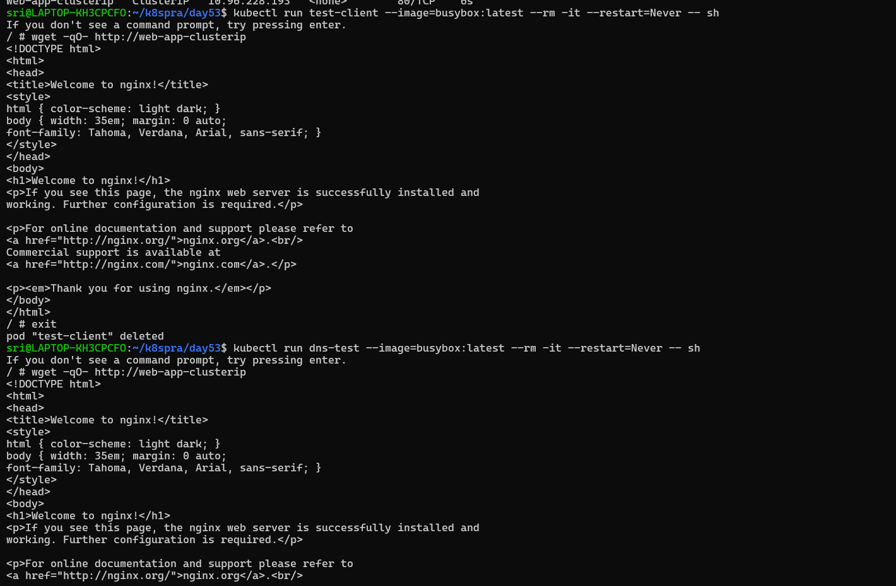
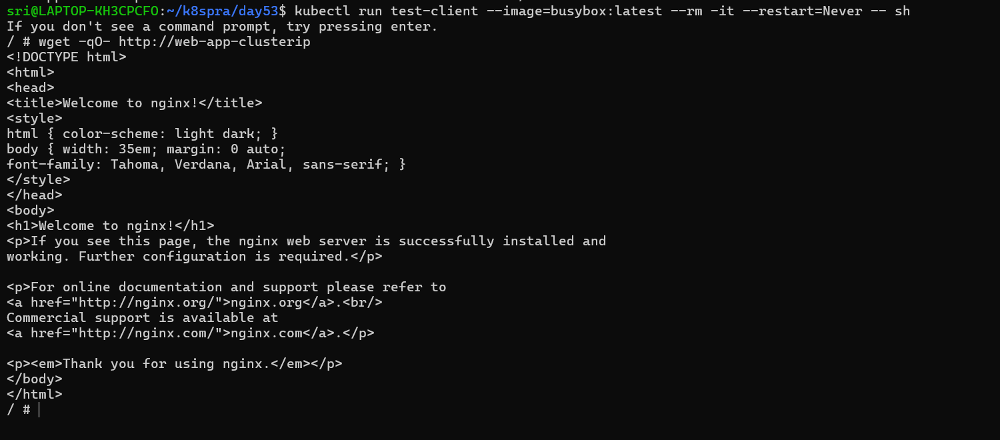
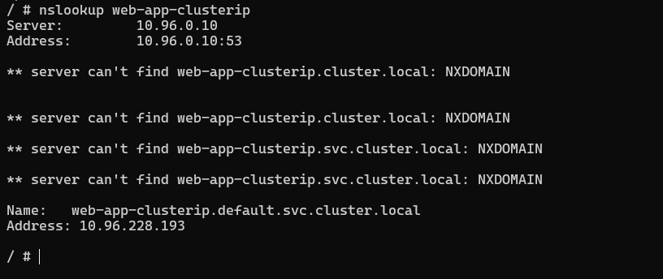
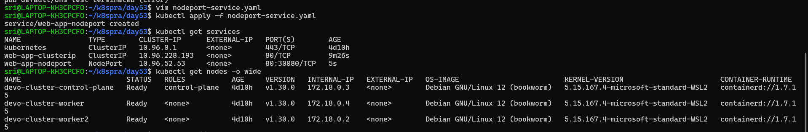
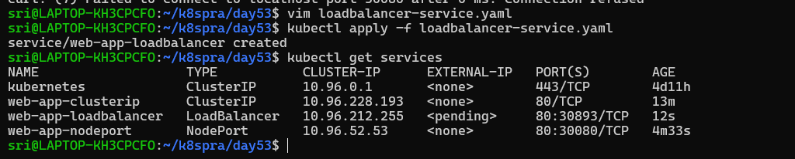
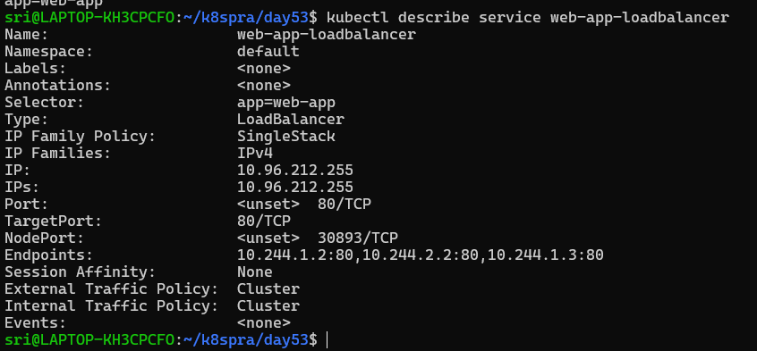
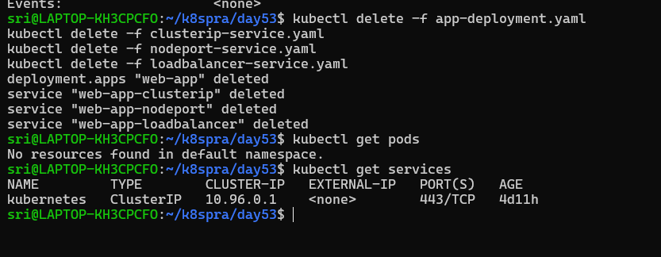

# Day 53 – Kubernetes Services

## Challenge Tasks

### Task 1: Deploy the Application
First, create a Deployment that you will expose with Services. Create `app-deployment.yaml`:

```yaml
apiVersion: apps/v1
kind: Deployment
metadata:
  name: web-app
  labels:
    app: web-app
spec:
  replicas: 3
  selector:
    matchLabels:
      app: web-app
  template:
    metadata:
      labels:
        app: web-app
    spec:
      containers:
      - name: nginx
        image: nginx:1.25
        ports:
        - containerPort: 80
```

```bash
kubectl apply -f app-deployment.yaml
kubectl get pods -o wide
```

Note the individual Pod IPs. These will change if pods restart — that is the problem Services fix.

**Verify:** Are all 3 pods running? Note down their IP addresses.




---

### Task 2: ClusterIP Service (Internal Access)
ClusterIP is the default Service type. It gives your Pods a stable internal IP that is only reachable from within the cluster.

Create `clusterip-service.yaml`:

```yaml
apiVersion: v1
kind: Service
metadata:
  name: web-app-clusterip
spec:
  type: ClusterIP
  selector:
    app: web-app
  ports:
  - port: 80
    targetPort: 80
```

Key fields:
- `selector.app: web-app` — this Service routes traffic to all Pods with the label `app: web-app`
- `port: 80` — the port the Service listens on
- `targetPort: 80` — the port on the Pod to forward traffic to

```bash
kubectl apply -f clusterip-service.yaml
kubectl get services
```



You should see `web-app-clusterip` with a CLUSTER-IP address. This IP is stable — it will not change even if Pods restart.

Now test it from inside the cluster:
```bash
# Run a temporary pod to test connectivity
kubectl run test-client --image=busybox:latest --rm -it --restart=Never -- sh

# Inside the test pod, run:
wget -qO- http://web-app-clusterip
exit
```

You should see the Nginx welcome page. The Service load-balanced your request to one of the 3 Pods.



**Verify:** Does the Service respond? Try running the wget command multiple times — the Service distributes traffic across all healthy Pods.
- Yes,service respond
---

### Task 3: Discover Services with DNS
Kubernetes has a built-in DNS server. Every Service gets a DNS entry automatically:

```
<service-name>.<namespace>.svc.cluster.local
```

Test this:
```bash
kubectl run dns-test --image=busybox:latest --rm -it --restart=Never -- sh

# Inside the pod:
# Short name (works within the same namespace)
wget -qO- http://web-app-clusterip

# Full DNS name
wget -qO- http://web-app-clusterip.default.svc.cluster.local

# Look up the DNS entry
nslookup web-app-clusterip
exit
```

Both the short name and the full DNS name resolve to the same ClusterIP. In practice, you use the short name when communicating within the same namespace and the full name when reaching across namespaces.

**Verify:** What IP does `nslookup` return? Does it match the CLUSTER-IP from `kubectl get services`?

- Yes — the IPs match perfectly.`nslookup` is correctly resolving the service to the `same ClusterIP` shown by Kubernetes.


---

### Task 4: NodePort Service (External Access via Node)
A NodePort Service exposes your application on a port on every node in the cluster. This lets you access the Service from outside the cluster.

Create `nodeport-service.yaml`:

```yaml
apiVersion: v1
kind: Service
metadata:
  name: web-app-nodeport
spec:
  type: NodePort
  selector:
    app: web-app
  ports:
  - port: 80
    targetPort: 80
    nodePort: 30080
```

- `nodePort: 30080` — the port opened on every node (must be in range 30000-32767)
- Traffic flow: `<NodeIP>:30080` -> Service -> Pod:80

```bash
kubectl apply -f nodeport-service.yaml
kubectl get services
```



Access the service:
```bash
# If using Minikube
minikube service web-app-nodeport --url

# If using Kind, get the node IP first
kubectl get nodes -o wide
# Then curl <node-internal-ip>:30080

# If using Docker Desktop
curl http://localhost:30080
```

**Verify:** Can you see the Nginx welcome page from your browser or terminal using the NodePort?
- Yes,I see the Nginx welcome page from terminal using the NodePort



---

### Task 5: LoadBalancer Service (Cloud External Access)
In a cloud environment (AWS, GCP, Azure), a LoadBalancer Service provisions a real external load balancer that routes traffic to your nodes.

Create `loadbalancer-service.yaml`:

```yaml
apiVersion: v1
kind: Service
metadata:
  name: web-app-loadbalancer
spec:
  type: LoadBalancer
  selector:
    app: web-app
  ports:
  - port: 80
    targetPort: 80
```

```bash
kubectl apply -f loadbalancer-service.yaml
kubectl get services
```

On a local cluster (Minikube, Kind, Docker Desktop), the EXTERNAL-IP will show `<pending>` because there is no cloud provider to create a real load balancer. This is expected.

If you are using Minikube:
```bash
# Minikube can simulate a LoadBalancer
minikube tunnel
# In another terminal, check again:
kubectl get services
```

In a real cloud cluster, the EXTERNAL-IP would be a public IP address or hostname provisioned by the cloud provider.

**Verify:** What does the EXTERNAL-IP column show? Why is it `<pending>` on a local cluster?

- In a local cluster,the EXTERNAL-IP staying `<pending>` is expected because there’s no cloud provider to assign an external address.
- In a cloud environment,the same Service type would automatically provision a public load balancer and receive an external IP.



---

### Task 6: Understand the Service Types Side by Side
Check all three services:

```bash
kubectl get services -o wide
```

Verify this:
```bash
kubectl describe service web-app-loadbalancer
```

You should see all three: a ClusterIP, a NodePort, and the LoadBalancer configuration.

**Verify:** Does the LoadBalancer service also have a ClusterIP and NodePort assigned?

- Yes — a LoadBalancer service always has both ClusterIP and NodePort.



---

### Task 7: Clean Up
```bash
kubectl delete -f app-deployment.yaml
kubectl delete -f clusterip-service.yaml
kubectl delete -f nodeport-service.yaml
kubectl delete -f loadbalancer-service.yaml

kubectl get pods
kubectl get services
```

Only the built-in `kubernetes` service in the default namespace should remain.

**Verify:** Is everything cleaned up?

- Yes,everything cleaned up




---

**What problem Services solve and how they relate to Pods and Deployments**

**The Problem**

Pods in Kubernetes are ephemeral:
- They get new IP addresses when restarted
- They are created/destroyed dynamically by a Deployment

**The Solution:** `Service`

A Service provides:
- A stable IP address (ClusterIP)
- A stable DNS name
- Load balancing across Pods

**Relationship**

`Deployment:` Manages Pods (creates 3 replicas)

`Pods:` Run your application (nginx)

`Service`: Sits in front of Pods, Uses labels (selector) to find them.Routes traffic to them

`Client → Service → Pods (via label selector)`


**Your three Service manifests with an explanation of each type**

`ClusterIP Service`

```bash
apiVersion: v1
kind: Service
metadata:
  name: web-app-clusterip
spec:
  type: ClusterIP
  selector:
    app: web-app
  ports:
  - port: 80
    targetPort: 80
```
- Default Service type
- Exposes Pods inside the cluster only
- Provides a stable internal IP + DNS name
- Used for internal communication between services


`NodePort Service`

```bash
apiVersion: v1
kind: Service
metadata:
  name: web-app-nodeport
spec:
  type: NodePort
  selector:
    app: web-app
  ports:
  - port: 80
    targetPort: 80
    nodePort: 30080
```
- Exposes Service on each node’s IP at a fixed port (30000–32767)
- Access using: `<NodeIP>:NodePort`
- Used for external access in development/testing


`LoadBalancer Service`

```bash
apiVersion: v1
kind: Service
metadata:
  name: web-app-loadbalancer
spec:
  type: LoadBalancer
  selector:
    app: web-app
  ports:
    - port: 80
      targetPort: 80
```
- Creates an external load balancer (in cloud environments)
- Provides a public IP to access the app
- Used for production external traffic
- Internally also includes ClusterIP + NodePort


**The difference between ClusterIP, NodePort, and LoadBalancer**

| Type | Accessible From | Use Case |
|------|----------------|----------|
| ClusterIP | Inside the cluster only | Internal communication between services |
| NodePort | Outside via `<NodeIP>:<NodePort>` | Development, testing, direct node access |
| LoadBalancer | Outside via cloud load balancer | Production traffic in cloud environments |

Each type builds on the previous one:
- LoadBalancer creates a NodePort, which creates a ClusterIP
- So a LoadBalancer service also has a ClusterIP and a NodePort


**How Kubernetes DNS works for service discovery**

1. `Service is created`
- Kubernetes automatically creates a DNS entry for the Service.
- Example: web-app-clusterip

2. `Pod makes a request using Service name`
- The Pod accesses the Service using its DNS name:`wget http://web-app-clusterip`

3. `DNS query sent to CoreDNS`
- The request is sent to Kubernetes DNS (CoreDNS) for resolution.

4. `DNS resolves Service name → ClusterIP`
- The Service name resolves to its ClusterIP.
- Example: web-app-clusterip → ClusterIP
- This matches the output of: kubectl get svc

5. `Request reaches the Service`
- The request is routed to the Service using the ClusterIP.

6. `Service forwards request to Pods (via Endpoints)`
- The Service selects Pods using labels (app: web-app)
- Traffic is load-balanced across all healthy Pods

7. `Response sent back to Pod`
- One of the Pods processes the request and returns a response
(e.g., Nginx welcome page)


`Pod → CoreDNS → Service (ClusterIP) → Endpoints → Pod`

**What Endpoints are and how to inspect them**

- `Endpoints` = actual Pod IPs behind a Service
- A Service does NOT directly store Pods — it uses Endpoints.

`Example:`
- `Service: web-app-clusterip`
- `Endpoints look like:`

```bash
  10.244.0.5:80
  10.244.0.6:80
  10.244.0.7:80
```

`Why Endpoints matter:`
- They show real backend Pods
- They update automatically when Pods: `Start ,Stop ,Restart`

`How to inspect Endpoints:`
```bash
kubectl get endpoints
```
```bash
kubectl describe endpoints web-app-clusterip
```