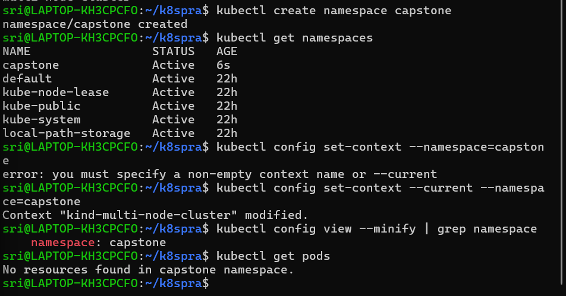
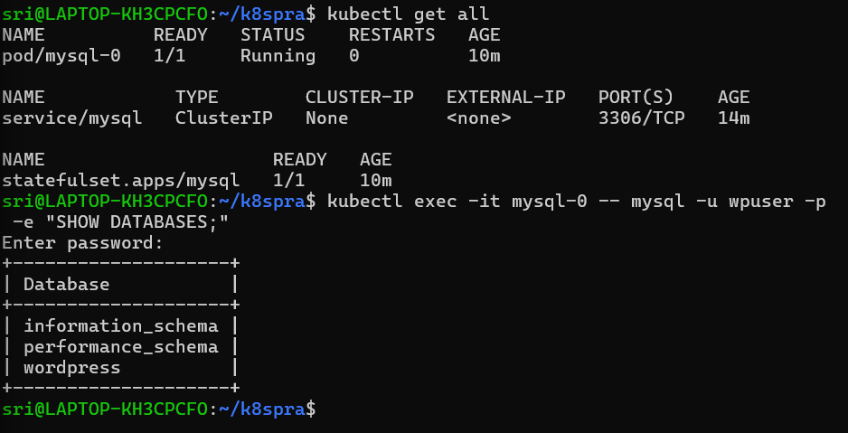
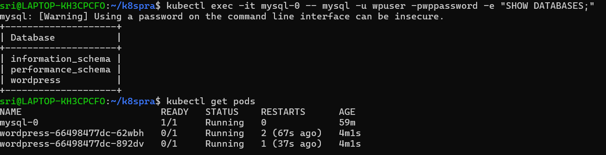
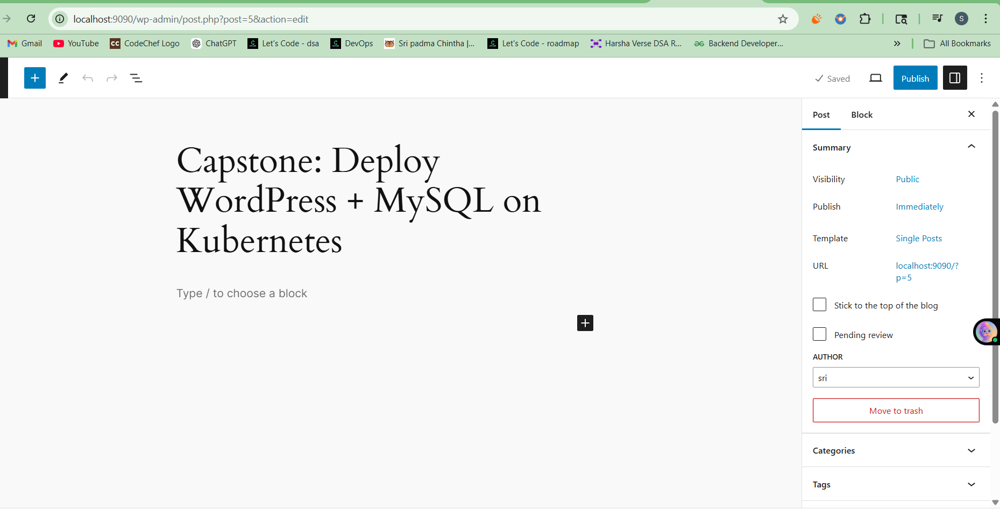
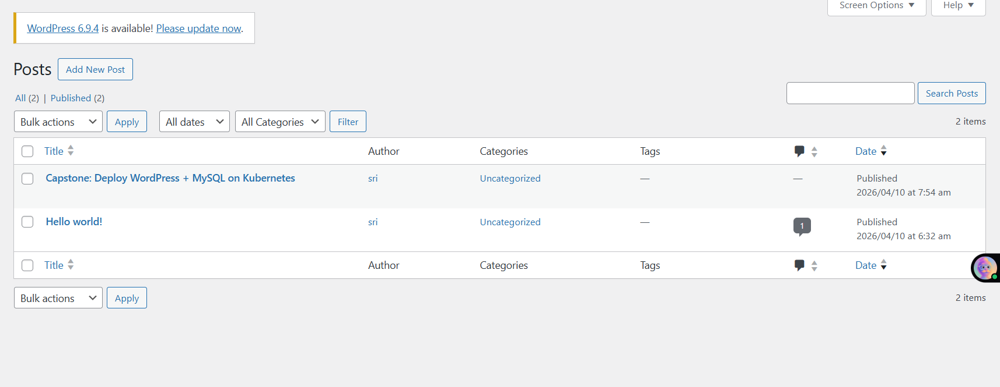
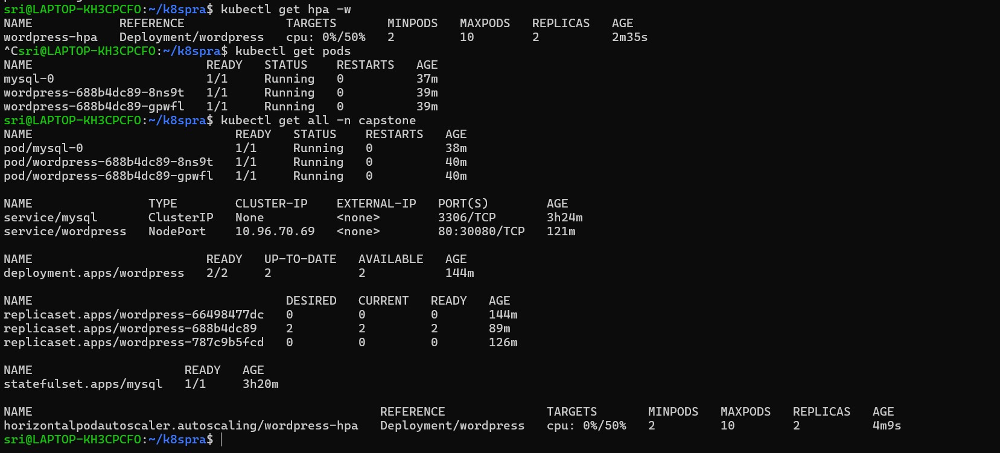
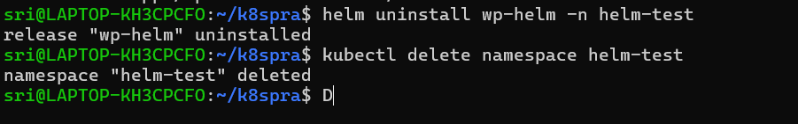
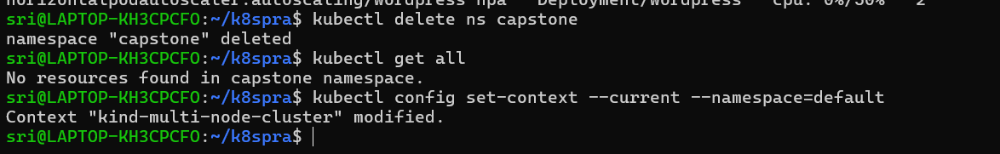

# Day 60 – Capstone: Deploy WordPress + MySQL on Kubernetes

---

## Challenge Tasks

### Task 1: Create the Namespace (Day 52)
1. Create a `capstone` namespace
2. Set it as your default: `kubectl config set-context --current --namespace=capstone`

---

### Task 2: Deploy MySQL (Days 54-56)
1. Create a Secret with `MYSQL_ROOT_PASSWORD`, `MYSQL_DATABASE`, `MYSQL_USER`, and `MYSQL_PASSWORD` using `stringData`
2. Create a Headless Service (`clusterIP: None`) for MySQL on port 3306
3. Create a StatefulSet for MySQL with:
   - Image: `mysql:8.0`
   - `envFrom` referencing the Secret
   - Resource requests (cpu: 250m, memory: 512Mi) and limits (cpu: 500m, memory: 1Gi)
   - A `volumeClaimTemplates` section requesting 1Gi of storage, mounted at `/var/lib/mysql`
4. Verify MySQL works: `kubectl exec -it mysql-0 -- mysql -u <user> -p<password> -e "SHOW DATABASES;"`

**Verify:** Can you see the `wordpress` database?
- Yes

---

### Task 3: Deploy WordPress (Days 52, 54, 57)
1. Create a ConfigMap with `WORDPRESS_DB_HOST` set to `mysql-0.mysql.capstone.svc.cluster.local:3306` and `WORDPRESS_DB_NAME`
2. Create a Deployment with 2 replicas using `wordpress:latest` that:
   - Uses `envFrom` for the ConfigMap
   - Uses `secretKeyRef` for `WORDPRESS_DB_USER` and `WORDPRESS_DB_PASSWORD` from the MySQL Secret
   - Has resource requests and limits
   - Has a liveness probe and readiness probe on `/wp-login.php` port 80
3. Wait until both pods show `1/1 Running`

**Verify:** Are both WordPress pods running and ready?
- Yes

---

### Task 4: Expose WordPress (Day 53)
1. Create a NodePort Service on port 30080 targeting the WordPress pods
2. Access WordPress in your browser:
   - Minikube: `minikube service wordpress -n capstone`
   - Kind: `kubectl port-forward svc/wordpress 8080:80 -n capstone`
3. Complete the setup wizard and create a blog post

**Verify:** Can you see the WordPress setup page?
- Yes

---

### Task 5: Test Self-Healing and Persistence
1. Delete a WordPress pod — watch the Deployment recreate it within seconds. Refresh the site.
2. Delete the MySQL pod: `kubectl delete pod mysql-0 -n capstone` — watch the StatefulSet recreate it
3. After MySQL recovers, refresh WordPress — your blog post should still be there

**Verify:** After deleting both pods, is your blog post still there?
- Yes

---

### Task 6: Set Up HPA (Day 58)
1. Write an HPA manifest targeting the WordPress Deployment with CPU at 50%, min 2, max 10 replicas
2. Apply and check: `kubectl get hpa -n capstone`
3. Run `kubectl get all -n capstone` for the complete picture

**Verify:** Does the HPA show correct min/max and target?
- Yes

---

### Task 7: (Bonus) Compare with Helm (Day 59)
1. Install WordPress using `helm install wp-helm bitnami/wordpress` in a separate namespace

2. Compare: how many resources did each approach create? Which gives more control?
- manual YAML deployment gives more control.

| Resource Type      | Manual YAML (`capstone`)                 | Helm (`wp-helm-ns`)                                             |
| ------------------ | ---------------------------------------- | --------------------------------------------------------------- |
| **Pods**           | 3 (2 WordPress + 1 MySQL)                | 2 (1 WordPress + 1 MariaDB)                                     |
| **Deployments**    | 1 (WordPress)                            | 1 (WordPress)                                                   |
| **StatefulSets**   | 1 (MySQL)                                | 1 (MariaDB)                                                     |
| **ReplicaSets**    | 1 (WordPress)                            | 1 (WordPress)                                                   |
| **Services**       | 2 (WordPress NodePort + MySQL ClusterIP) | 3 (WordPress LoadBalancer + MariaDB ClusterIP + headless)       |
| **HPA**            | 1 (WordPress CPU-based)                  | 0 (Not created by default)                                      |
| **ConfigMaps**     | 1 (`wordpress-config`)                   | 1 (`wp-helm-mariadb`)                                           |
| **Secrets**        | 1 (`mysql-secret`)                       | 3 (`wp-helm-mariadb`, `wp-helm-wordpress`, Helm release secret) |
| **PVCs / Storage** | 1 (`mysql-data-mysql-0`)                 | 2 (`data-wp-helm-mariadb-0`, `wp-helm-wordpress`)               |

3. Clean up the Helm deployment

---

### Task 8: Clean Up and Reflect
1. Take a final look: `kubectl get all -n capstone`
2. Count the concepts you used: Namespace, Secret, ConfigMap, PVC, StatefulSet, Headless Service, Deployment, NodePort Service, Resource Limits, Probes, HPA, Helm — twelve concepts in one deployment
3. Delete the namespace: `kubectl delete namespace capstone`
4. Reset default: `kubectl config set-context --current --namespace=default`

**Verify:** Did deleting the namespace remove everything?
- Yes

---

**Architecture Diagram**(which resources connect to which)

1. User / Local Machine → WordPress NodePort Service
- External traffic comes from users or local port-forward (127.0.0.1:9090) to the NodePort Service (30080).

2. WordPress NodePort Service → WordPress Pods
- The NodePort Service forwards traffic to the WordPress Deployment pods on port 80 using label selectors and load balancing.

3. WordPress Pods → ConfigMap & Secrets
- Pods read the ConfigMap for WORDPRESS_DB_HOST and WORDPRESS_DB_NAME.
- Pods read the Secrets for WORDPRESS_DB_USER and WORDPRESS_DB_PASSWORD.

4.WordPress Pods → MySQL Headless Service
- Pods connect to MySQL using the DNS name: mysql-0.mysql.capstone.svc.cluster.local:3306

5. MySQL Headless Service → MySQL StatefulSet Pods
- The Headless Service (clusterIP: None) routes connections directly to the MySQL StatefulSet pod (mysql-0).

6. MySQL Pods → PVC (PersistentVolumeClaim)
- MySQL pods store their data in the PVC mounted at /var/lib/
- mysql for persistent storage across restarts.

7. WordPress Deployment → HPA
- The HPA monitors WordPress pods for CPU usage and scales replicas between 2 and 10 based on load.

**Results of self-healing and persistence tests**

   - Even if database pod fails/recreated, the data is persistent.
   - Because of deployment the desired state is maintained and any deleted pod is created again automatically.

**A table mapping each concept to the day you learned it**
   | Concept | Day |
   |---------|-----|
   | Namespace | 52 |
   | Services | 53 |
   | ConfigMAp, Secrets | 54 |
   | Persistent volumes | 55 |
   | Headless Service | 56 |
   | Probes | 57 |
   | Metrics, HPA | 58 |
   | Helm Charts | 59 |

**Reflection: what was hardest, what clicked, what you would add for production**

`Hardest Part`:
   - Configuring liveness/readiness probes with correct initialDelaySeconds, periodSeconds, and timeoutSeconds so WordPress pods don’t restart unnecessarily.
   - Troubleshooting StatefulSet and WordPress → MySQL connectivity.

`What Clicked`
   - Understanding probe parameters:
      - initialDelaySeconds: 10 → Wait 10 seconds before the first probe (increase for slow startups).
      - periodSeconds: 5 → Probe every 5 seconds.
      - timeoutSeconds: 3 → Mark probe as failed if no response in 3 seconds.

`What I Would Add for Production`
   - `Database & Secrets:` Use a managed DB (RDS) and a secrets manager.
   - `Secure Access:` Use Gateway API with TLS 
   - `Access Control:` Use RBAC to manage who can create Gateways, Routes, or Secrets.
   - `Monitoring:` Deploy Prometheus + Grafana with alerts
   
---
