## Challenge Tasks

### Task 1: Understand Infrastructure as Code
Before touching the terminal, research and write short notes on:

1. What is Infrastructure as Code (IaC)? Why does it matter in DevOps?

- Infrastructure as Code is the practice of defining and managing infrastructure (servers, networks, databases, etc.) using machine-readable configuration files instead of manual setup.

Instead of clicking through a cloud console, you write code that describes the desired infrastructure state, and a tool like Terraform provisions it automatically.


2. What problems does IaC solve compared to manually creating resources in the AWS console?

# Infrastructure as Code (IaC) vs. Manual Configuration

Transitioning from manual infrastructure management ("ClickOps") to Infrastructure as Code (IaC) is essential for modern DevOps. Below is a comparison of the challenges faced without IaC and how IaC provides the solution.

| Feature | Manual Configuration (The Old Way) | Infrastructure as Code (The Better Way) |
| :--- | :--- | :--- |
| **Accuracy** | ❌ **Human Error:** Likely to select wrong regions, miss settings, or misconfigure resources. | ✅ **Automated Provisioning:** Code-driven deployments eliminate manual entry errors. |
| **Consistency** | ❌ **No Reproducibility:** Hard to recreate the exact same setup across environments. | ✅ **Exact Replication:** Same code = same infra. Perfectly mirror Dev, Staging, and Prod. |
| **Speed** | ❌ **Time-Consuming:** Clicking through UIs repeatedly is slow and tedious. | ✅ **Rapid Deployment:** Entire stacks can be spun up or down in minutes with a single command. |
| **Reliability** | ❌ **Configuration Drift:** Environments become inconsistent over time as manual changes pile up. | ✅ **Drift Detection:** Tools (like Terraform) identify and fix differences from the desired state. |
| **Accountability** | ❌ **No Audit Trail:** Unclear who changed what, when, or why. | ✅ **Version Control:** Full history of modifications via Git (PRs, commits, and authors). |
| **Scalability** | ❌ **Linear Effort:** Doubling your infra requires doubling your manual work. | ✅ **Instant Scaling:** Scale from one instance to one hundred by changing a single variable. |

---

3. How is Terraform different from AWS CloudFormation, Ansible, and Pulumi?

### 1. Terraform vs. AWS CloudFormation
*The battle of Cloud-Agnostic vs. Native.*

| Feature | Terraform | AWS CloudFormation |
| :--- | :--- | :--- |
| **Cloud Scope** | **Multi-Cloud:** Supports AWS, Azure, GCP, SaaS, etc. | **AWS Only:** Deeply integrated with AWS services. |
| **Ecosystem** | Massive; community-driven providers for everything. | Managed by AWS; usually supports new features on Day 1. |
| **State Management** | Stored in a `state` file (Local, S3, or Terraform Cloud). | Managed internally by AWS as "Stacks." |
| **Best For** | Organizations using multiple clouds or hybrid setups. | AWS-exclusive shops wanting a fully managed service. |

> **👉 Verdict:** Use **Terraform** for platform flexibility; use **CloudFormation** if you are 100% AWS-native and want no external state management.

---

### 2. Terraform vs. Ansible
*Provisioning vs. Configuration Management.*

| Feature | Terraform (Provisioning) | Ansible (Configuration) |
| :--- | :--- | :--- |
| **Primary Goal** | **Build the House:** Creates VPCs, Subnets, VMs. | **Decorate the House:** Installs Nginx, updates OS. |
| **Model** | **Declarative:** You define the final state. | **Procedural/Hybrid:** You define the steps to take. |
| **Agentless** | Yes (Communicates via Cloud APIs). | Yes (Communicates via SSH or WinRM). |
| **Example** | "I need an EC2 instance with 20GB storage." | "Install Python and start the Nginx service." |

> **👉 Verdict:** Use **Terraform** to build the server; use **Ansible** to configure the software inside the server.

---

### 3. Terraform vs. Pulumi
*HCL vs. General Purpose Languages.*

| Feature | Terraform | Pulumi |
| :--- | :--- | :--- |
| **Language** | **HCL:** Domain-specific, easy to read, rigid. | **General Purpose:** Python, JS, Go, C#, Java. |
| **Learning Curve** | Low/Medium: Simple syntax for non-coders. | Medium/High: Requires software engineering skills. |
| **Flexibility** | Standardized; what you see is what you get. | High; use loops, logic, and testing frameworks. |
| **Best For** | Teams seeking a "Standard" DevOps language. | Teams who want to treat infra exactly like application code. |

> **👉 Verdict:** Use **Terraform** for simplicity and standardization; use **Pulumi** if you want the full power of a programming language.
4. What does it mean that Terraform is "declarative" and "cloud-agnostic"?

- Declarative : You define what you want, not how to do it.

- You don’t specify: API calls , Order of operations.

- Cloud-agnostic : Terraform is not tied to a single provider.

It can manage:AWS,Azure,GCP,Kubernetes,even SaaS tools.

Write this in your own words -- not copy-pasted definitions.

---

### Task 2: Install Terraform and Configure AWS
1. Install Terraform:
```bash
# macOS
brew tap hashicorp/tap
brew install hashicorp/tap/terraform

# Linux (amd64)
wget -O - https://apt.releases.hashicorp.com/gpg | sudo gpg --dearmor -o /usr/share/keyrings/hashicorp-archive-keyring.gpg
echo "deb [signed-by=/usr/share/keyrings/hashicorp-archive-keyring.gpg] https://apt.releases.hashicorp.com $(lsb_release -cs) main" | sudo tee /etc/apt/sources.list.d/hashicorp.list
sudo apt update && sudo apt install terraform

# Windows
choco install terraform
```

2. Verify:
```bash
terraform -version
```

3. Install and configure the AWS CLI:
```bash
aws configure
# Enter your Access Key ID, Secret Access Key, default region (e.g., ap-south-1), output format (json)
```

4. Verify AWS access:
```bash
aws sts get-caller-identity
```


You should see your AWS account ID and ARN.

---

### Task 3: Your First Terraform Config -- Create an S3 Bucket
Create a project directory and write your first Terraform config:

```bash
mkdir terraform-basics && cd terraform-basics
```

Create a file called `main.tf` with:
1. A `terraform` block with `required_providers` specifying the `aws` provider
2. A `provider "aws"` block with your region
3. A `resource "aws_s3_bucket"` that creates a bucket with a globally unique name

Run the Terraform lifecycle:
```bash
terraform init      # Download the AWS provider
terraform plan      # Preview what will be created
terraform apply     # Create the bucket (type 'yes' to confirm)
```
 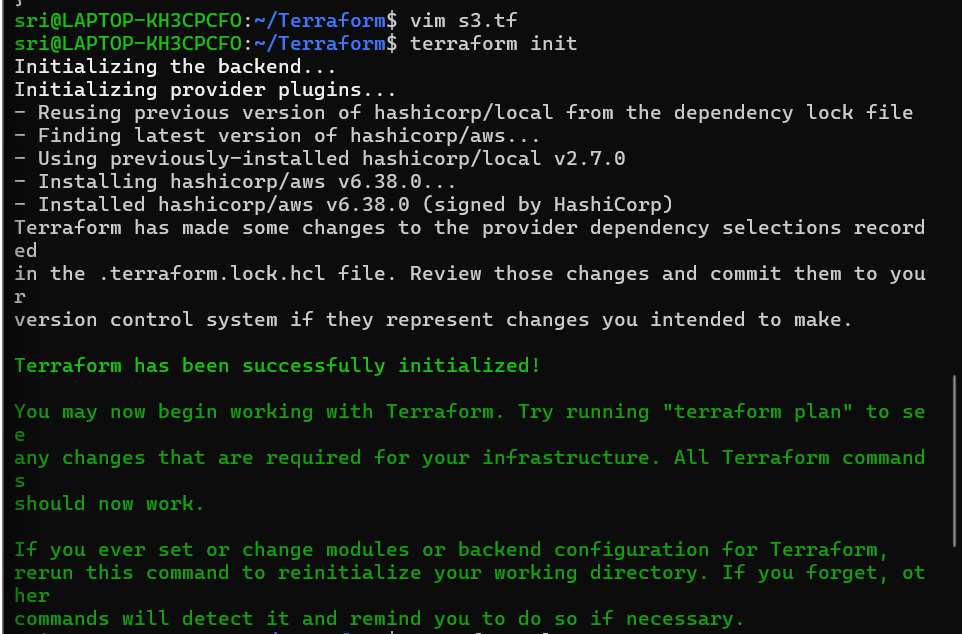

 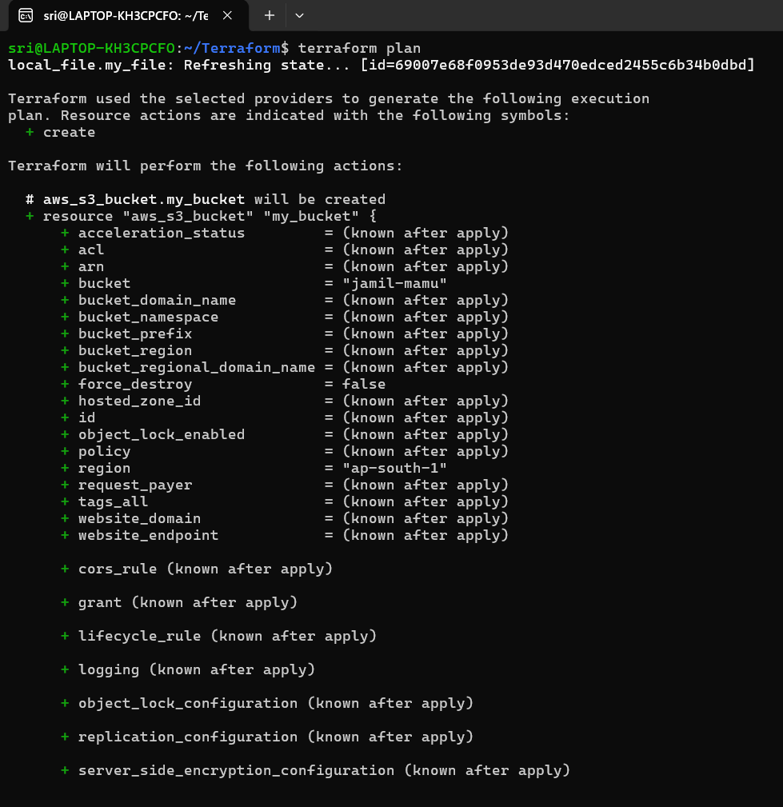

 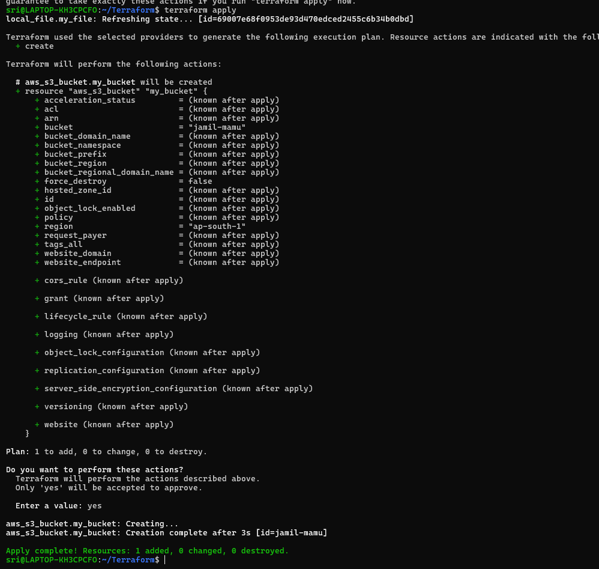

Go to the AWS S3 console and verify your bucket exists.

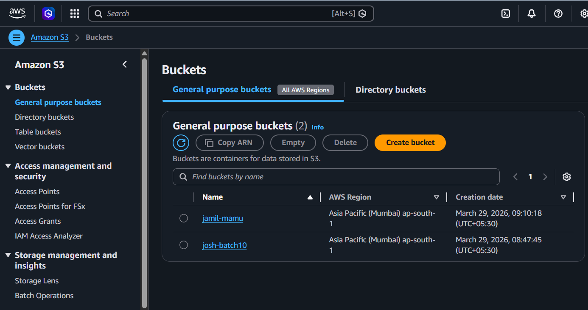

yes i can see the s3 bucket on my console.

**Document:** What did `terraform init` download? What does the `.terraform/` directory contain?

terraform init — What it downloads
Providers → Plugins (AWS, Azure, etc.)
Modules → Reusable code (if used)
Backend setup → Connects to remote state (like S3)
Lock file → .terraform.lock.hcl (fixes versions)

👉 In short: it prepares everything Terraform needs to run


.terraform/ directory — What it contains
providers/ → downloaded provider plugins
modules/ → downloaded modules
backend data → state connection info
internal files → dependency tracking

👉 In short: it stores all downloaded dependencies

---

### Task 4: Add an EC2 Instance
In the same `main.tf`, add:
1. A `resource "aws_instance"` using AMI `ami-0f5ee92e2d63afc18` (Amazon Linux 2 in ap-south-1 -- use the correct AMI for your region)
2. Set instance type to `t2.micro`
3. Add a tag: `Name = "TerraWeek-Day1"`

Run:
```bash
terraform plan      # You should see 1 resource to add (bucket already exists)
terraform apply
```
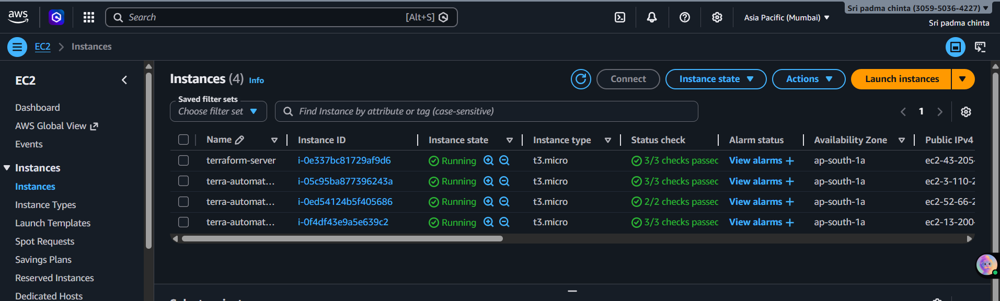

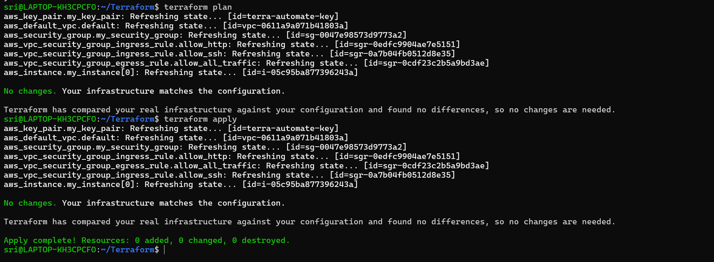

Go to the AWS EC2 console and verify your instance is running with the correct name tag.

**Document:** How does Terraform know the S3 bucket already exists and only the EC2 instance needs to be created?

- Uses terraform.tfstate , Tracks already created resources , So only EC2 is added.

---

### Task 5: Understand the State File
Terraform tracks everything it creates in a state file. Time to inspect it.

1. Open `terraform.tfstate` in your editor -- read the JSON structure
2. Run these commands and document what each returns:
```bash
terraform show                          # Human-readable view of current state
terraform state list                    # List all resources Terraform manages
terraform state show aws_s3_bucket.<name>   # Detailed view of a specific resource
terraform state show aws_instance.<name>
```

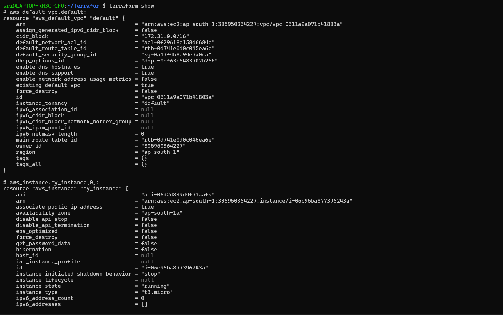

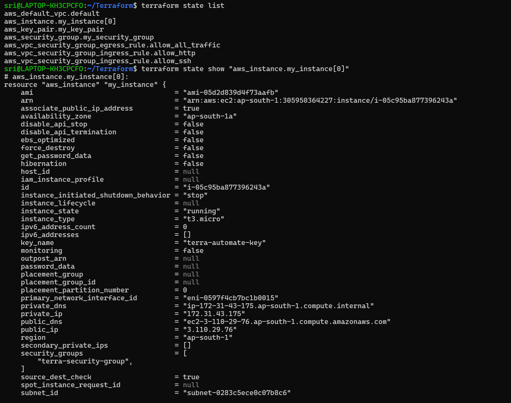

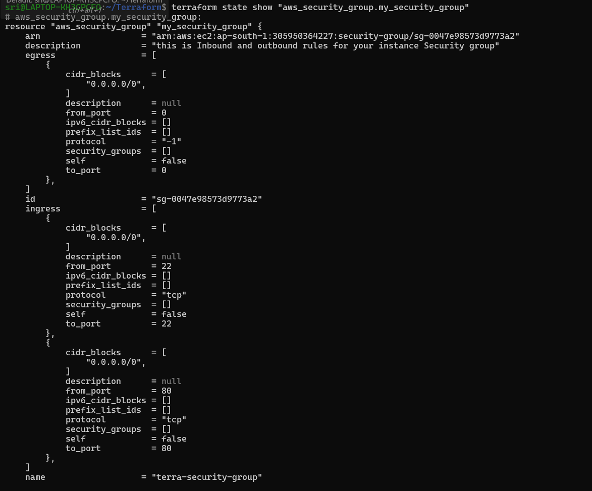

3. Answer these questions in your notes:
   
1. What information does the state file store?
- Resource type and name (e.g., aws_instance.my_instance).
Real cloud IDs (EC2 ID, VPC ID, etc.)
Configuration values (instance type, tags).
- Computed values (public IP, DNS).
- Resource dependencies.
- Metadata (region, account info).

2.Why should you never manually edit the state file?
- Breaks Terraform’s tracking of resources.
- Causes mismatch between real infrastructure and state.
- Leads to errors, duplication, or resource loss.
- No validation → high risk of corruption.

3.Why should the state file not be committed to Git?


- May contain sensitive data (IPs, ARNs, etc.).
- Environment-specific (not reusable across setups).
- Can cause conflicts in team collaboration.
---

### Task 6: Modify, Plan, and Destroy
1. Change the EC2 instance tag from `"TerraWeek-Day1"` to `"TerraWeek-Modified"` in your `main.tf`

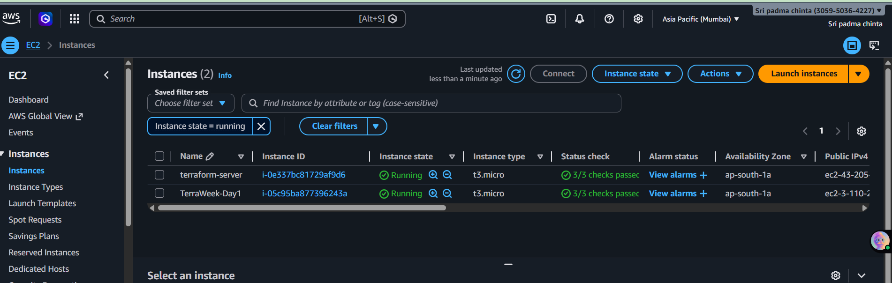

2. Run `terraform plan` and read the output carefully:
1. What do the `~`, `+`, and `-` symbols mean?
 - + = Create , - = Destory , ~ = Modify 
2. Is this an in-place update or a destroy-and-recreate?
 - Update type: Changing tag → ✅ in-place update (no recreation).
 - Destroy : terraform destroy, ✔ Deletes all resources (EC2 + S3). 
3. Apply the change
4. Verify the tag changed in the AWS console
5. Finally, destroy everything:
```bash
terraform destroy
```
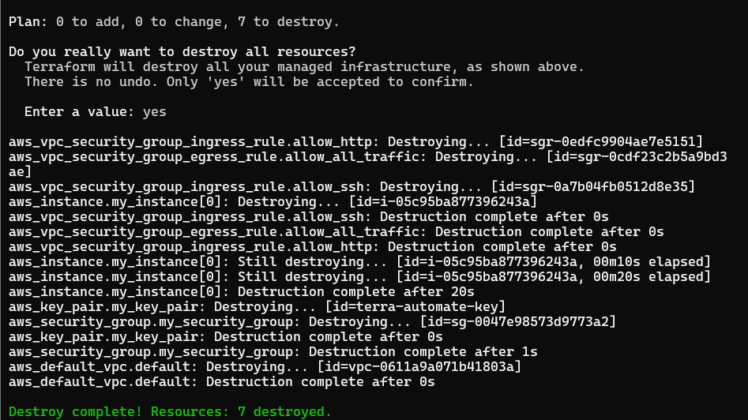

6. Verify in the AWS console -- both the S3 bucket and EC2 instance should be gone

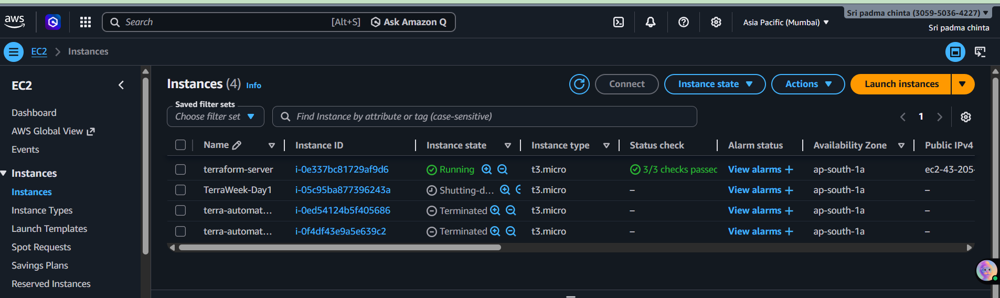

---

## Hints
- S3 bucket names must be globally unique -- use something like `terraweek-<yourname>-2026`
- AMI IDs are region-specific -- search "Amazon Linux 2 AMI" in your region's EC2 launch wizard
- `terraform fmt` auto-formats your `.tf` files -- run it before committing
- `terraform validate` checks for syntax errors without connecting to AWS
- The `.terraform/` directory contains downloaded provider plugins
- Add `*.tfstate`, `*.tfstate.backup`, and `.terraform/` to your `.gitignore`

---
