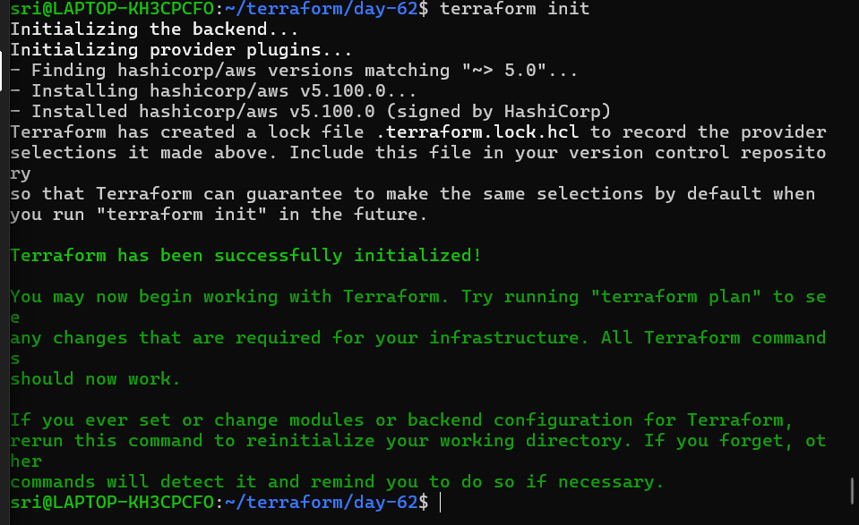
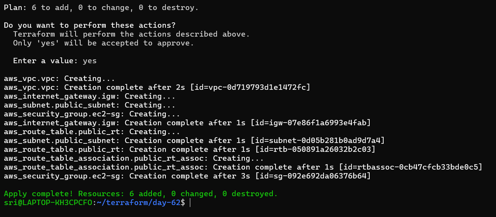
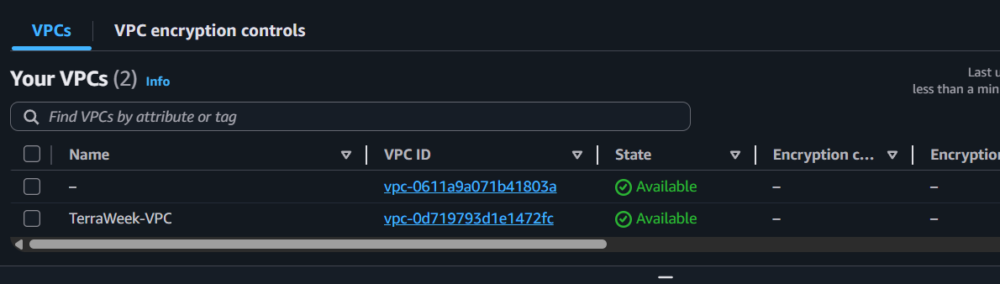
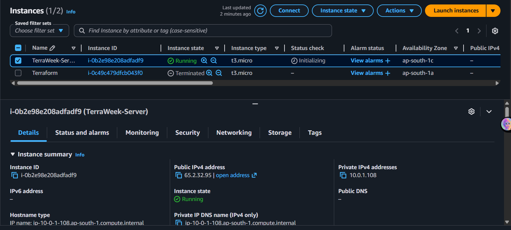
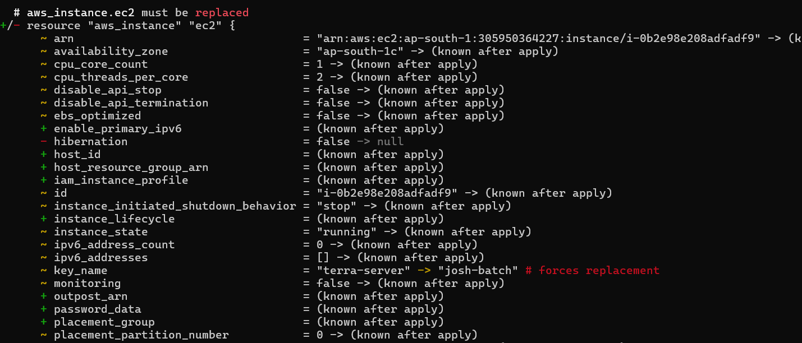
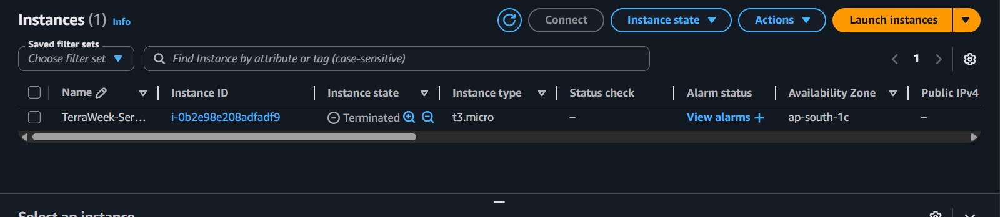
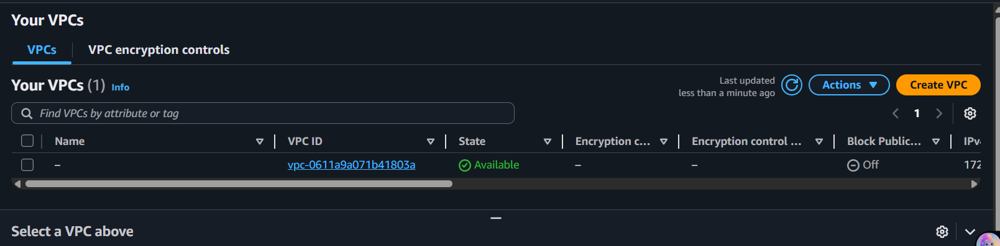

# Day 62 -- Providers, Resources and Dependencies

## Challenge Tasks

### Task 1: Explore the AWS Provider
1. Create a new project directory: `terraform-aws-infra`
2. Write a `providers.tf` file:
   - Define the `terraform` block with `required_providers` pinning the AWS provider to version `~> 5.0`
   - Define the `provider "aws"` block with your region
3. Run `terraform init` and check the output -- what version was installed?
    - `v5.100.0` version installed

    

4. Read the provider lock file `.terraform.lock.hcl` -- what does it do?

    - The `.terraform.lock.hcl` file locks the exact provider version (5.100.0) used in the project and ensures Terraform always installs the same version that satisfies the constraint ~> 5.0.
    - It also stores hashes to verify the provider’s integrity, ensuring it is secure and not modified.

**Document:** What does `~> 5.0` mean? How is it different from `>= 5.0` and `= 5.0.0`?

   - `~> 5.0` Allows versions 5.x but not 6.0

   - `>= 5.0` Allows 5.0 and any higher version

   - `= 5.0.0` Allows only exactly 5.0.0

---

### Task 2: Build a VPC from Scratch
Create a `main.tf` and define these resources one by one:

1. `aws_vpc` -- CIDR block `10.0.0.0/16`, tag it `"TerraWeek-VPC"`
2. `aws_subnet` -- CIDR block `10.0.1.0/24`, reference the VPC ID from step 1, enable public IP on launch, tag it `"TerraWeek-Public-Subnet"`
3. `aws_internet_gateway` -- attach it to the VPC
4. `aws_route_table` -- create it in the VPC, add a route for `0.0.0.0/0` pointing to the internet gateway
5. `aws_route_table_association` -- associate the route table with the subnet

Run `terraform plan` -- you should see 5 resources to create.

**Verify:** Apply and check the AWS VPC console. Can you see all five resources connected?
- Yes,all five resources connected





---

### Task 3: Understand Implicit Dependencies
Look at your `main.tf` carefully:

1. The subnet references `aws_vpc.main.id` -- this is an implicit dependency
2. The internet gateway references the VPC ID -- another implicit dependency
3. The route table association references both the route table and the subnet

Answer these questions:
- How does Terraform know to create the VPC before the subnet?
   - Terraform builds a dependency graph based on references between resources.
    ```sh
      resource "aws_subnet" "public_subnet" {
      vpc_id = aws_vpc.vpc.id
      }
   ```
   - `aws_vpc.vpc.id` is an attribute reference
   - `Terraform sees:` Subnet depends on VPC
   - So Terraform automatically creates this dependency: `aws_vpc.vpc --> aws_subnet.public_subnet`

- What would happen if you tried to create the subnet before the VPC existed?
   - AWS would reject the request: `Error: InvalidVpcID.NotFound: The vpc ID 'vpc-xxxx' does not exist`
   - A subnet must belong to a VPC, AWS requires a valid vpc_id
   - `No VPC`--> `no subnet possible`

- Find all implicit dependencies in your config and list them

   | Resource Relationship                 | Terraform Reference Mapping                                                 |
   | ------------------------------------- | --------------------------------------------------------------------------- |
   | Subnet → VPC                          | `aws_subnet.public_subnet --> aws_vpc.vpc`                                  |
   | Internet Gateway → VPC                | `aws_internet_gateway.igw --> aws_vpc.vpc`                                  |
   | Route Table → VPC                     | `aws_route_table.public_rt --> aws_vpc.vpc`                                 |
   | Route Table → Internet Gateway        | `aws_route_table.public_rt --> aws_internet_gateway.igw`                    |
   | Route Table Association → Subnet      | `aws_route_table_association.public_rt_assoc --> aws_subnet.public_subnet`  |
   | Route Table Association → Route Table | `aws_route_table_association.public_rt_assoc --> aws_route_table.public_rt` |

---

### Task 4: Add a Security Group and EC2 Instance
Add to your config:

1. `aws_security_group` in the VPC:
   - Ingress rule: allow SSH (port 22) from `0.0.0.0/0`
   - Ingress rule: allow HTTP (port 80) from `0.0.0.0/0`
   - Egress rule: allow all outbound traffic
   - Tag: `"TerraWeek-SG"`

2. `aws_instance` in the subnet:
   - Use Amazon Linux 2 AMI for your region
   - Instance type: `t2.micro`
   - Associate the security group
   - Set `associate_public_ip_address = true`
   - Tag: `"TerraWeek-Server"`

Apply and verify -- your EC2 instance should have a public IP and be reachable.




---

### Task 5: Explicit Dependencies with depends_on
Sometimes Terraform cannot detect a dependency automatically.

1. Add a second `aws_s3_bucket` resource for application logs
2. Add `depends_on = [aws_instance.main]` to the S3 bucket -- even though there is no direct reference, you want the bucket created only after the instance
3. Run `terraform plan` and observe the order

Now visualize the entire dependency tree:
```bash
terraform graph | dot -Tpng > graph.png
```
If you don't have `dot` (Graphviz) installed, use:
```bash
terraform graph
```
and paste the output into an online Graphviz viewer.

**Document:** When would you use `depends_on` in real projects? Give two examples.

- `depends_on` is used to enforce the creation order of resources when Terraform cannot automatically determine it.

- Example:
   
   - `RDS depends on VPC & Subnets` Ensure the VPC and subnets exist before creating the RDS database.

   - `EC2 depends on IAM Role` Make sure an IAM role with S3 access is created before attaching it to an EC2 instance.

   - `ACM Certificate depends on CloudFront` Ensure the ACM certificate is issued before attaching it to the CloudFront distribution.

---

### Task 6: Lifecycle Rules and Destroy
1. Add a `lifecycle` block to your EC2 instance:
```hcl
lifecycle {
  create_before_destroy = true
}
```
2. Change the AMI ID to a different one and run `terraform plan` -- observe that Terraform plans to create the new instance before destroying the old one



3. Destroy everything:
```bash
terraform destroy
```

4. Watch the destroy order -- Terraform destroys in reverse dependency order. Verify in the AWS console that everything is cleaned up.





**Document:** What are the three lifecycle arguments (`create_before_destroy`, `prevent_destroy`, `ignore_changes`) and when would you use each?

   - `create_before_destroy` By default, Terraform destroys a resource before creating a new one; with create_before_destroy = true, Terraform first creates the new resource and then destroys the old one.
      - `Example` Update RDS instance without downtime.

   - `prevent_destroy` Protects a resource from accidental or intentional deletion; Terraform will block destroy operations and raise an error if attempted.
      -  `Example` Prevent deletion of a production S3 bucket and database containing critical data.

   - `ignore_changes` Specifies resource attributes to ignore during updates; Terraform will not manage these attributes, useful when they are changed outside Terraform
      - `Example` Ignore EC2 instance tags or security group rules that are managed manually
---

**implicit vs explicit dependencies**

- `Implicit dependencies` – Terraform automatically determines the order of resource creation based on references between resources.

   - `Example:` An EC2 instance referencing a security group automatically waits for the security group to be created.

- `explicit dependencies` - Allow you to manually define the order of resource creation when Terraform cannot automatically determine it

    - `Example:` Auto Scaling Group depends on Launch Template – Ensure the launch template exists before creating the Auto Scaling Group

---
