# Day 64 -- Terraform State Management and Remote Backends

---

## Challenge Tasks

### Task 1: Inspect Your Current State
Use your Day 63 config (or create a small config with a VPC and EC2 instance). Apply it and then explore the state:

```bash
terraform show                                    # Full state in human-readable format
terraform state list                              # All resources tracked by Terraform
terraform state show aws_instance.<name>          # Every attribute of the instance
terraform state show aws_vpc.<name>               # Every attribute of the VPC
```

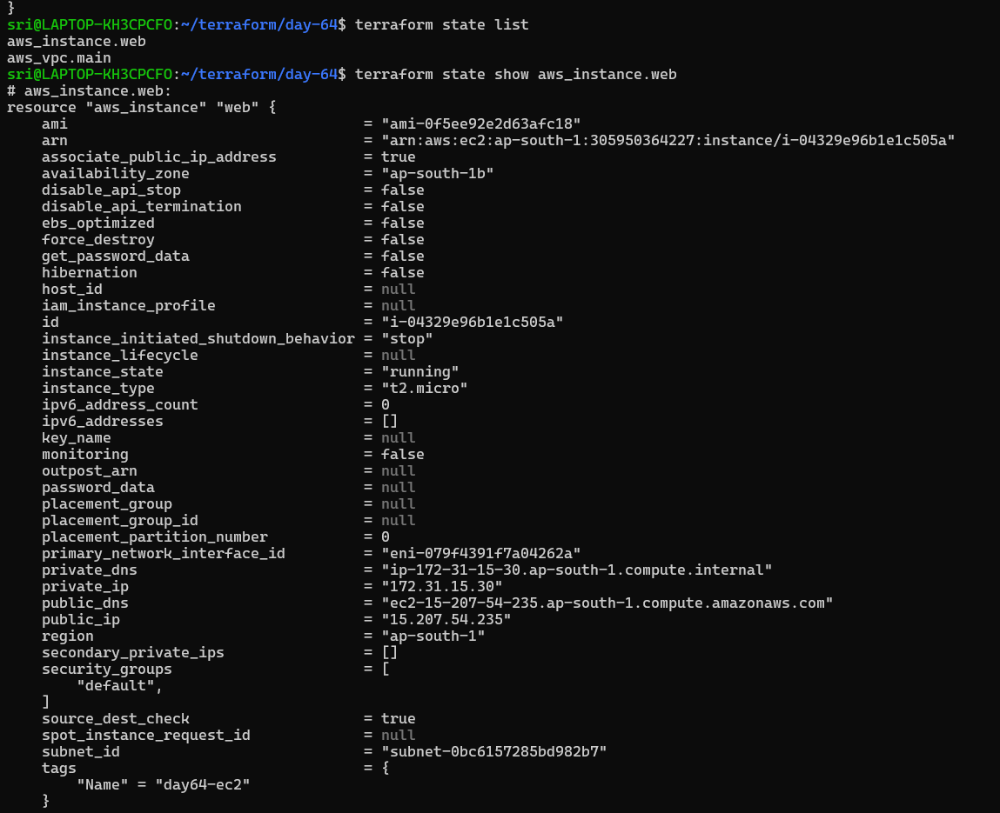

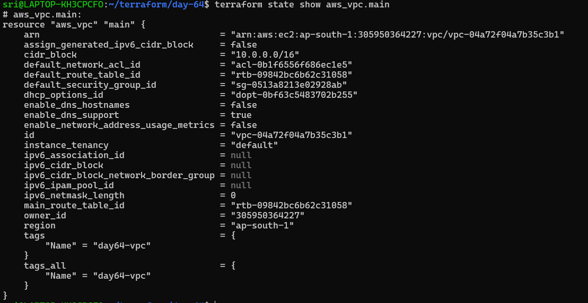

Answer:
1. How many resources does Terraform track?

    - Terraform track 7 resources (Data sources are read-only and not counted)

2. What attributes does the state store for an EC2 instance? (hint: way more than what you defined)
    - `ami`,`instance_type`,`tags`,`key_name`

    - `private_ip`, `public_ip`, `private_dns`, `public_dns`, `subnet_id`, `vpc_security_group_ids`, `primary_network_interface_id`

    - `root_block_device` ,`volume_id`, `volume_size`, `volume_type`, `delete_on_termination`

3. Open `terraform.tfstate` in an editor -- find the `serial` number. What does it represent?

    - The serial number in `terraform.tfstate` represents how many times the state has been updated.
    - It increments with every change
---

### Task 2: Set Up S3 Remote Backend
Storing state locally is dangerous -- one deleted file and you lose everything. Time to move it to S3.

1. First, create the backend infrastructure (do this manually or in a separate Terraform config):
```bash
# Create S3 bucket for state storage
aws s3api create-bucket \
  --bucket terraweek-state-<yourname> \
  --region ap-south-1 \
  --create-bucket-configuration LocationConstraint=ap-south-1

# Enable versioning (so you can recover previous state)
aws s3api put-bucket-versioning \
  --bucket terraweek-state-<yourname> \
  --versioning-configuration Status=Enabled

# Create DynamoDB table for state locking
aws dynamodb create-table \
  --table-name terraweek-state-lock \
  --attribute-definitions AttributeName=LockID,AttributeType=S \
  --key-schema AttributeName=LockID,KeyType=HASH \
  --billing-mode PAY_PER_REQUEST \
  --region ap-south-1
```

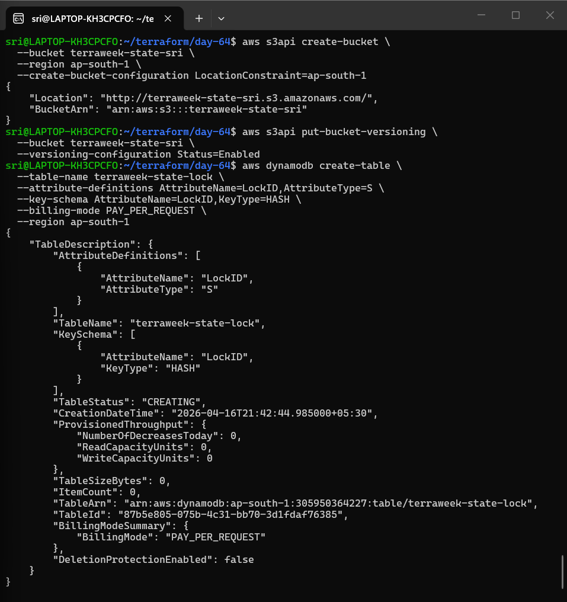

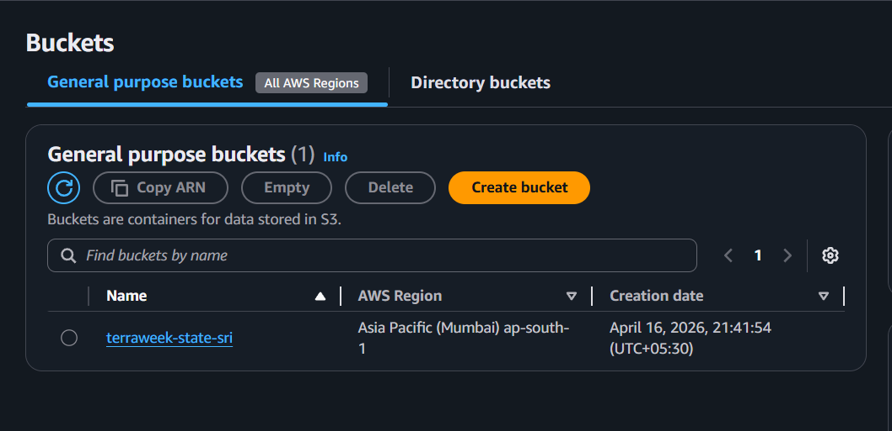


2. Add the backend block to your Terraform config:
```hcl
terraform {
  backend "s3" {
    bucket         = "terraweek-state-<yourname>"
    key            = "dev/terraform.tfstate"
    region         = "ap-south-1"
    dynamodb_table = "terraweek-state-lock"
    encrypt        = true
  }
}
```

3. Run:
```bash
terraform init
```
Terraform will ask: "Do you want to copy existing state to the new backend?" -- say yes.

4. Verify:
   - Check the S3 bucket -- you should see `dev/terraform.tfstate`

  

  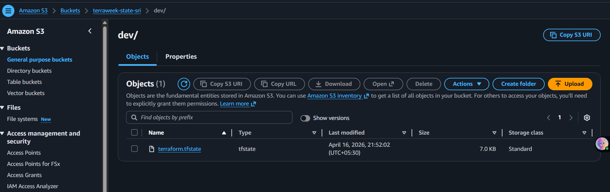

   
   - Your local `terraform.tfstate` should now be empty or gone

        - Yes,it should be empty

   - Run `terraform plan` -- it should show no changes (state migrated correctly)
---

### Task 3: Test State Locking
State locking prevents two people from running `terraform apply` at the same time and corrupting the state.

1. Open **two terminals** in the same project directory
2. In Terminal 1, run:
```bash
terraform apply
```
3. While Terminal 1 is waiting for confirmation, in Terminal 2 run:
```bash
terraform plan
```
4. Terminal 2 should show a **lock error** with a Lock ID

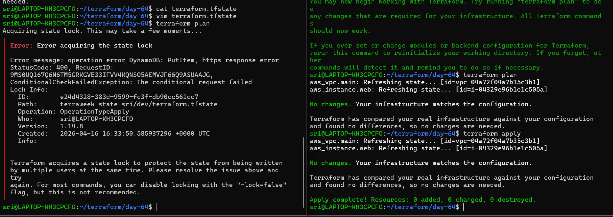

**Document:** What is the error message? Why is locking critical for team environments?

- `Error:`Terraform can’t acquire the state lock because DynamoDB says the state is already locked (ConditionalCheckFailedException).

- `Why locking matters:` It prevents concurrent writes, which could corrupt the state file and cause unintended infrastructure changes—critical in team environments.

5. After the test, if you get stuck with a stale lock:
```bash
terraform force-unlock <LOCK_ID>
```

---

### Task 4: Import an Existing Resource
Not everything starts with Terraform. Sometimes resources already exist in AWS and you need to bring them under Terraform management.

1. Manually create an S3 bucket in the AWS console -- name it `terraweek-import-test-<yourname>`

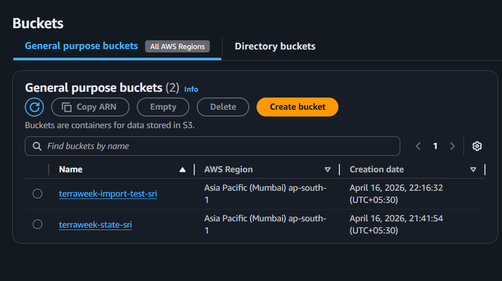

2. Write a `resource "aws_s3_bucket"` block in your config for this bucket (just the bucket name, nothing else)
3. Import it:
```bash
terraform import aws_s3_bucket.imported terraweek-import-test-<yourname>
```
4. Run `terraform plan`:
   - If you see "No changes" -- the import was perfect
   - If you see changes -- your config does not match reality. Update your config to match, then plan again until you get "No changes"

5. Run `terraform state list` -- the imported bucket should now appear alongside your other resources

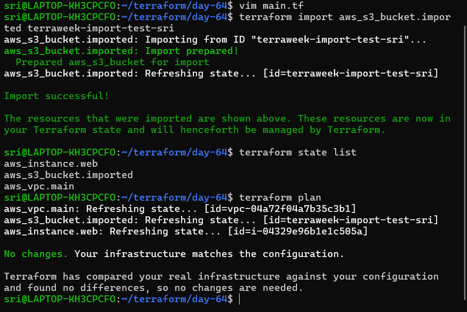

**Document:** What is the difference between `terraform import` and creating a resource from scratch?

`terraform import`
- Bring an existing resource (already in AWS, etc.) under Terraform management
- Updates the Terraform state file to track the resource
- `use case` Migrating manual or existing resources into Terraform
- `Example:`
    ```bash
    # Import an existing S3 bucket
    terraform import aws_s3_bucket.imported terraweek-import-test-sri
    ```

`Creating a Resource from Scratch`
- Terraform creates a new resource in the cloud
- Both state and actual resource are created by Terraform
- `use case` Standard workflow when starting from scratch
- `Example:`
    ```bash
    # Create a new S3 bucket from scratch
    resource "aws_s3_bucket" "new" {
    bucket = "terraweek-new-bucket"
    }

    ```

---

### Task 5: State Surgery -- mv and rm
Sometimes you need to rename a resource or remove it from state without destroying it in AWS.

1. **Rename a resource in state:**
```bash
terraform state list                              # Note the current resource names
terraform state mv aws_s3_bucket.imported aws_s3_bucket.logs_bucket
```
Update your `.tf` file to match the new name. Run `terraform plan` -- it should show no changes.

- `current resource name:` `aws_s3_bucket.imported`
- `after rename resource name:` `aws_s3_bucket.logs_bucket`


2. **Remove a resource from state (without destroying it):**
```bash
terraform state rm aws_s3_bucket.logs_bucket
```

Run `terraform plan` -- Terraform no longer knows about the bucket, but it still exists in AWS.


3. **Re-import it** to bring it back:
```bash
terraform import aws_s3_bucket.logs_bucket terraweek-import-test-<yourname>
```
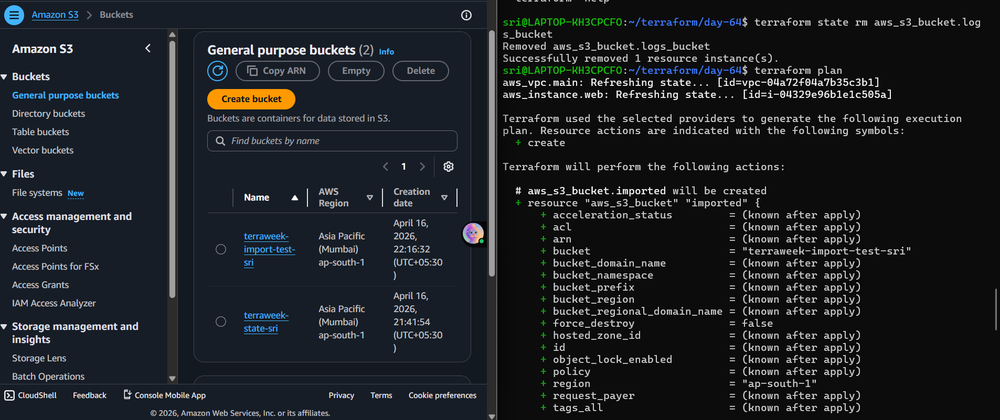

**Document:** When would you use `state mv` in a real project? When would you use `state rm`?

---

### Task 6: Simulate and Fix State Drift
State drift happens when someone changes infrastructure outside of Terraform -- through the AWS console, CLI, or another tool.

1. Apply your full config so everything is in sync
2. Go to the **AWS console** and manually:
   - Change the Name tag of your EC2 instance to `"ManuallyChanged"`
   - Change the instance type if it's stopped (or add a new tag)

   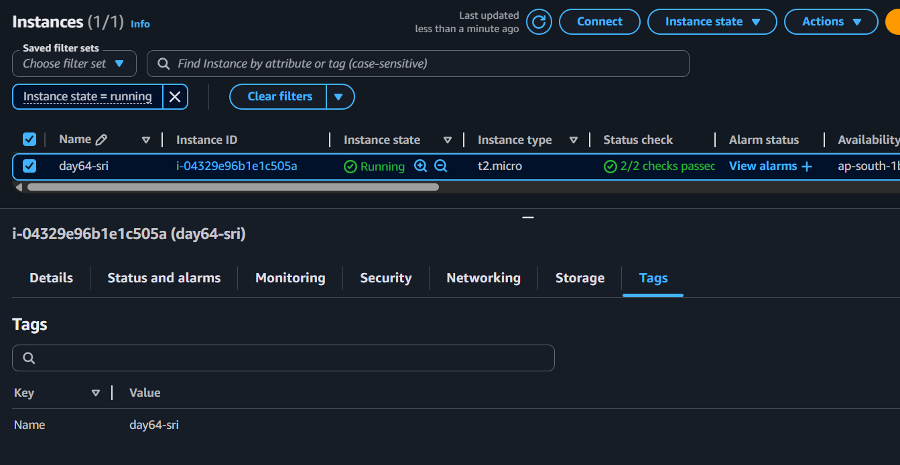
3. Run:
```bash
terraform plan
```
You should see a **diff** -- Terraform detects that reality no longer matches the desired state.

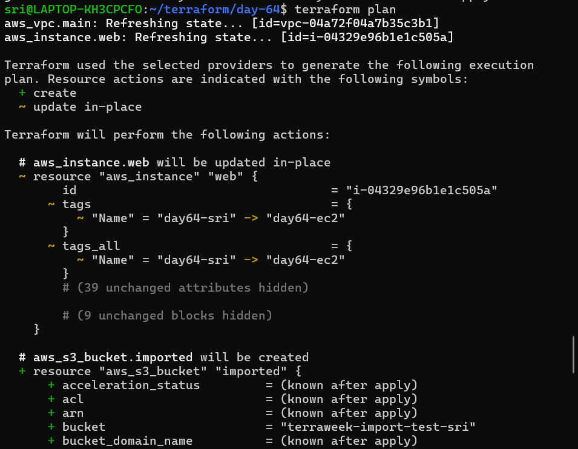

4. You have two choices:
   - **Option A:** Run `terraform apply` to force reality back to match your config (reconcile)
   - **Option B:** Update your `.tf` files to match the manual change (accept the drift)

5. Choose Option A -- apply and verify the tags are restored.


6. Run `terraform plan` again -- it should show "No changes." Drift resolved.


**Document:** How do teams prevent state drift in production? 

- Teams prevent state drift in production by **restricting console access** and ensuring **all changes go through CI/CD pipelines with version-controlled configurations**.

---

**Below are the steps I followed to perform the `terraform import`**
1. `Write the Terraform resource block:`
  - Make sure the name matches the existing bucket exactly:
    ```bash
    resource "aws_s3_bucket" "imported" {
    bucket = "terraweek-import-test-sanketdangat"
    }
    ```
  - `Note:` Don’t include any other arguments yet (ACLs, versioning, etc.). Just the bucket name.

2. `Import the existing bucket`
  - `Run the command:`
    ```bash
    terraform import aws_s3_bucket.imported terraweek-import-test-sri
    ```
  - Here:
    `aws_s3_bucket.imported` : resource type + Terraform name
    `terraweek-import-test-sri` : existing AWS bucket name

3. `Check Terraform state`
  - `terraform state list`
  - You should see `aws_s3_bucket.imported` listed.


**Explanation of state drift with real example**

  State drift happens when someone changes infrastructure outside of Terraform -- through the AWS console, CLI, or another tool.


  -  Go to the **AWS console** and manually:
      -  add a new tag `Owner:Sri`
  
  -  Run:  `terraform plan`

  You should see a **diff** -- Terraform detects that reality no longer matches the desired state.


  -  You have two choices:
      - **Option A:** Run `terraform apply` to force reality back to match your config (reconcile)
    
      - **Option B:** Update your `.tf` files to match the manual change (accept the drift)

  -  Choose Option A -- apply and verify the tags are restored.

  

  -  Run `terraform plan` again -- it should show "No changes." Drift resolved.

 


**When to use: `state mv`, `state rm`, `import`, `force-unlock`, `refresh`**

  -  `state mv`	Rename/move a resource in state without recreating it
  -  `state rm`	Stop Terraform from managing a resource
  -  `import`	Bring an existing resource under Terraform management
  -  `force-unlock`	Unlock a stuck state file after a failed operation
  -  `refresh`	ync state with real-world resources (detect drift)

---