# Day 66 -- Provision an EKS Cluster with Terraform Modules

## Challenge Tasks

### Task 1: Project Setup
Create a new project directory with proper file structure:

```
terraform-eks/
  providers.tf        # Provider and backend config
  vpc.tf              # VPC module call
  eks.tf              # EKS module call
  variables.tf        # All input variables
  outputs.tf          # Cluster outputs
  terraform.tfvars    # Variable values
```

In `providers.tf`:
1. Pin the AWS provider to `~> 5.0`
2. Pin the Kubernetes provider (you will need it later)
3. Set your region

In `variables.tf`, define:
- `region` (string)
- `cluster_name` (string, default: `"terraweek-eks"`)
- `cluster_version` (string, default: `"1.31"`)
- `node_instance_type` (string, default: `"t3.medium"`)
- `node_desired_count` (number, default: `2`)
- `vpc_cidr` (string, default: `"10.0.0.0/16"`)

---

### Task 2: Create the VPC with Registry Module
EKS requires a VPC with both public and private subnets across multiple availability zones.

In `vpc.tf`, use the `terraform-aws-modules/vpc/aws` module:
1. CIDR: `var.vpc_cidr`
2. At least 2 availability zones
3. 2 public subnets and 2 private subnets
4. Enable NAT gateway (single NAT to save cost): `enable_nat_gateway = true`, `single_nat_gateway = true`
5. Enable DNS hostnames: `enable_dns_hostnames = true`
6. Add the required EKS tags on subnets:
```hcl
public_subnet_tags = {
  "kubernetes.io/role/elb" = 1
}

private_subnet_tags = {
  "kubernetes.io/role/internal-elb" = 1
}
```

Run `terraform init` and `terraform plan` to verify the VPC config before moving on.

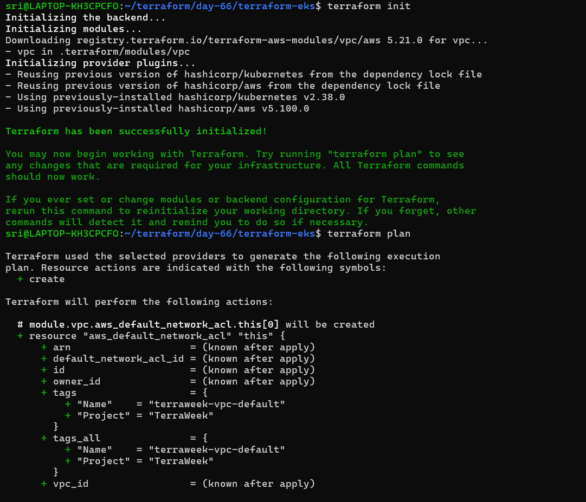

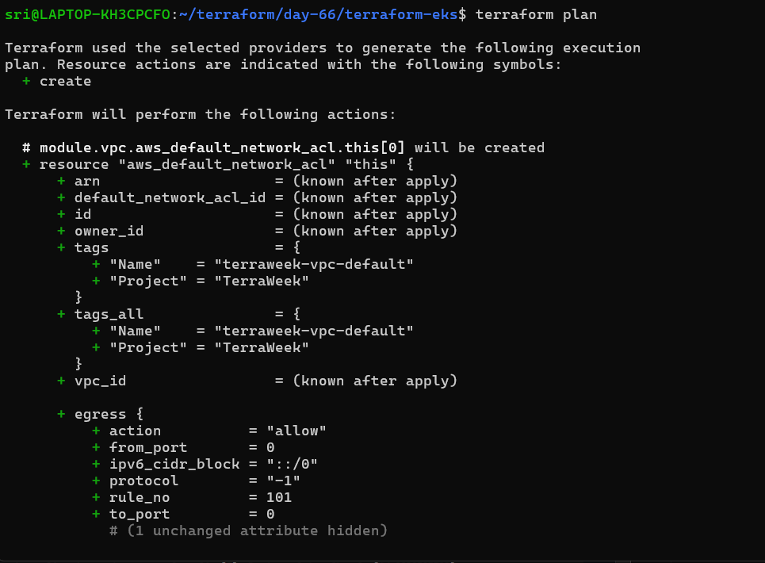

**Document:** Why does EKS need both public and private subnets? What do the subnet tags do?


**Why both subnets?**

* **Private subnets:** run your EKS nodes/pods securely (no direct internet access)
* **Public subnets:** host internet-facing load balancers

**What do the tags do?**

* `"kubernetes.io/role/elb"` tells AWS to use these **public subnets** for external load balancers
* `"kubernetes.io/role/internal-elb"` tells AWS to use these **private subnets** for internal load balancers

---

### Task 3: Create the EKS Cluster with Registry Module
In `eks.tf`, use the `terraform-aws-modules/eks/aws` module:

```hcl
module "eks" {
  source  = "terraform-aws-modules/eks/aws"
  version = "~> 20.0"

  cluster_name    = var.cluster_name
  cluster_version = var.cluster_version

  vpc_id     = module.vpc.vpc_id
  subnet_ids = module.vpc.private_subnets

  cluster_endpoint_public_access = true

  eks_managed_node_groups = {
    terraweek_nodes = {
      ami_type       = "AL2_x86_64"
      instance_types = [var.node_instance_type]

      min_size     = 1
      max_size     = 3
      desired_size = var.node_desired_count
    }
  }

  tags = {
    Environment = "dev"
    Project     = "TerraWeek"
    ManagedBy   = "Terraform"
  }
}
```

Run:
```bash
terraform init      # Download EKS module and its dependencies
terraform plan      # Review -- this will create 30+ resources
```


Review the plan carefully before applying. You should see: EKS cluster, IAM roles, node group, security groups, and more.

---

### Task 4: Apply and Connect kubectl
1. Apply the config:
```bash
terraform apply
```
This will take 10-15 minutes. EKS cluster creation is slow -- be patient.

2. Add outputs in `outputs.tf`:
```hcl
output "cluster_name" {
  value = module.eks.cluster_name
}

output "cluster_endpoint" {
  value = module.eks.cluster_endpoint
}

output "cluster_region" {
  value = var.region
}
```

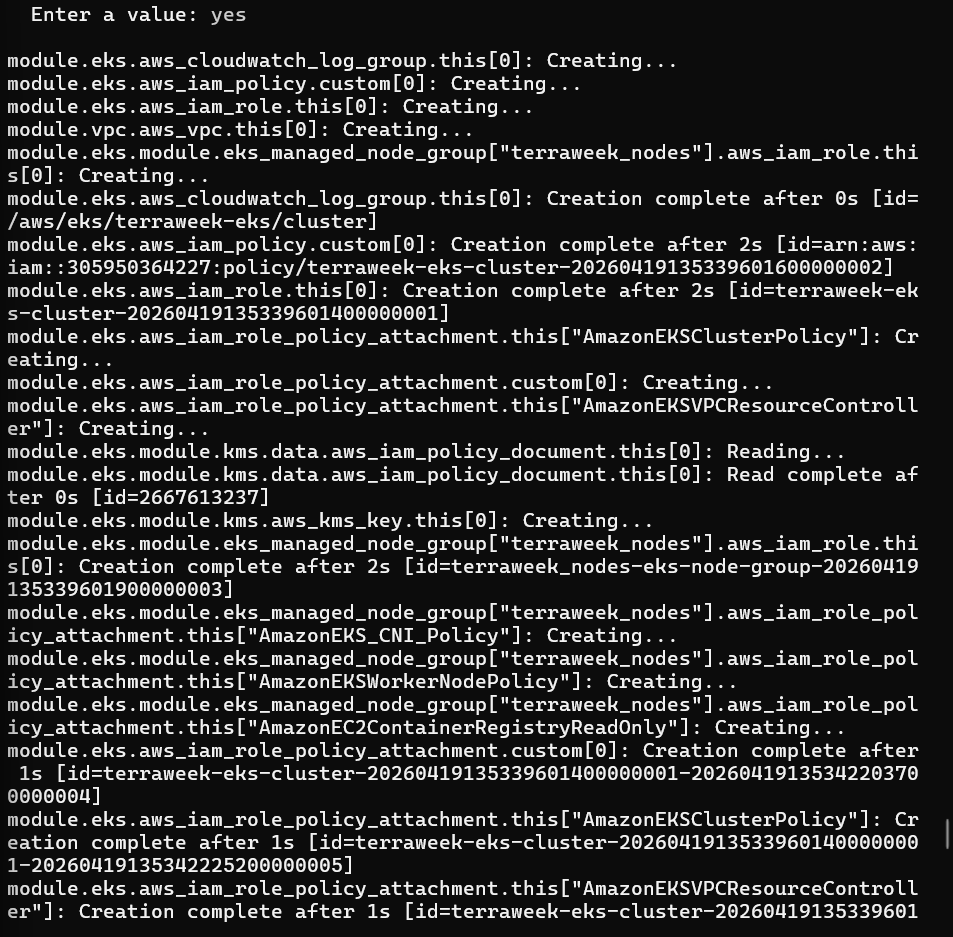

3. Update your kubeconfig:
```bash
aws eks update-kubeconfig --name terraweek-eks --region <your-region>
```

4. Verify:
```bash
kubectl get nodes
kubectl get pods -A
kubectl cluster-info
```
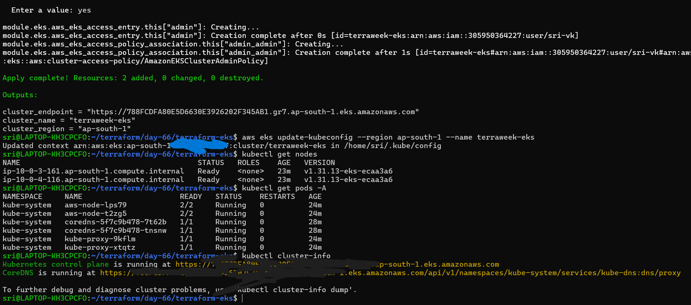

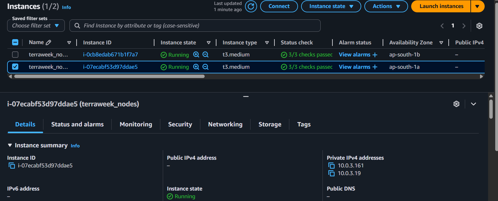

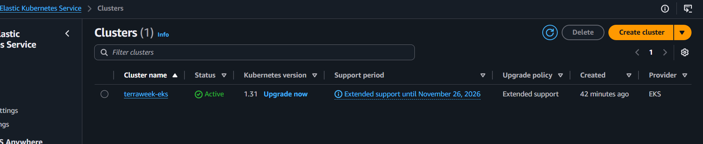

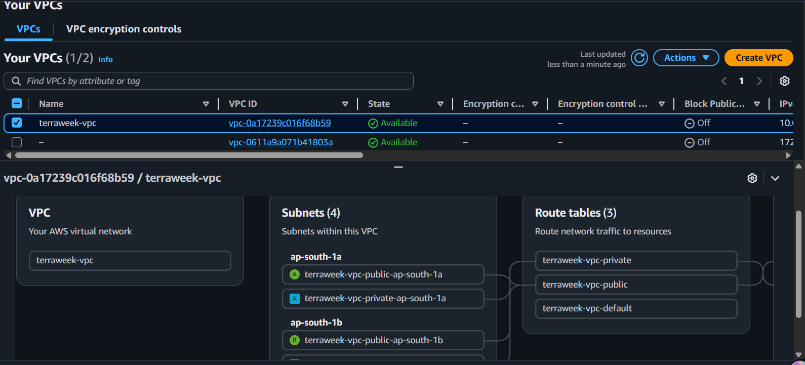

**Verify:** Do you see 2 nodes in `Ready` state? Can you see the kube-system pods running?
- Yes, both nodes are in the Ready state, and all kube-system pods are running.

---

### Task 5: Deploy a Workload on the Cluster
Your Terraform-provisioned cluster is live. Deploy something on it.

1. Create a file `k8s/nginx-deployment.yaml`:
```yaml
apiVersion: apps/v1
kind: Deployment
metadata:
  name: nginx-terraweek
  labels:
    app: nginx
spec:
  replicas: 3
  selector:
    matchLabels:
      app: nginx
  template:
    metadata:
      labels:
        app: nginx
    spec:
      containers:
      - name: nginx
        image: nginx:latest
        ports:
        - containerPort: 80
---
apiVersion: v1
kind: Service
metadata:
  name: nginx-service
spec:
  type: LoadBalancer
  selector:
    app: nginx
  ports:
  - port: 80
    targetPort: 80
```

2. Apply:
```bash
kubectl apply -f k8s/nginx-deployment.yaml
```

3. Wait for the LoadBalancer to get an external IP:
```bash
kubectl get svc nginx-service -w
```

4. Access the Nginx page via the LoadBalancer URL

5. Verify the full picture:
```bash
kubectl get nodes
kubectl get deployments
kubectl get pods
kubectl get svc
```
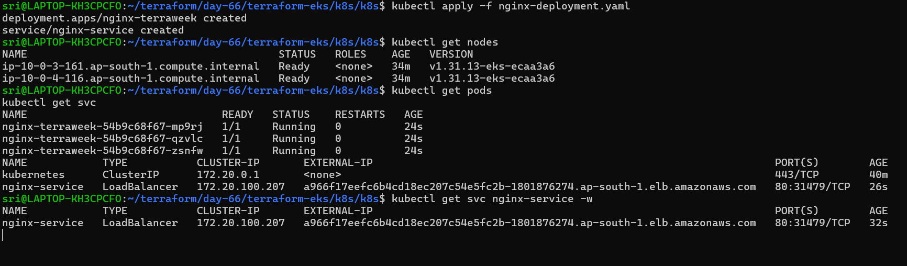

**Verify:** Can you access the Nginx welcome page through the LoadBalancer URL?
- Yes

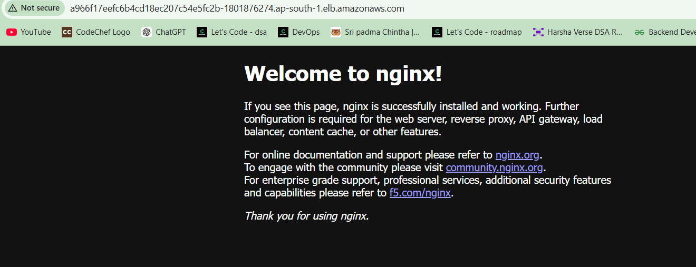

---

### Task 6: Destroy Everything
This is the most important step. EKS clusters cost money. Clean up completely.

1. First, remove the Kubernetes resources (so the AWS LoadBalancer gets deleted):
```bash
kubectl delete -f k8s/nginx-deployment.yaml
```

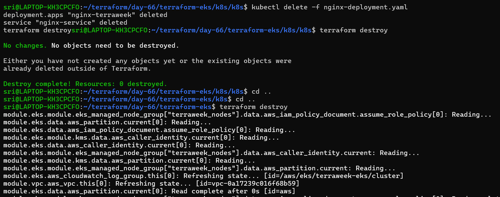

2. Wait for the LoadBalancer to be fully removed (check EC2 > Load Balancers in AWS console)

3. Destroy all Terraform resources:
```bash
terraform destroy
```
This will take 10-15 minutes.

4. Verify in the AWS console:
   - EKS clusters: empty
   - EC2 instances: no node group instances
   - VPC: the terraweek VPC should be gone
   - NAT Gateways: deleted
   - Elastic IPs: released


**Verify:** Is your AWS account completely clean? No leftover resources?
- Yes, my AWS account is completely clean with no leftover resources.
---


**complete file structure and key config files**

```
terraform-eks/
│
├── .terraform/                # Terraform cache (auto-generated)
├── .gitignore
├── .terraform.lock.hcl       # Provider lock file
│
├── k8s/                      # Kubernetes manifests (post-EKS setup)
│   ├── nginx-deployment.yaml
│
├── eks.tf                    # EKS module call
├── vpc.tf                    # VPC module call
├── providers.tf              # Provider and backend config
├── variables.tf              # All input variables
├── terraform.tfvars          # Variable values
├── outputs.tf                # Cluster outputs
```

**How many resources Terraform created in total**

  - 57 resources

  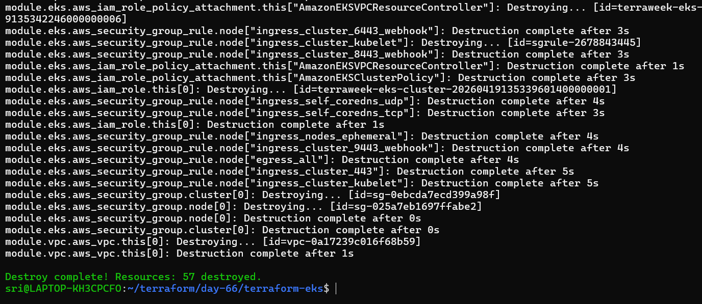

**The destroy process and verification**


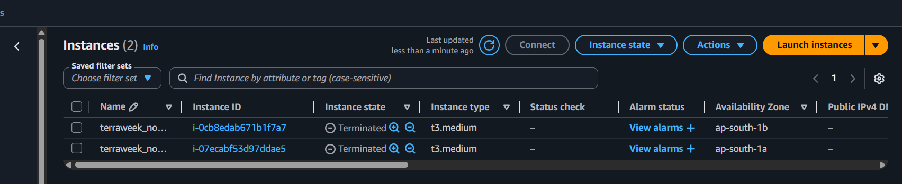


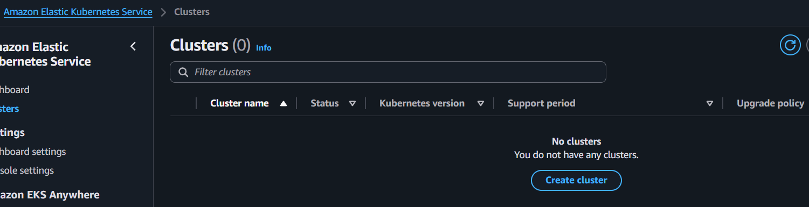

**Local Cluster manual setup vs Terraform + EKS**

| Local cluster             | Production-grade cluster       |
| ------------------------- | ------------------------------ |
| Manual setup              | Automated (IaC with Terraform) |
| Not reusable              | Reusable                       |
| Not scalable              | Scalable                       |
| No IAM integration        | IAM integrated (Amazon EKS)    |
| Not highly available      | Highly available               |
| Runs on local machine     | Runs on AWS cloud              |
| Free                      | Paid                           |
| Basic networking          | Advanced VPC networking        |
| Used for learning/testing | Used for production workloads  |


**Challenges Faced and Fixes**

| Challenge                                                                                   | Cause                                                             | Fix                                                                                                                                                                        |
| ------------------------------------------------------------------------------------------- | ----------------------------------------------------------------- | -------------------------------------------------------------------------------------------------------------------------------------------------------------------------- |
| `kubectl get nodes` fails with "the server has asked for the client to provide credentials" | IAM user has AWS permissions but is not mapped to the EKS cluster | Add `access_entries` in Terraform v20 module using `data.aws_caller_identity.current.arn`, run `terraform apply`, then refresh kubeconfig with `aws eks update-kubeconfig` |


| Configuration                          | Description                                         |
| -------------------------------------- | --------------------------------------------------- |
| `data "aws_caller_identity" "current"` | Fetches current IAM user/role details from AWS      |
| `principal_arn`                        | Uses current IAM identity ARN for cluster access    |
| `access_entries`                       | Maps IAM identity to EKS cluster access             |
| `policy_arn`                           | Grants admin access using Amazon EKS cluster policy |
| `access_scope`                         | Defines access level (cluster-wide)                 |
