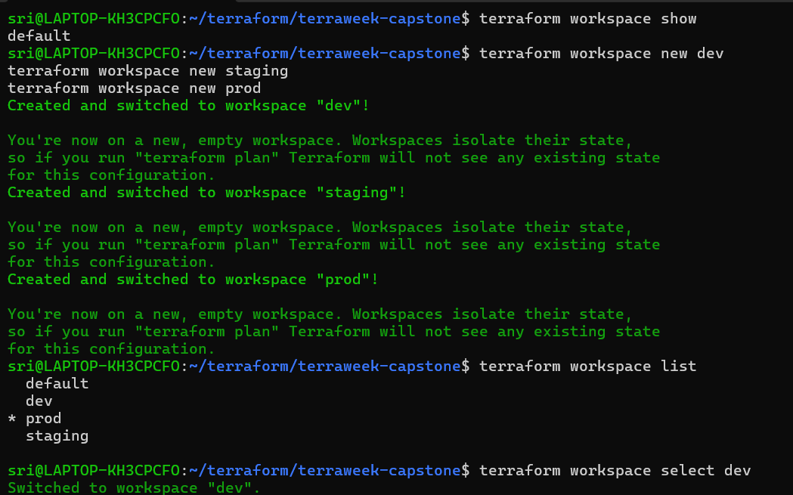
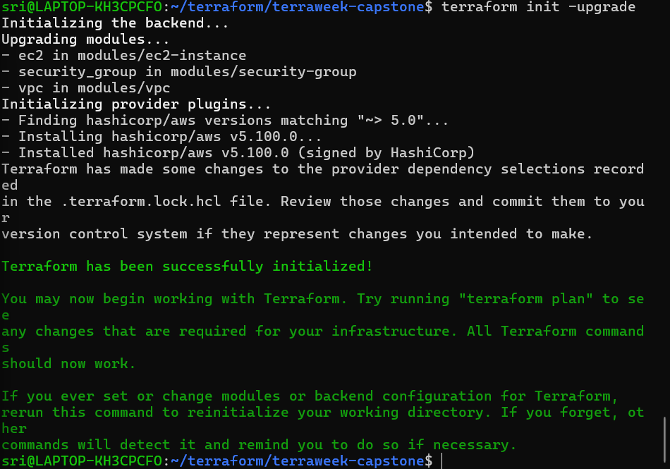
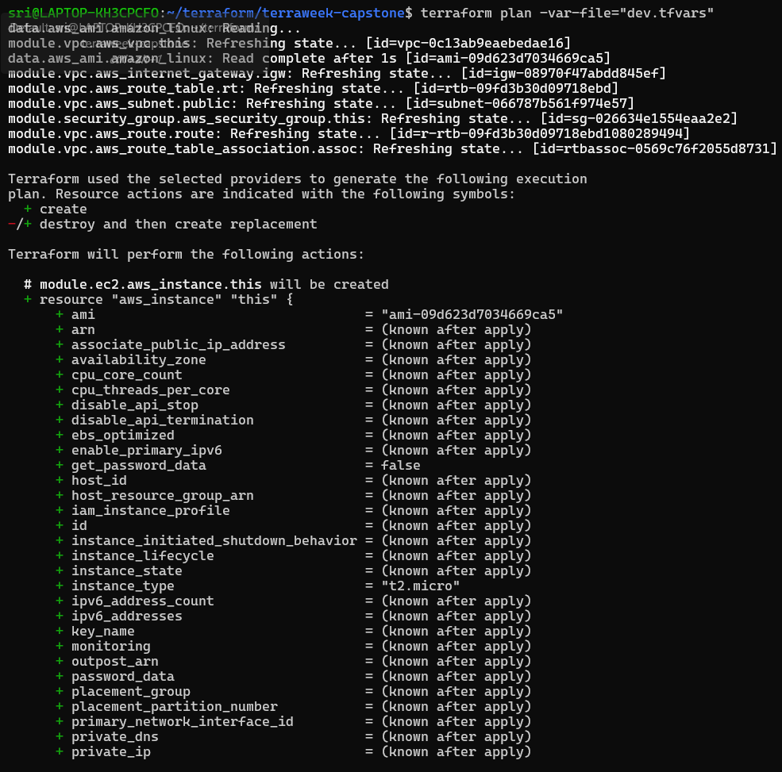
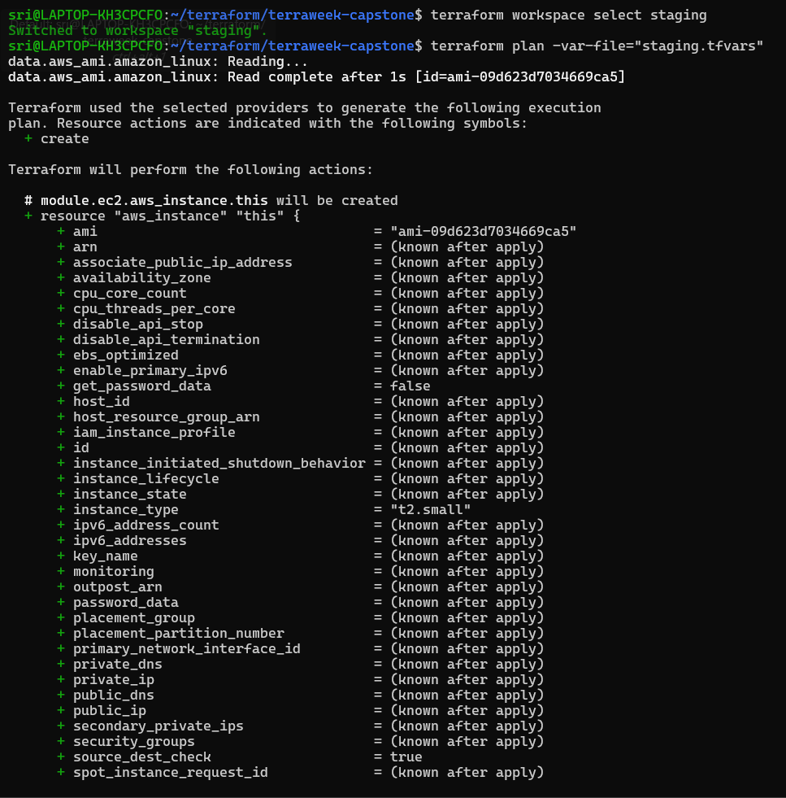
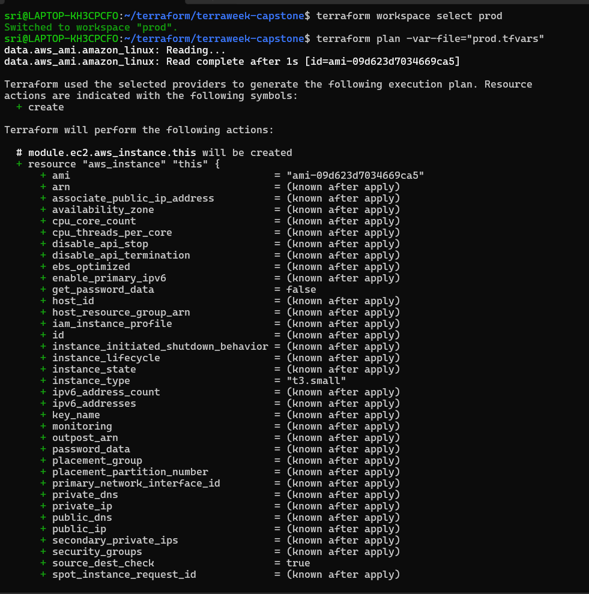
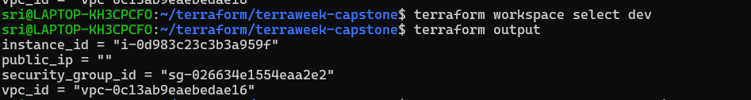
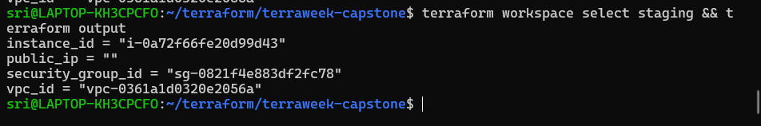
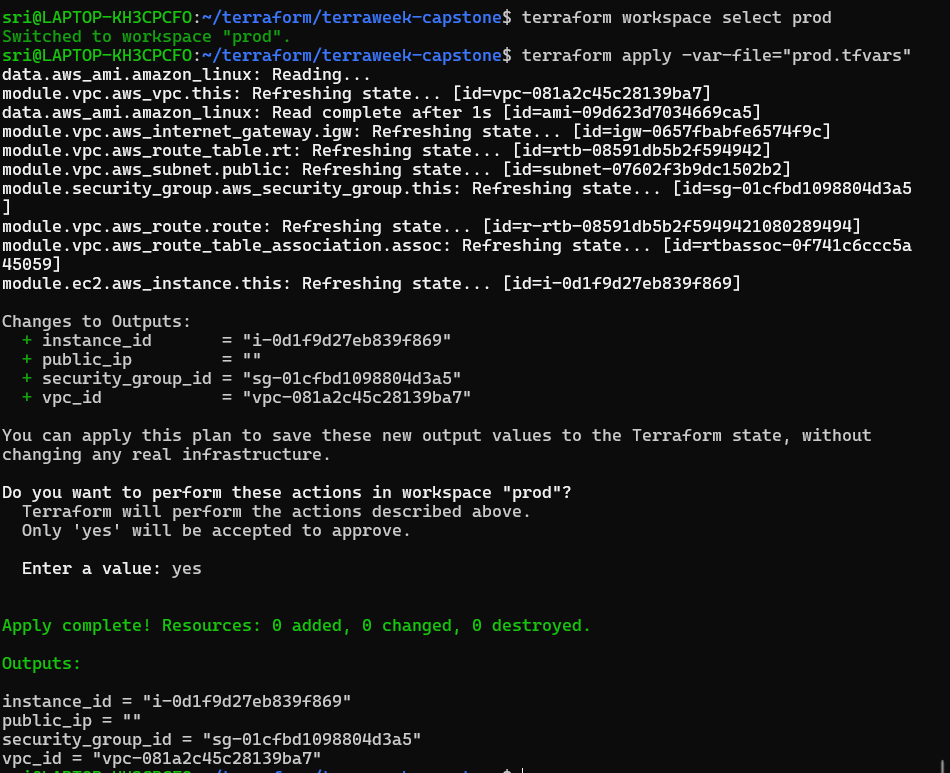
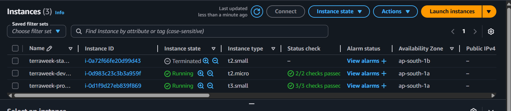
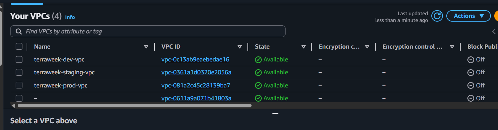

# Day 67 -- TerraWeek Capstone: Multi-Environment Infrastructure with Workspaces and Modules

## Challenge Tasks

### Task 1: Learn Terraform Workspaces
Before building the project, understand workspaces:

```bash
mkdir terraweek-capstone && cd terraweek-capstone
terraform init

# See current workspace
terraform workspace show                    # default


# Create new workspaces
terraform workspace new dev
terraform workspace new staging
terraform workspace new prod


# List all workspaces
terraform workspace list


# Switch between them
terraform workspace select dev
terraform workspace select staging
terraform workspace select prod
```


Answer:
1. What does `terraform.workspace` return inside a config?
- `terraform.workspace` is a built-in variable that returns the name of the currently selected workspace.

2. Where does each workspace store its state file?
- In `terraform.tfstate.d` directory

3. How is this different from using separate directories per environment?
- `Workspaces:` One codebase, multiple environments via separate state files
- `Directories:` Multiple copies of code, one per environment
---

### Task 2: Set Up the Project Structure
Create this layout:

```
terraweek-capstone/
  main.tf                   # Root module -- calls child modules
  variables.tf              # Root variables
  outputs.tf                # Root outputs
  providers.tf              # AWS provider and backend
  locals.tf                 # Local values using workspace
  dev.tfvars                # Dev environment values
  staging.tfvars            # Staging environment values
  prod.tfvars               # Prod environment values
  .gitignore                # Ignore state, .terraform, tfvars with secrets
  modules/
    vpc/
      main.tf
      variables.tf
      outputs.tf
    security-group/
      main.tf
      variables.tf
      outputs.tf
    ec2-instance/
      main.tf
      variables.tf
      outputs.tf
```

Create the `.gitignore`:
```
.terraform/
*.tfstate
*.tfstate.backup
*.tfvars
.terraform.lock.hcl
```

**Document:** Why is this file structure considered best practice?
- This Terraform structure is best practice because it keeps everything clean and easy to manage.
- We separate files `main.tf` `variables.tf`and `outputs.tf` so the code is more organized and easier to understand.
- We use modules, which helps us reuse code instead of writing the same thing again and again.
- We also support different environments like `dev` `staging` and `prod` using `.tfvars` files, which makes deployment safer.
- The `.gitignore` file protects sensitive data like state files and secrets.
- Overall, this structure makes the project organized, reusable and secure which is important for real-world use.
---

### Task 3: Build the Custom Modules
Create three focused modules:

**Module 1: `modules/vpc/`**
- Input: `cidr`, `public_subnet_cidr`, `environment`, `project_name`
- Resources: VPC, public subnet, internet gateway, route table, route table association
- Output: `vpc_id`, `subnet_id`
- All resources tagged with environment and project name

**Module 2: `modules/security-group/`**
- Input: `vpc_id`, `ingress_ports`, `environment`, `project_name`
- Resources: Security group with dynamic ingress rules, allow all egress
- Output: `sg_id`

**Module 3: `modules/ec2-instance/`**
- Input: `ami_id`, `instance_type`, `subnet_id`, `security_group_ids`, `environment`, `project_name`
- Resources: EC2 instance with tags
- Output: `instance_id`, `public_ip`

Write and validate each module:
```bash
terraform validate
```


---

### Task 4: Wire It All Together with Workspace-Aware Config
In the root module, use `terraform.workspace` to drive environment-specific behavior.

**`locals.tf`:**
```hcl
locals {
  environment = terraform.workspace
  name_prefix = "${var.project_name}-${local.environment}"

  common_tags = {
    Project     = var.project_name
    Environment = local.environment
    ManagedBy   = "Terraform"
    Workspace   = terraform.workspace
  }
}
```

**`variables.tf`:**
```hcl
variable "project_name" {
  type    = string
  default = "terraweek"
}

variable "vpc_cidr" {
  type = string
}

variable "subnet_cidr" {
  type = string
}

variable "instance_type" {
  type = string
}

variable "ingress_ports" {
  type    = list(number)
  default = [22, 80]
}
```

**`main.tf`** -- call all three modules, passing workspace-aware names and variables.

**Environment-specific tfvars:**

`dev.tfvars`:
```hcl
vpc_cidr      = "10.0.0.0/16"
subnet_cidr   = "10.0.1.0/24"
instance_type = "t3.micro"  # Im taking here `t3.micro`,`t2.micro` is not available in my AWS account
```

`staging.tfvars`:
```hcl
vpc_cidr      = "10.1.0.0/16"
subnet_cidr   = "10.1.1.0/24"
instance_type = "t3.small" 
ingress_ports = [22, 80, 443]
```

`prod.tfvars`:
```hcl
vpc_cidr      = "10.2.0.0/16"
subnet_cidr   = "10.2.1.0/24"
instance_type = "c7i-flex.large"  # Im taking here c7i-flex.large
ingress_ports = [80, 443]
```

Notice: dev allows SSH, prod does not. Different CIDRs prevent overlap. Instance types scale up per environment.

---

### Task 5: Deploy All Three Environments
Deploy each environment using its workspace and tfvars file:

**Dev:**
```bash
terraform workspace select dev
terraform plan -var-file="dev.tfvars"
terraform apply -var-file="dev.tfvars"
```

**Staging:**
```bash
terraform workspace select staging
terraform plan -var-file="staging.tfvars"
terraform apply -var-file="staging.tfvars"
```

**Prod:**
```bash
terraform workspace select prod
terraform plan -var-file="prod.tfvars"
terraform apply -var-file="prod.tfvars"
```






After all three are deployed, verify:
```bash
# Check each workspace's resources
terraform workspace select dev && terraform output
terraform workspace select staging && terraform output
terraform workspace select prod && terraform output
```





Go to the AWS console and verify:
- Three separate VPCs with different CIDR ranges
- Three EC2 instances with different instance types
- Different Name tags per environment: `terraweek-dev-server`, `terraweek-staging-server`, `terraweek-prod-server`

**Verify:** Are all three environments completely isolated from each other?




---

### Task 6: Terraform best practices guide:
 
1. **File Structure** — Separate files for each concern: `providers.tf`, `variables.tf`, `outputs.tf`, `locals.tf`, `main.tf`
2. **State Management** — Remote S3 backend with `encrypt = true`, `use_lockfile = true`. Each workspace gets its own state file at `env:/<workspace>/terraweek-capstone/terraform.tfstate`
3. **Variables** — Never hardcode values. Used `dev/staging/prod.tfvars` per environment.
4. **Modules** — One concern per module. Three focused modules: `vpc/` (networking), `security-group/` (access control), `ec2-instance/` (compute). Each module has `main.tf`, `variables.tf`, `outputs.tf`
5. **Workspaces** — Three workspaces for full environment isolation. `terraform.workspace` drives environment name through `locals.tf`. One codebase, three environments
6. **Security** — `.gitignore` excludes `*.tfvars`, `*.tfstate`, `.terraform/`. State encrypted at rest with `encrypt = true`. No credentials hardcoded anywhere
7. **Commands** — Always `terraform validate` → `terraform plan` → `terraform apply`. Never skip plan. Use `terraform fmt` before committing
8. **Tagging** — Every resource tagged with `Environment`, `Project`, `ManagedBy = "Terraform"`.
9. **Naming** — Consistent pattern: `<environment>-<project>-<resource>` e.g. `dev-terraweek-VPC`, `terraweek-prod-Server`
10. **Cleanup** — always `terraform destroy` non-production environments when not in use

---

### Task 7: Destroy All Environments
Clean up all three environments in reverse order:

```bash
terraform workspace select prod
terraform destroy -var-file="prod.tfvars"

terraform workspace select staging
terraform destroy -var-file="staging.tfvars"

terraform workspace select dev
terraform destroy -var-file="dev.tfvars"
```


Verify in the AWS console -- all VPCs, instances, security groups, and gateways should be gone.


Delete the workspaces:
```bash
terraform workspace select default
terraform workspace delete dev
terraform workspace delete staging
terraform workspace delete prod
```


**Verify:** Is your AWS account completely clean?
- Yes
---

