# Day 68 -- Introduction to Ansible and Inventory Setup
---

## Challenge Tasks

### Task 1: Understand Ansible
Research and write short notes on:

1. What is configuration management? Why do we need it?

- `Configuration Management` is the practice of automating the setup and management of servers using code.
- Instead of manually configuring each system, we define the desired setup and apply it automatically using tools like `Ansible.`

  `Why do we need it?`
   - We need Configuration Management because:
      - `Saves time` No need to configure servers manually
      - `Ensures consistency` All systems are set up the same way
      - `Reduces errors` Automation avoids human mistakes
      - `Supports DevOps` Helps in fast deployments and CI/CD pipelines

2. How is Ansible different from Chef, Puppet, and Salt?

   - Ansible is different because it is **agentless and easy to use**, working over SSH with a simple YAML syntax. It uses a **push model**
   - While Chef and Puppet mainly use a **pull model** and require agents. 
   - `Salt` supports `both push and event-driven models` but is more complex. 
   - Overall, **Ansible is simpler and faster to set up**, whereas `Chef` `Puppet`and `Salt` are more complex but offer advanced features.

3. What does "agentless" mean? How does Ansible connect to managed nodes?

   - **Agentless** means that no dedicated software (agent) needs to be installed or running on the managed nodes.
   - The control system communicates with nodes directly when tasks need to be executed.
   - In **Ansible**, the control node connects to managed nodes using standard remote protocols:
      * **SSH** for Linux/Unix systems
      * **WinRM** for Windows systems
   - When a task is run, Ansible:
      1. Establishes a connection (SSH/WinRM)
      2. Transfers the required module/code temporarily
      3. Executes it on the node
      4. Removes it and disconnects
   - This approach makes Ansible **simple to set up, lightweight, and easier to maintain**, since there are no agents to install or manage on each node.


4. Describe the Ansible architecture:
   - **Control Node** -- the machine where Ansible runs (your laptop or a jump server)
   - **Managed Nodes** -- the servers Ansible configures (your EC2 instances)
   - **Inventory** -- the list of managed nodes
   - **Modules** -- units of work Ansible executes (install a package, copy a file, start a service)
   - **Playbooks** -- YAML files that define what to do on which hosts


   1. `Command Execution (Control Node)`
       - You run an Ansible command (ansible or ansible-playbook) from the Control Node.
       - Only this machine needs Ansible installed.
      
   2. `Read Inventory & Playbook`
      - `Ansible:`
         - Reads the Inventory -> identifies Managed Nodes
         - Parses the Playbook -> understands tasks and modules to execute
      
   3. `Establish Connections`
         - Ansible opens SSH connections to managed nodes in parallel
      
   4. `Module Preparation & Transfer`
       - `For each task:`
         - Ansible packages the required Module into a temporary script
         - Uploads it to `/tmp` on the remote server
      
   5. `Remote Execution`
      - The script runs on the Managed Node using its Python interpreter
      - No agent required (agentless)
      
   6. `Result Return`
      - `The module:`
         - Sends back a JSON result ( `ok`, `changed`, `failed`, `skipped`)
         - Deletes itself from /tmp after execution
      
   7. `Final Summary`
      - Ansible collects results from all nodes and shows a clear summary on `control node`

   `Analogy: The Delivery Driver`

   - Think of Ansible like a delivery driver.
   - The driver (Ansible) picks up packages (modules) from the warehouse (control node)
   - Drives to each house (managed node) using an address list (inventory)
   - Delivers the package (runs the module), gets a signature (receives JSON result) and drives away. 
   - The house doesn't need any special equipment installed to receive deliveries — just a doorbell (SSH).  


---

### Task 2: Set Up Your Lab Environment
You need 2-3 EC2 instances to practice on. Choose one approach:

**Option A: Use Terraform (recommended -- you just learned this)**
Use your TerraWeek skills to provision 3 EC2 instances with:
- Amazon Linux 2 or Ubuntu 22.04
- `t2.micro` instance type `iam taking t3.micro because on my account t2.micro N/A`
- A security group allowing SSH (port 22)
- A key pair for SSH access

**Option B: Launch manually from AWS Console**
Create 3 instances with the same specs above.

Label them mentally:
- **Instance 1:** web server
- **Instance 2:** app server
- **Instance 3:** db server

Verify you can SSH into each one from your control node:
```bash
ssh -i ~/your-key.pem ec2-user@<public-ip-1>
ssh -i ~/your-key.pem ec2-user@<public-ip-2>
ssh -i ~/your-key.pem ec2-user@<public-ip-3>
```
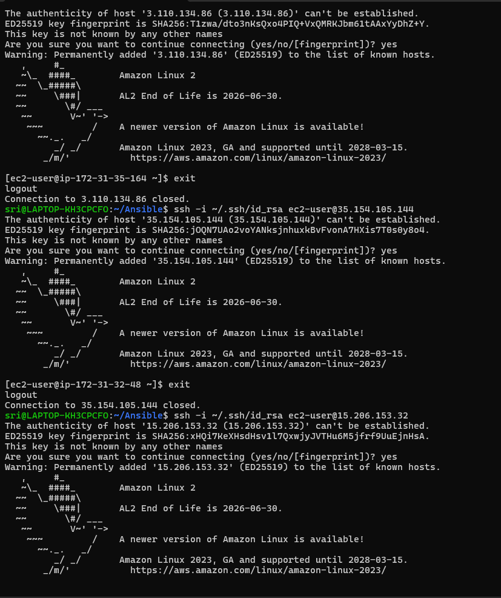


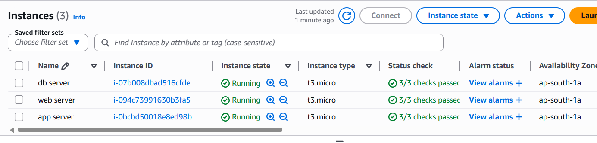
---

### Task 3: Install Ansible
Install Ansible on your **control node** (your laptop or one dedicated EC2 instance):

```bash
# macOS
brew install ansible

# Ubuntu/Debian
sudo apt update
sudo apt install ansible -y

# Amazon Linux / RHEL
sudo yum install ansible -y
# or
pip3 install ansible

# Verify
ansible --version
```

Confirm the output shows the Ansible version, config file path, and Python version.

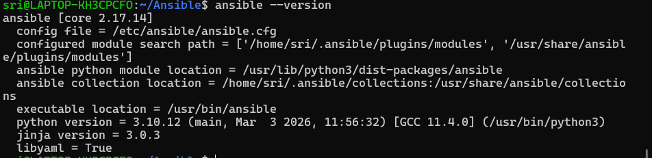

**Document:** On which machine did you install Ansible? Why is it only needed on the control node?

- Ansible is installed on the **control node** because it runs playbooks from there and connects to other servers via SSH. 
- Target machines only need SSH and Python—no Ansible installation is required.

---

### Task 4: Create Your Inventory File
The inventory tells Ansible which servers to manage. Create a project directory and your first inventory:

```bash
mkdir ansible-practice && cd ansible-practice
```

Create a file called `inventory.ini`:
```ini
[web]
web-server ansible_host=<PUBLIC_IP_1>

[app]
app-server ansible_host=<PUBLIC_IP_2>

[db]
db-server ansible_host=<PUBLIC_IP_3>

[all:vars]
ansible_user=ec2-user
ansible_ssh_private_key_file=~/your-key.pem
```

Verify Ansible can reach all hosts:
```bash
ansible all -i inventory.ini -m ping
```

You should see green `SUCCESS` with `"ping": "pong"` for each host.

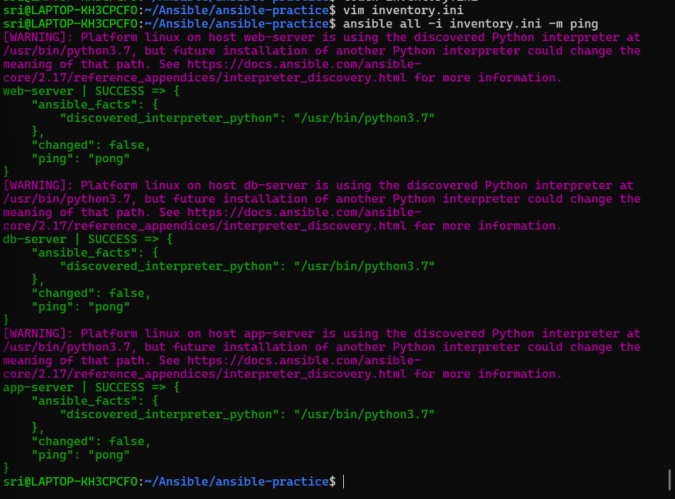

**Troubleshoot:** If ping fails:
- Check the SSH key path and permissions (`chmod 400 your-key.pem`)
- Check the security group allows SSH from your IP
- Check the `ansible_user` matches your AMI (ec2-user for Amazon Linux, ubuntu for Ubuntu)

---

### Task 5: Run Ad-Hoc Commands
Ad-hoc commands let you run quick one-off tasks without writing a playbook.

1. **Check uptime on all servers:**
```bash
ansible all -i inventory.ini -m command -a "uptime"
```

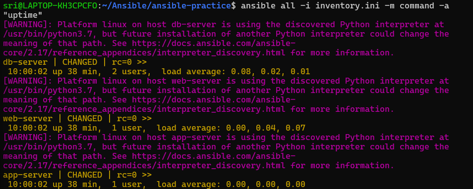

2. **Check free memory on web servers only:**
```bash
ansible web -i inventory.ini -m command -a "free -h"
```

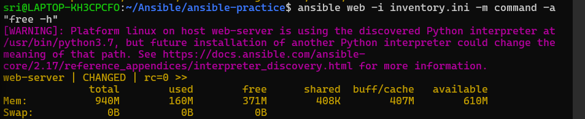

3. **Check disk space on all servers:**
```bash
ansible all -i inventory.ini -m command -a "df -h"
```

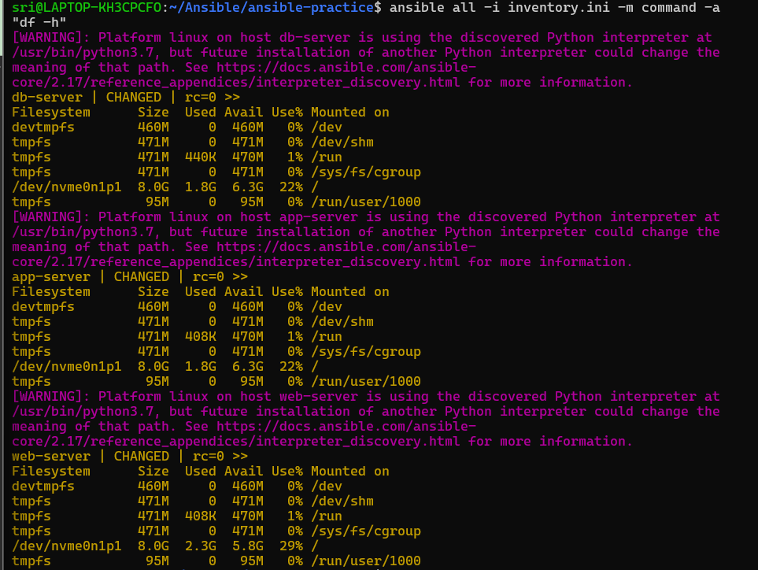

4. **Install a package on the web group:**
```bash
ansible web -i inventory.ini -m yum -a "name=git state=present" --become
```
(Use `apt` instead of `yum` if running Ubuntu)

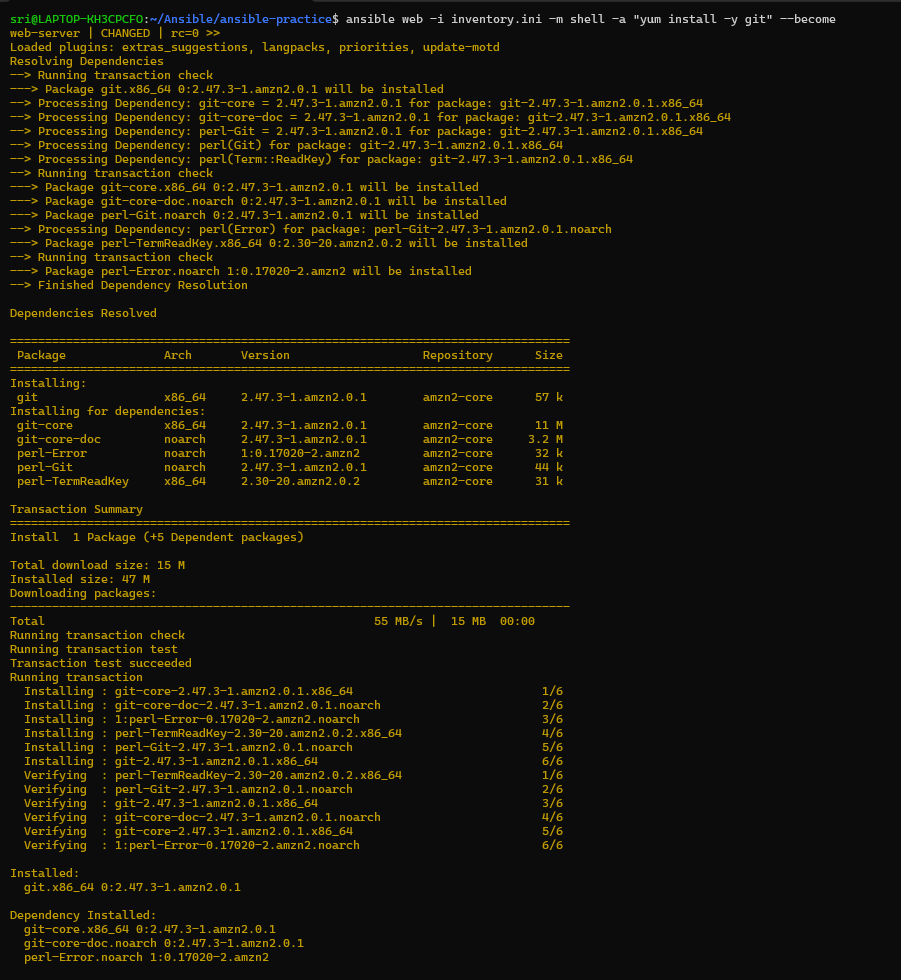

5. **Copy a file to all servers:**
```bash
echo "Hello from Ansible" > hello.txt
ansible all -i inventory.ini -m copy -a "src=hello.txt dest=/tmp/hello.txt"
```

6. **Verify the file was copied:**
```bash
ansible all -i inventory.ini -m command -a "cat /tmp/hello.txt"
```
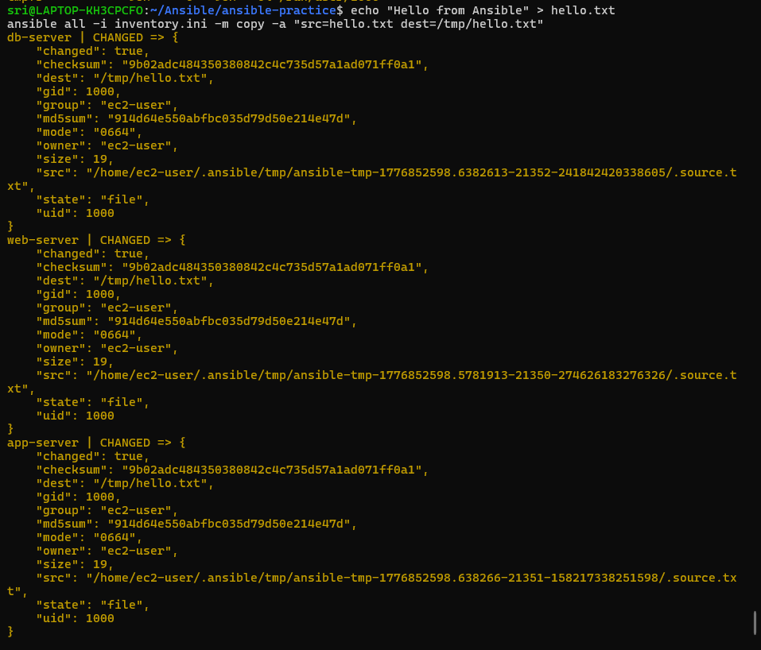

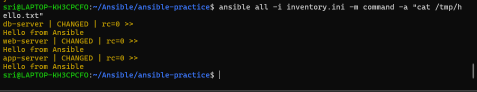


**Document:** What does `--become` do? When do you need it?

   - `--become` escalates to root (like `sudo`) -- needed for package installation and service management
---

### Task 6: Explore Inventory Groups and Patterns
1. **Create a group of groups** -- add this to your `inventory.ini`:
```ini
[application:children]
web
app

[all_servers:children]
application
db
```

2. Run commands against different groups:
```bash
ansible application -i inventory.ini -m ping     # web + app servers
ansible db -i inventory.ini -m ping               # only db server
ansible all_servers -i inventory.ini -m ping      # everything
```

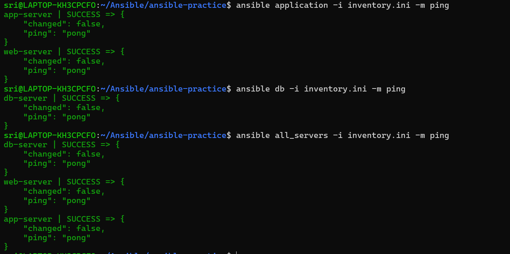

3. **Use patterns:**
```bash
ansible 'web:app' -i inventory.ini -m ping        # OR: web or app
ansible 'all:!db' -i inventory.ini -m ping        # NOT: all except db
```

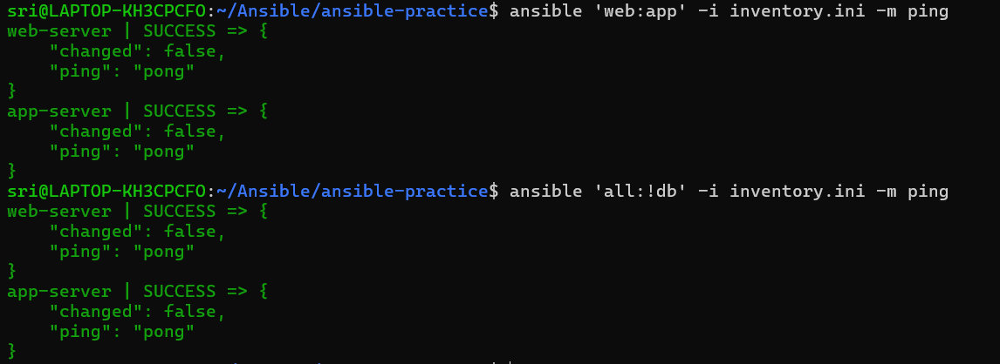

4. **Create an `ansible.cfg`** to avoid typing `-i inventory.ini` every time:
```ini
[defaults]
inventory = inventory.ini
host_key_checking = False
remote_user = ec2-user
private_key_file = ~/your-key.pem
```

Now you can simply run:
```bash
ansible all -m ping
```

**Verify:** Does `ansible all -m ping` work without specifying the inventory file?

- Yes

   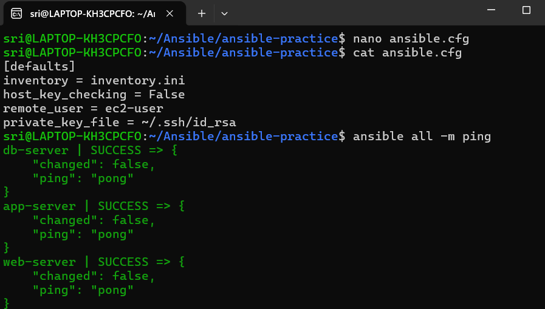

---


- Ansible uses SSH by default -- no agent installation needed on managed nodes
- `ansible.cfg` is read from the current directory first, then `~/.ansible.cfg`, then `/etc/ansible/ansible.cfg`
- `-m` specifies the module, `-a` specifies the module arguments
-  `command` module runs simple commands, `shell` module supports pipes and redirects
- Ad-hoc commands are great for quick tasks, but playbooks are better for anything repeatable

---