# Day 69 -- Ansible Playbooks and Modules

---

## Challenge Tasks

### Task 1: Your First Playbook
Create `install-nginx.yml`:

```yaml
---
- name: Install and start Nginx on web servers
  hosts: web
  become: true

  tasks:
    - name: Install Nginx
      yum:
        name: nginx
        state: present

    - name: Start and enable Nginx
      service:
        name: nginx
        state: started
        enabled: true

    - name: Create a custom index page
      copy:
        content: "<h1>Deployed by Ansible - TerraWeek Server</h1>"
        dest: /usr/share/nginx/html/index.html
```

(Use `apt` instead of `yum` if your instances run Ubuntu)

Run it:
```bash
ansible-playbook install-nginx.yml
```

Read the output carefully -- every task shows `changed`, `ok`, or `failed`.

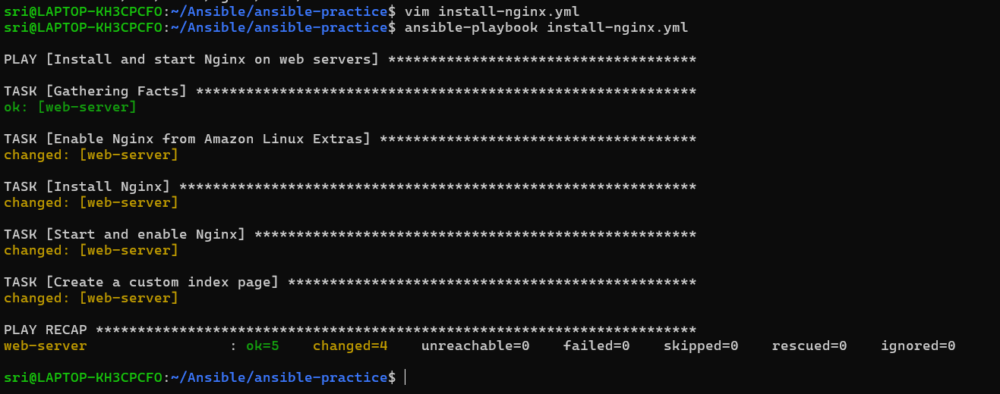

Now run it **again**. Notice that tasks show `ok` instead of `changed`. This is **idempotency** -- Ansible only makes changes when needed.


**Verify:** Curl the web server's public IP. Do you see your custom page?


---

### Task 2: Understand the Playbook Structure
Open your playbook and annotate each part in your notes:

```yaml
---                                    # YAML document start
- name: Play name                      # PLAY -- targets a group of hosts
  hosts: web                           # Which inventory group to run on
  become: true                         # Run tasks as root (sudo)

  tasks:                               # List of TASKS in this play
    - name: Task name                  # TASK -- one unit of work
      module_name:                     # MODULE -- what Ansible does
        key: value                     # Module arguments
```

Answer:
1. What is the difference between a play and a task?
    - A `play define:`
      - Which hosts to target
      - What roles/tasks to apply

    - A `task define`
      - Single unit of work
      - Calls one module (like apt, copy, service)
      - It’s a high-level mapping between hosts and work

2. Can you have multiple plays in one playbook?
    - Yes, `Each play:` `Targets different host groups` and `Runs independently in sequence`

3. What does `become: true` do at the play level vs the task level?

    - `play level` Applies to ALL tasks in the play

    - `task level` Applies only to that task


4. What happens if a task fails -- do remaining tasks still run?
    - `Default behavior:`
      - Execution stops for that host
        ```
        tasks:
          - name: Task 1 (fails)
          - name: Task 2 (won’t run)
        ```
    - But other hosts --> `Continue normally`
---

### Task 3: Learn the Essential Modules
Practice each of these modules by writing a playbook called `essential-modules.yml` with multiple tasks:

1. **`yum`/`apt`** -- Install and remove packages:
```yaml
- name: Install multiple packages
  yum:
    name:
      - git
      - curl
      - wget
      - tree
    state: present
```

2. **`service`** -- Manage services:
```yaml
- name: Ensure Nginx is running
  service:
    name: nginx
    state: started
    enabled: true
```

3. **`copy`** -- Copy files from control node to managed nodes:
```yaml
- name: Copy config file
  copy:
    src: files/app.conf
    dest: /etc/app.conf
    owner: root
    group: root
    mode: '0644'
```

4. **`file`** -- Create directories and manage permissions:
```yaml
- name: Create application directory
  file:
    path: /opt/myapp
    state: directory
    owner: ec2-user
    mode: '0755'
```

5. **`command`** -- Run a command (no shell features):
```yaml
- name: Check disk space
  command: df -h
  register: disk_output

- name: Print disk space
  debug:
    var: disk_output.stdout_lines
```

6. **`shell`** -- Run a command with shell features (pipes, redirects):
```yaml
- name: Count running processes
  shell: ps aux | wc -l
  register: process_count

- name: Show process count
  debug:
    msg: "Total processes: {{ process_count.stdout }}"
```

7. **`lineinfile`** -- Add or modify a single line in a file:
```yaml
- name: Set timezone in environment
  lineinfile:
    path: /etc/environment
    line: 'TZ=Asia/Kolkata'
    create: true
```

Create a `files/` directory with a sample `app.conf` file for the copy task. Run the playbook against all servers.

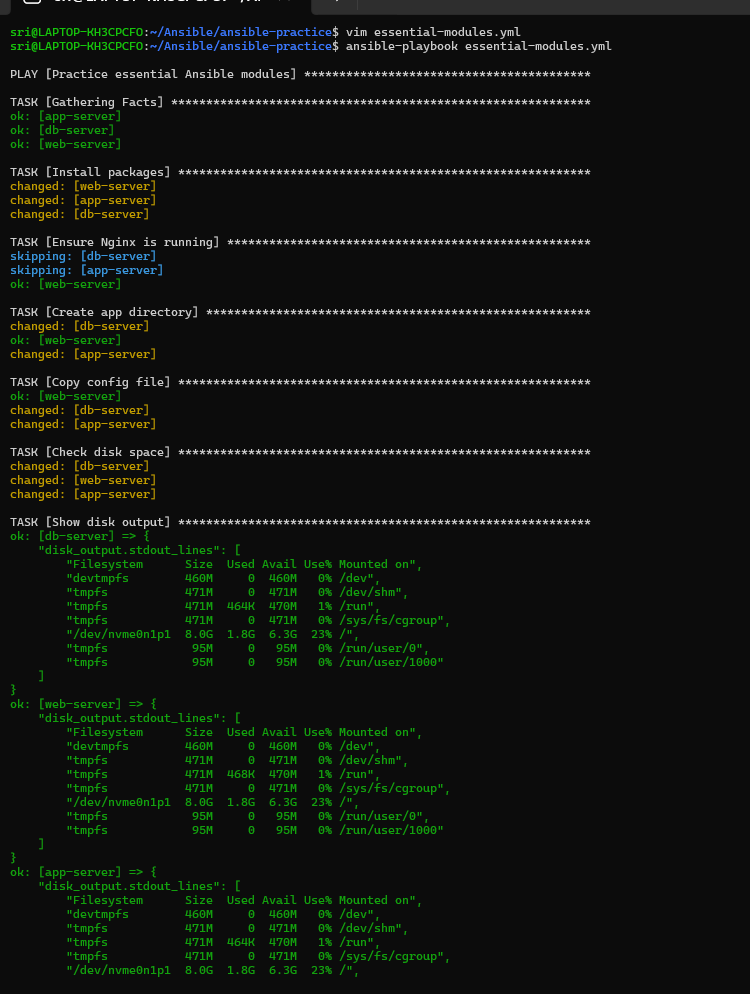


**Document:** What is the difference between `command` and `shell`? When should you use each?

  - `command` module runs simple commands, `shell` module supports pipes and redirects
  
  - Use `command`
    - For simple commands
    - No pipes, redirects, or variables

  - Use `shell`
    - When you need shell features
    - Pipes (|)
    - Redirects (>)
    - Variables ($HOME)

---

### Task 4: Handlers -- Restart Services Only When Needed
Handlers are tasks that run only when triggered by a `notify`. This avoids unnecessary service restarts.

Create `nginx-config.yml`:
```yaml
---
- name: Configure Nginx with a custom config
  hosts: web
  become: true

  tasks:
    - name: Install Nginx
      yum:
        name: nginx
        state: present

    - name: Deploy Nginx config
      copy:
        src: files/nginx.conf
        dest: /etc/nginx/nginx.conf
        owner: root
        mode: '0644'
      notify: Restart Nginx

    - name: Deploy custom index page
      copy:
        content: "<h1>Managed by Ansible</h1><p>Server: {{ inventory_hostname }}</p>"
        dest: /usr/share/nginx/html/index.html

    - name: Ensure Nginx is running
      service:
        name: nginx
        state: started
        enabled: true

  handlers:
    - name: Restart Nginx
      service:
        name: nginx
        state: restarted
```

Create `files/nginx.conf` with a basic Nginx config.

Run the playbook:
- First run: handler triggers because the config file is new
- Second run: handler does NOT trigger because nothing changed

**Verify:** Run it twice and compare the output. Does the handler run both times?
- No, Handler run first run

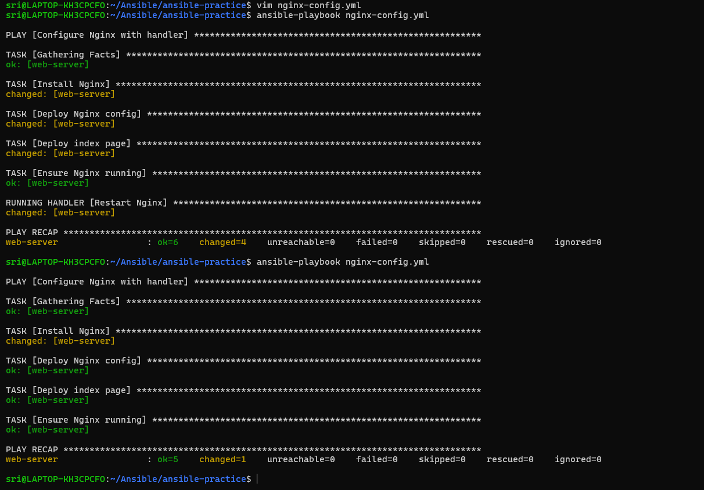


---

### Task 5: Dry Run, Diff, and Verbosity
Before running playbooks on production, always preview changes first.

1. **Dry run (check mode)** -- shows what would change without changing anything:
```bash
ansible-playbook install-nginx.yml --check
```

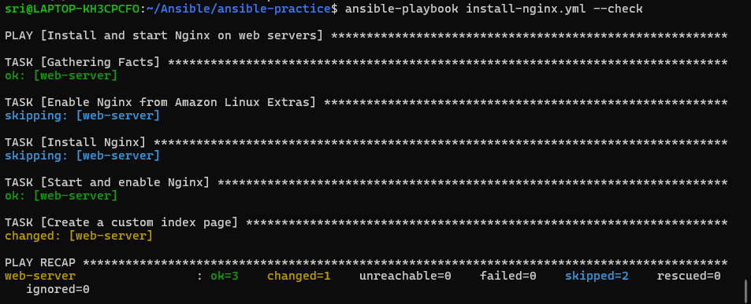

2. **Diff mode** -- shows the actual file differences:
```bash
ansible-playbook nginx-config.yml --check --diff
```

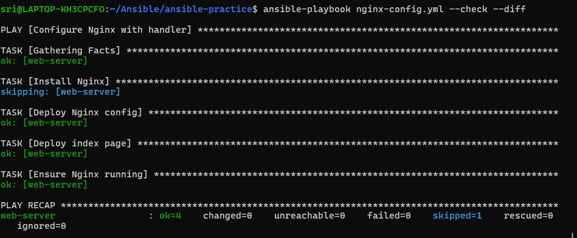

3. **Verbosity** -- increase output detail for debugging:
```bash
ansible-playbook install-nginx.yml -v       # verbose
ansible-playbook install-nginx.yml -vv      # more verbose
ansible-playbook install-nginx.yml -vvv     # connection debugging
```
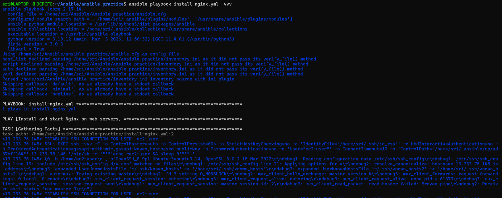


4. **Limit to specific hosts:**
```bash
ansible-playbook install-nginx.yml --limit web-server
```

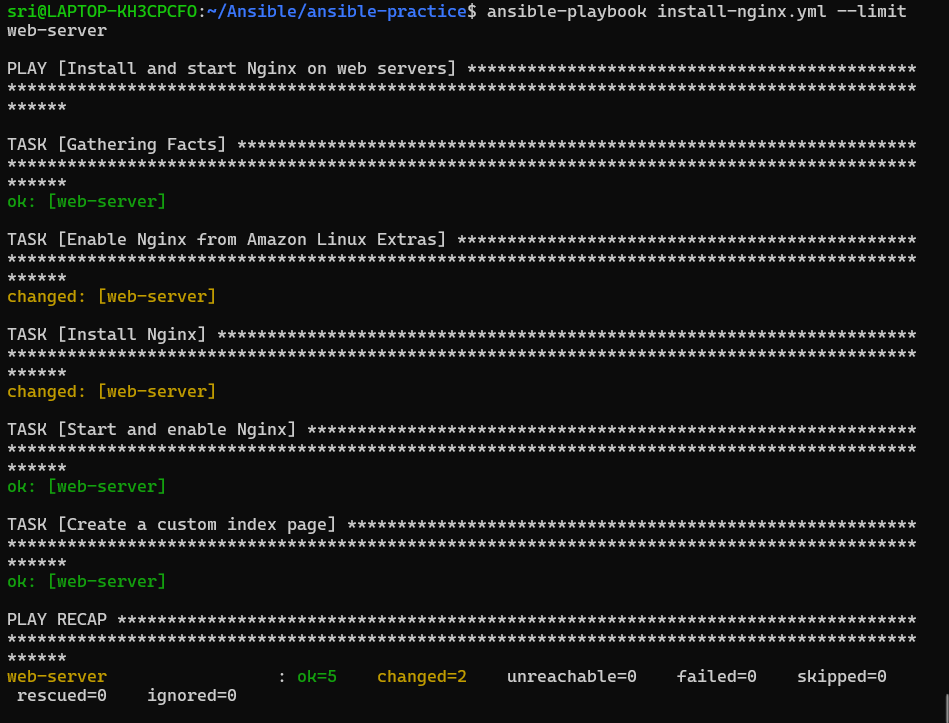

5. **List what would be affected without running:**
```bash
ansible-playbook install-nginx.yml --list-hosts
ansible-playbook install-nginx.yml --list-tasks
```

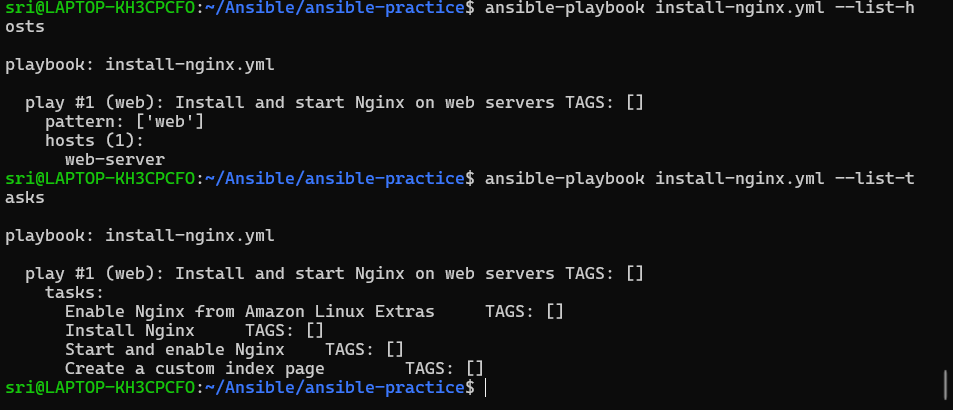

**Document:** Why is `--check --diff` the most important flag combination for production use?

- Because `--check --diff` lets you simulate `changes without applying them` and `see exactly what would change`,helping `avoid mistakes` in `production.`
---

### Task 6: Multiple Plays in One Playbook
Write `multi-play.yml` with separate plays for each server group:

```yaml
---
- name: Configure web servers
  hosts: web
  become: true
  tasks:
    - name: Install Nginx
      yum:
        name: nginx
        state: present
    - name: Start Nginx
      service:
        name: nginx
        state: started
        enabled: true

- name: Configure app servers
  hosts: app
  become: true
  tasks:
    - name: Install Node.js dependencies
      yum:
        name:
          - gcc
          - make
        state: present
    - name: Create app directory
      file:
        path: /opt/app
        state: directory
        mode: '0755'

- name: Configure database servers
  hosts: db
  become: true
  tasks:
    - name: Install MySQL client
      yum:
        name: mysql
        state: present
    - name: Create data directory
      file:
        path: /var/lib/appdata
        state: directory
        mode: '0700'
```

Run it:
```bash
ansible-playbook multi-play.yml
```

Watch the output -- each play targets a different group, and tasks run only on the relevant hosts.

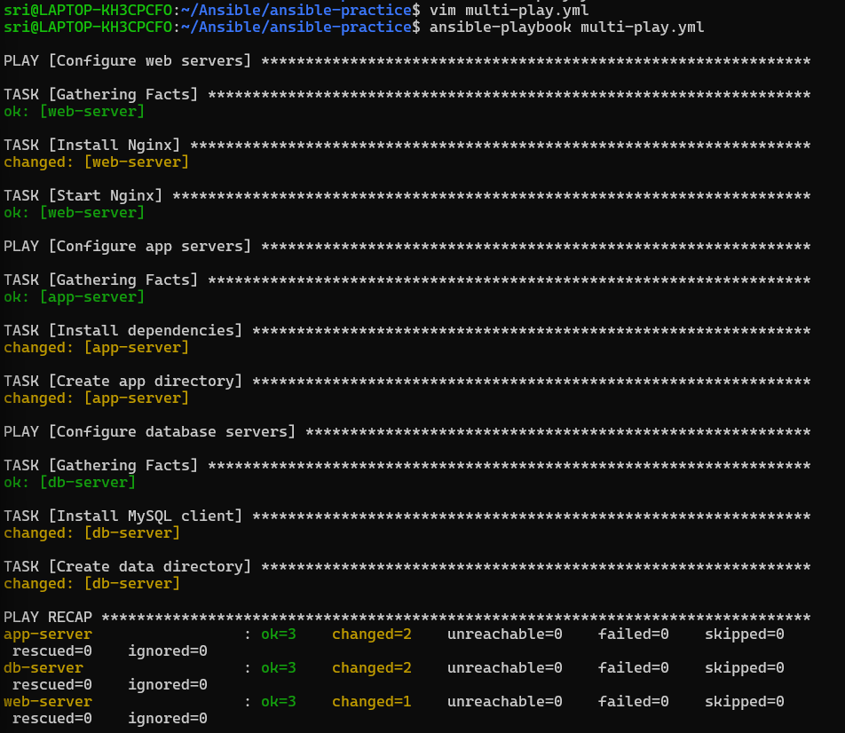

**Verify:** Is Nginx only installed on web servers? Is MySQL only on db servers?

  - Yes, `Nginx` is Installed on `web server` & `Mysql` is on `db server`

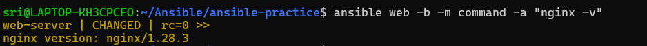

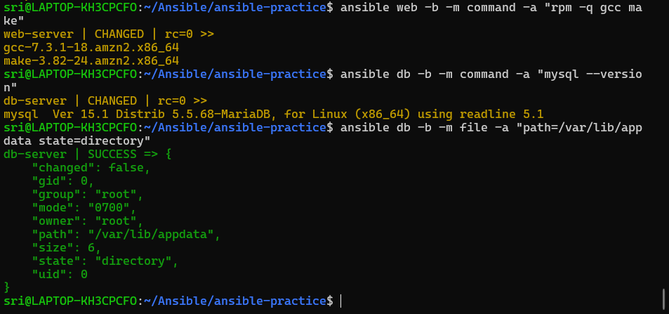
---

- first playbook with annotations explaining each section

```bash
---                                                                # YAML document start
- name: Install and start Nginx on web servers                     # PLAY name
  hosts: web                                                       # Target Inventory Group: Executes on all hosts in the 'web' group
  become: true                                                     # Privilege Escalation: Executes tasks as root using sudo

  tasks:                                                           # list of Tasks

    - name: Install Nginx                                          # Task 1: Ensure Nginx is installed
      yum:                                                         # Module: yum 
        name: nginx                                                # Name of the package to install
        state: present                                             # Desired State: Package must be installed (idempotent)

    - name: Start and Enable Nginx                                 # Task 2: Ensure Nginx service is running and enabled on boot
      service:                                                     # Module: service (manages system services)
        name: nginx                                                # Service to manage
        state: started                                             # Desired State: Service must be running
        enabled: true                                              # Boot Behavior: Service enabled to start on system boot

    - name: Create a custom index page                             # Task 3: Create a custom HTML page
      copy:                                                        # Module: copy (copies files or content to remote hosts)
        content: "<h1>Deploy by Ansible - TerraWeek Server</h1>"   # Inline content for index.html
        dest: /usr/share/nginx/html/index.html                     # Destination path on remote host(web)th
```
- All seven module examples with what each does

 1. **`yum`/`apt`** -- Install and remove packages:
```yaml
- name: Remove multiple packages
  yum:
    name:
      - git
      - curl
      - wget
      - tree
    state: absent
```

2. **`service`** -- Manage services:
```yaml
- name: Ensure Nginx is running
  service:
    name: nginx
    state: started
    enabled: true
```

3. **`copy`** -- Copy files from control node to managed nodes:
```yaml
- name: Copy config file
  copy:
    src: files/app.conf
    dest: /etc/app.conf
    owner: root
    group: root
    mode: '0644'
```

4. **`file`** -- Create directories and manage permissions:
```yaml
- name: Create application directory
  file:
    path: /opt/myapp
    state: directory
    owner: ec2-user
    mode: '0755'
```

5. **`command`** -- Run a command (no shell features):
```yaml
- name: Check disk space
  command: df -h
  register: disk_output

- name: Print disk space
  debug:
    var: disk_output.stdout_lines
```

6. **`shell`** -- Run a command with shell features (pipes, redirects):
```yaml
- name: Count running processes
  shell: ps aux | wc -l
  register: process_count
```

7. **`lineinfile`** -- Add or modify a single line in a file:
```yaml
- name: Disable root SSH login
  lineinfile:
    path: /etc/ssh/sshd_config
    regexp: '^PermitRootLogin'
    line: 'PermitRootLogin no'
```
- How handlers work with a before/after comparison

  - First run: handler triggers because the config file is new
  - Second run: handler does NOT trigger because nothing changed

  

- Difference between `--check`, `--diff`, and `-v`

  `--check` Dry run (shows what would change, doesn’t apply anything)

  `--diff` Shows actual differences (before vs after changes in files)

  `-v` Verbose output

---