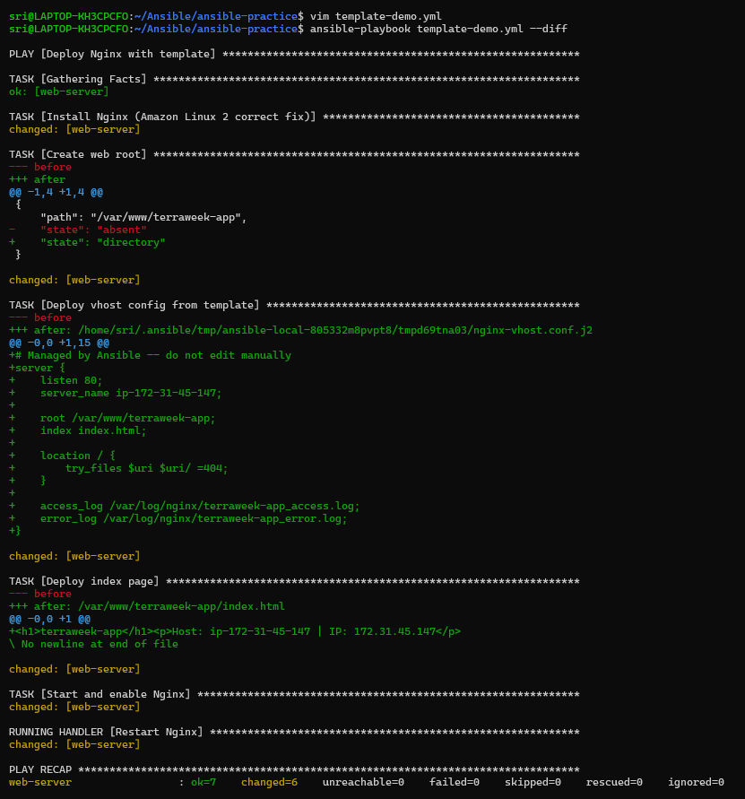
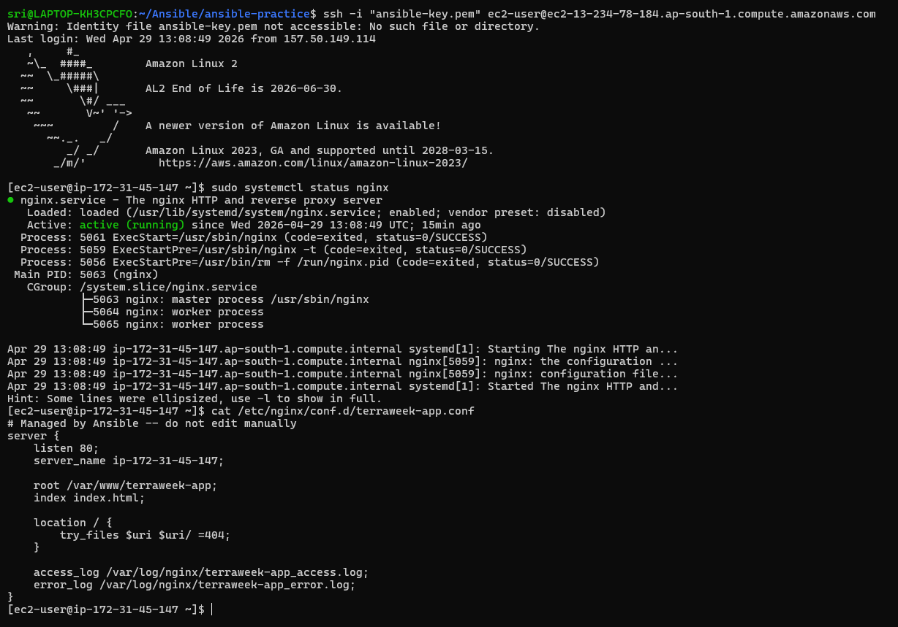
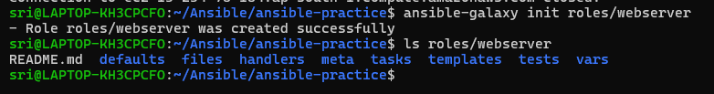
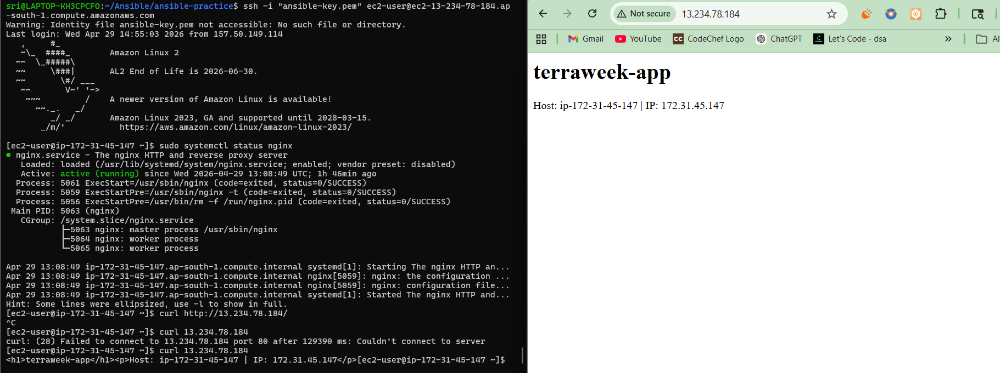
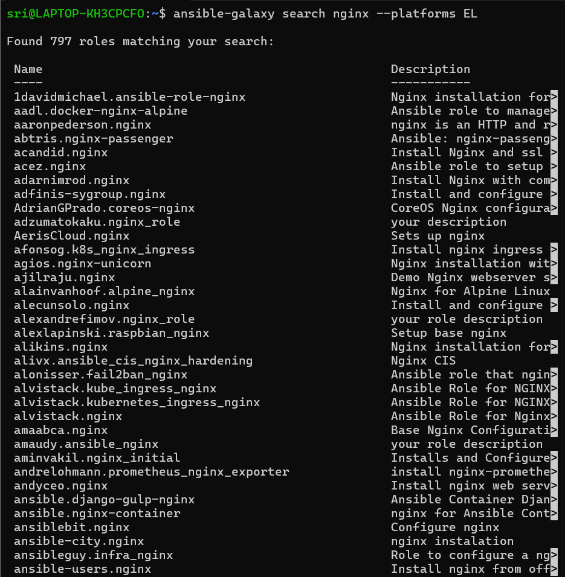
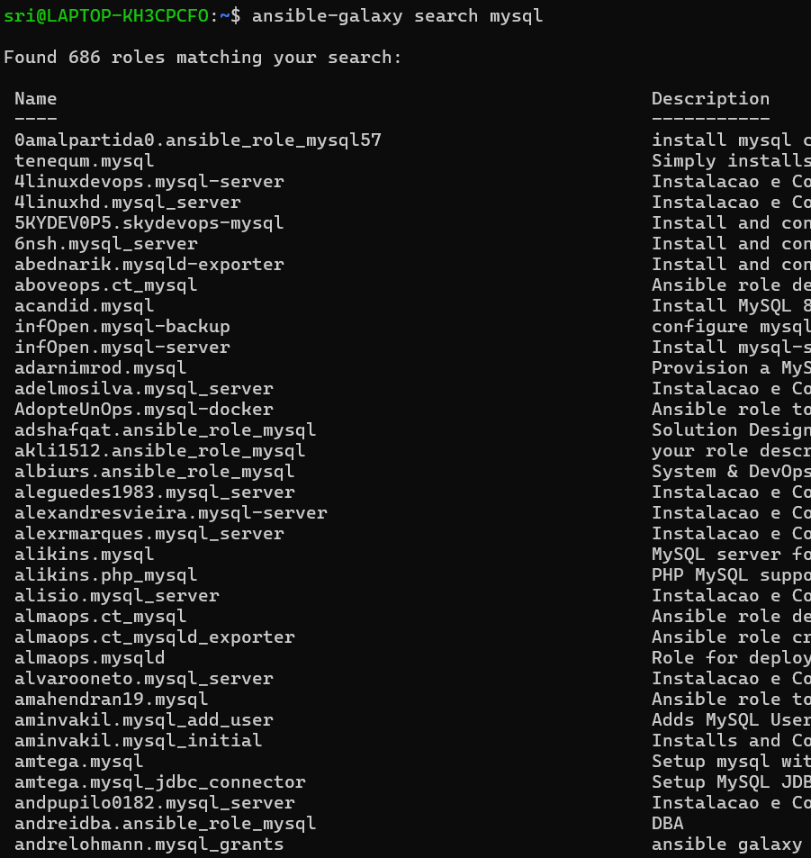
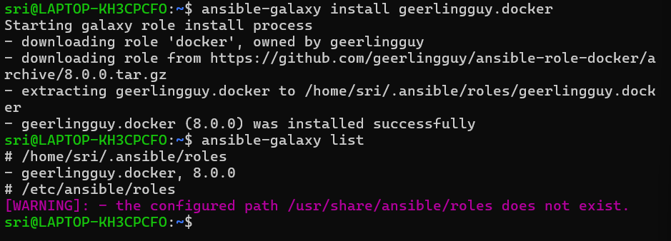
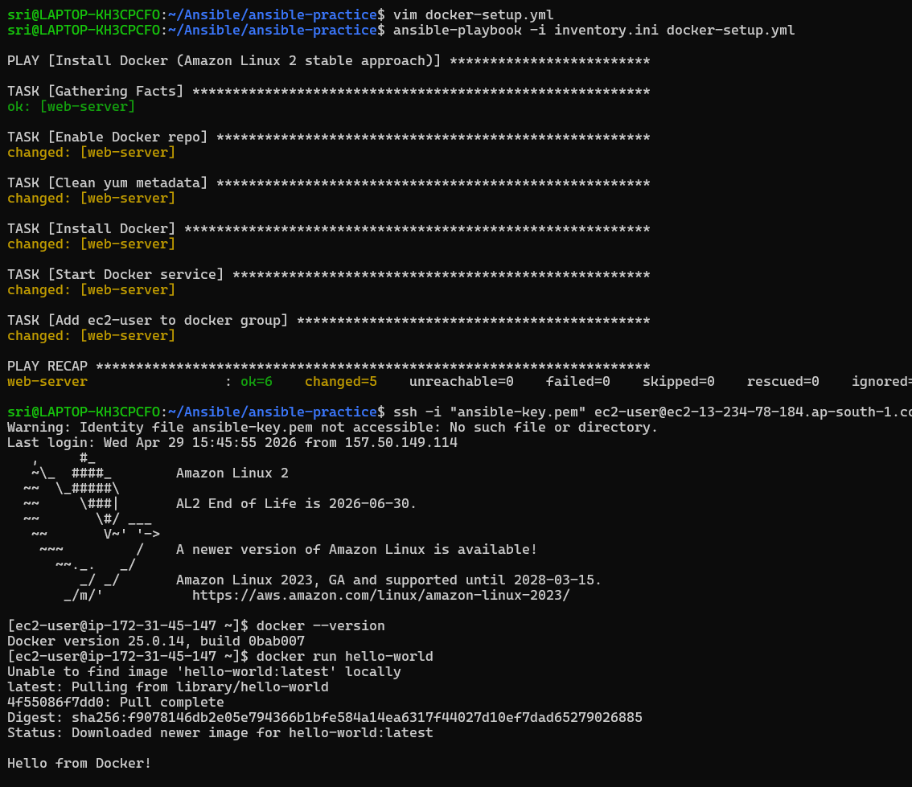
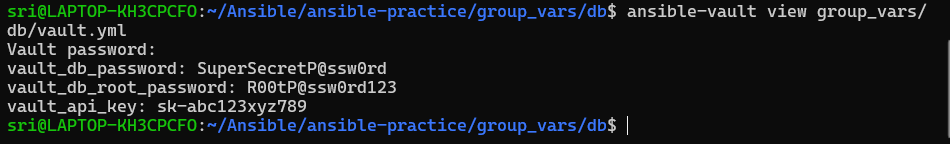
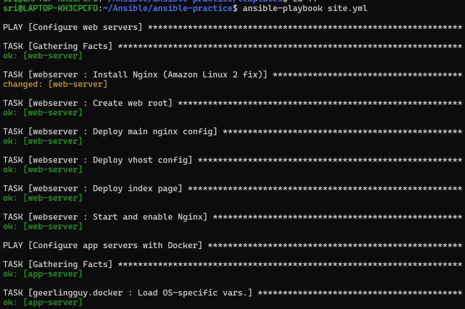

# Day 71 -- Roles, Galaxy, Templates and Vault

---

## Challenge Tasks

### Task 1: Jinja2 Templates
Templates let you generate config files dynamically using variables and facts.

1. Create `templates/nginx-vhost.conf.j2`:
```jinja2
# Managed by Ansible -- do not edit manually
server {
    listen {{ http_port | default(80) }};
    server_name {{ ansible_hostname }};

    root /var/www/{{ app_name }};
    index index.html;

    location / {
        try_files $uri $uri/ =404;
    }

    access_log /var/log/nginx/{{ app_name }}_access.log;
    error_log /var/log/nginx/{{ app_name }}_error.log;
}
```

2. Create a playbook `template-demo.yml`:
```yaml
---
- name: Deploy Nginx with template
  hosts: web
  become: true
  vars:
    app_name: terraweek-app
    http_port: 80

  tasks:
    - name: Install Nginx
      apt:
        name: nginx
        state: present

    - name: Create web root
      file:
        path: "/var/www/{{ app_name }}"
        state: directory
        mode: '0755'

    - name: Deploy vhost config from template
      template:
        src: templates/nginx-vhost.conf.j2
        dest: "/etc/nginx/conf.d/{{ app_name }}.conf"
        owner: root
        mode: '0644'
      notify: Restart Nginx

    - name: Deploy index page
      copy:
        content: "<h1>{{ app_name }}</h1><p>Host: {{ ansible_hostname }} | IP: {{ ansible_default_ipv4.address }}</p>"
        dest: "/var/www/{{ app_name }}/index.html"

  handlers:
    - name: Restart Nginx
      service:
        name: nginx
        state: restarted
```

Run it with `--diff` to see the rendered template:
```bash
ansible-playbook template-demo.yml --diff
```



**Verify:** SSH into the web server and read the generated config. Are the variables replaced with actual values?
- Yes



---

### Task 2: Understand the Role Structure
An Ansible role has a fixed directory structure. Each directory has a specific purpose:

```
roles/
  webserver/
    tasks/
      main.yml         # The main task list
    handlers/
      main.yml         # Handlers (restart services, etc.)
    templates/
      nginx.conf.j2    # Jinja2 templates
    files/
      index.html       # Static files to copy
    vars/
      main.yml         # Role variables (high priority)
    defaults/
      main.yml         # Default variables (low priority, easily overridden)
    meta/
      main.yml         # Role metadata and dependencies
```

Every directory contains a `main.yml` that Ansible loads automatically. You only create the directories you need.

Generate a skeleton with:
```bash
ansible-galaxy init roles/webserver
```



Explore the generated directory. Read the README.md that Galaxy creates.

**Document:** What is the difference between `vars/main.yml` and `defaults/main.yml`?

- `defaults/main.yml` values you can change easily (for users)

- `vars/main.yml`values you usually don’t change (fixed inside role)


---

### Task 3: Build a Custom Webserver Role
Build a complete `webserver` role from scratch:

**`roles/webserver/defaults/main.yml`:**
```yaml
---
http_port: 80
app_name: myapp
max_connections: 512
```

**`roles/webserver/tasks/main.yml`:**
```yaml
---
- name: Install Nginx
  yum:
    name: nginx
    state: present

- name: Deploy Nginx config
  template:
    src: nginx.conf.j2
    dest: /etc/nginx/nginx.conf
    owner: root
    mode: '0644'
  notify: Restart Nginx

- name: Deploy vhost config
  template:
    src: vhost.conf.j2
    dest: "/etc/nginx/conf.d/{{ app_name }}.conf"
    owner: root
    mode: '0644'
  notify: Restart Nginx

- name: Create web root
  file:
    path: "/var/www/{{ app_name }}"
    state: directory
    mode: '0755'

- name: Deploy index page
  template:
    src: index.html.j2
    dest: "/var/www/{{ app_name }}/index.html"
    mode: '0644'

- name: Start and enable Nginx
  service:
    name: nginx
    state: started
    enabled: true
```

**`roles/webserver/handlers/main.yml`:**
```yaml
---
- name: Restart Nginx
  service:
    name: nginx
    state: restarted
```

**`roles/webserver/templates/index.html.j2`:**
```html
<h1>{{ app_name }}</h1>
<p>Server: {{ ansible_hostname }}</p>
<p>IP: {{ ansible_default_ipv4.address }}</p>
<p>Environment: {{ app_env | default('development') }}</p>
<p>Managed by Ansible</p>
```

Create the `vhost.conf.j2` and `nginx.conf.j2` templates yourself based on what you learned in Task 1.

**`roles/webserver/templates/vhsot.confg.j2`:**
```yaml
# Managed by Ansible -- do not edit manually

server {
    # Listen on configured HTTP port
    listen {{ http_port | default(80) }} default_server;

    # Server name: IP as default, _ as wildcard
    server_name {{ ansible_default_ipv4.address }} _;

    # Web root directory
    root /var/www/{{ app_name }};
    index index.html;

    # Request handling
    location / {
        # Try requested URI, then directory, else return 404
        try_files $uri $uri/ =404;
    }

    # App-specific logs
    access_log /var/log/nginx/{{ app_name }}_access.log;
    error_log /var/log/nginx/{{ app_name }}_error.log;
}
```

**`roles/webserver/templates/nginx.conf.j2`:**
```yaml
# Event settings
events {
    # Maximum simultaneous connections per worker
    worker_connections {{ max_connections | default(512) }};
}

# HTTP block for general settings
http {
    # Load MIME types
    include /etc/nginx/mime.types;

    # Default content type
    default_type application/octet-stream;

    # Enable efficient file sending
    sendfile on;

    # Keep connections alive for 65 seconds
    keepalive_timeout 65;

    # Global access and error logs
    access_log /var/log/nginx/access.log;
    error_log /var/log/nginx/error.log;

    # Include all virtual hosts
    include /etc/nginx/conf.d/*.conf;
}
```

Now call the role from a playbook `site.yml`:
```yaml
---
- name: Configure web servers
  hosts: web
  become: true
  roles:
    - role: webserver
      vars:
        app_name: terraweek
        http_port: 80
```

Run it:
```bash
ansible-playbook site.yml
```

**Verify:** Curl the web server. Does the custom page load?


---

### Task 4: Ansible Galaxy -- Use Community Roles
Ansible Galaxy is a marketplace of pre-built roles.

1. **Search for roles:**
```bash
ansible-galaxy search nginx --platforms EL
ansible-galaxy search mysql
```





2. **Install a role from Galaxy:**
```bash
ansible-galaxy install geerlingguy.docker
```

3. **Check where it was installed:**
```bash
ansible-galaxy list
```



- The geerlingguy.docker role was installed locally in the roles/ folder i.e.`ansible-practice/roles/geerlingguy.docker/`

4. **Use the installed role** -- create `docker-setup.yml`:
```yaml
---
- name: Install Docker using Galaxy role
  hosts: app-server
  become: yes

  vars:
    docker_apt_repository:
      repo: "deb [arch=amd64 signed-by=/etc/apt/keyrings/docker.gpg] https://download.docker.com/linux/ubuntu jammy stable"

    docker_apt_key_url: "https://download.docker.com/linux/ubuntu/gpg"
    docker_apt_keyring: "/etc/apt/keyrings/docker.gpg"

    # Docker packages
    docker_package: "docker-ce"
    docker_package_state: present
    docker_compose_package: "docker-compose-plugin"
    docker_compose_package_state: present

    # Docker service
    docker_daemon_enable: true
    docker_daemon_state: started

    # Users
    docker_users:
      - ubuntu

    # Skip tasks that fail in check mode
    docker_skip_package_install: "{{ ansible_check_mode }}"
    docker_skip_service_start: "{{ ansible_check_mode }}"

  roles:
    - role: geerlingguy.docker
      when: not docker_skip_package_install

```

Run it -- Docker gets installed with a single role call.



5. **Use a requirements file** for managing multiple roles. Create `requirements.yml`:
```yaml
---
roles:
  - name: geerlingguy.docker
    version: "7.4.1"
  - name: geerlingguy.ntp
```

Install all at once:
```bash
ansible-galaxy install -r requirements.yml
```


**Document:** Why use a `requirements.yml` instead of installing roles manually?

  - Easy to share with others or use on different machines.
  - Specify exact versions to avoid unexpected changes.
  - Avoids manually copying or managing role files.


---

### Task 5: Ansible Vault -- Encrypt Secrets
Never put passwords, API keys, or tokens in plain text. Ansible Vault encrypts sensitive data.

1. **Create an encrypted file:**
```bash
ansible-vault create group_vars/db/vault.yml
```

It will ask for a vault password, then open an editor. Add:
```yaml
vault_db_password: SuperSecretP@ssw0rd
vault_db_root_password: R00tP@ssw0rd123
vault_api_key: sk-abc123xyz789
```
Save and exit. Open the file with `cat` -- it is fully encrypted.


2. **Edit an encrypted file:**
```bash
ansible-vault edit group_vars/db/vault.yml
```

3. **View without editing:**
```bash
ansible-vault view group_vars/db/vault.yml
```




4. **Encrypt an existing file:**
```bash
ansible-vault encrypt group_vars/db/secrets.yml
```

5. **Use vault variables in a playbook** -- create `db-setup.yml`:
```yaml
---
- name: Configure database
  hosts: db
  become: true

  tasks:
    - name: Show DB password (never do this in production)
      debug:
        msg: "DB password is set: {{ vault_db_password | length > 0 }}"
```

Run with the vault password:
```bash
ansible-playbook db-setup.yml --ask-vault-pass
```

6. **Use a password file** (better for CI/CD):
```bash
echo "YourVaultPassword" > .vault_pass
chmod 600 .vault_pass
echo ".vault_pass" >> .gitignore

ansible-playbook db-setup.yml --vault-password-file .vault_pass
```


Or set it in `ansible.cfg`:
```ini
[defaults]
vault_password_file = .vault_pass
```

**Document:** Why is `--vault-password-file` better than `--ask-vault-pass` for automated pipelines?
- `--vault-password-file` allows fully automated, reproducible, and secure playbook execution
- `--ask-vault-pass` is interactive and unsuitable for CI/CD pipelines
---

### Task 6: Combine Roles, Templates, and Vault
Write a complete `site.yml` that uses everything you learned today:

```yaml
---
- name: Configure web servers
  hosts: web
  become: true
  roles:
    - role: webserver
      vars:
        app_name: terraweek
        http_port: 80

- name: Configure app servers with Docker
  hosts: app
  become: true
  roles:
    - geerlingguy.docker

- name: Configure database servers
  hosts: db
  become: true
  tasks:
    - name: Create DB config with secrets
      template:
        src: templates/db-config.j2
        dest: /etc/db-config.env
        owner: root
        mode: '0600'
```

Create `templates/db-config.j2`:
```jinja2
# Database Configuration -- Managed by Ansible
DB_HOST={{ ansible_default_ipv4.address }}
DB_PORT={{ db_port | default(3306) }}
DB_PASSWORD={{ vault_db_password }}
DB_ROOT_PASSWORD={{ vault_db_root_password }}
```

Run:
```bash
ansible-playbook site.yml
```



**Verify:** SSH into the db server and check `/etc/db-config.env`. Are the secrets rendered correctly? Is the file permission `600`?

- Yes

---

**When to use roles vs playbooks vs ad-hoc commands**

`Ad-Hoc Commands`
  - Quick, one-off tasks run directly on hosts.  
  - Use for testing, debugging, or simple operations.  
  ```bash
  ansible webservers -m shell -a "uptime"
  ```

`Playbooks`
- Use for multi-step automation across hosts.
```bash
- hosts: webservers
  tasks:
    - name: Install Nginx
      apt:
        name: nginx
        state: present
```
`Roles`
- Modular, reusable components (tasks, handlers, templates).
- Use for scalable, maintainable, and shareable automation.
```bash
- hosts: webservers
  roles:
    - webserver
```


---


