# Day 73 -- Introduction to Observability and Prometheus
---

## Challenge Tasks

### Task 1: Understand Observability
Research and write short notes on:

1. What is observability? How is it different from traditional monitoring?
   - **Monitoring** tells you _when_ something is wrong (alerts, thresholds)
   - **Observability** tells you _why_ something is wrong (explore, query, correlate)

      | Monitoring                             | Observability                                      |
      | -------------------------------------- | -------------------------------------------------- |
      | Checks if system is **working or not** | Helps understand **why it is not working**         |
      | Gives **alerts when something breaks** | Helps **find the reason of the problem**           |
      | Looks at **fixed metrics**             | Uses **metrics, logs, and traces**                 |
      | **Example:** Alert-> “Website is slow” | **Example:** Find cause-> “Database query is slow” |


2. The three pillars of observability:
   - **Metrics** -- numerical measurements over time (CPU usage, request count, error rate). Tools: Prometheus, Datadog, CloudWatch
   - **Logs** -- timestamped text records of events (application output, error messages). Tools: Loki, ELK Stack, Fluentd
   - **Traces** -- the journey of a single request across multiple services. Tools: OpenTelemetry, Jaeger, Zipkin

3. Why do DevOps engineers need all three?
   - Metrics tell you _what_ is broken (high error rate on `/api/users`)
   - Logs tell you _why_ it broke (stack trace showing a database timeout)
   - Traces tell you _where_ it broke (the payment service call took 12 seconds)

4. Draw or describe this architecture -- this is what you will build over the next 5 days:
   ```
   [Your App] --> metrics --> [Prometheus] --> [Grafana Dashboards]
   [Your App] --> logs    --> [Promtail]   --> [Loki] --> [Grafana]
   [Your App] --> traces  --> [OTEL Collector] --> [Grafana/Debug]
   [Host]     --> metrics --> [Node Exporter] --> [Prometheus]
   [Docker]   --> metrics --> [cAdvisor] --> [Prometheus]
   ```

    
    `[Your App] --> metrics --> [Prometheus] --> [Grafana Dashboards]`
      - The app generates performance metrics such as: `request count`, `response time`, `CPU usage`and `memory usage`
      - Prometheus collects (scrapes) metrics from the app
      - Prometheus stores this data over time
      - Grafana displays the data as graphs and dashboards
      - This helps you monitor how the system is performing

            
    `[Your App] --> logs --> [Promtail] --> [Loki] --> [Grafana]`
        
      - The app generates logs (event messages)
      - `Example:` “User logged in”, “Error occurred”
      - Promtail collects logs from the app (from files or stdout)
      - Promtail sends logs to Loki for storage
      - Grafana is used to search and view logs
      - This helps you understand what happened inside the system

    `[Your App] --> traces --> [OTEL Collector] --> [Grafana/Debug]`
      
      - Traces show how a request moves through the system
      - `Example:` User request → API → Database → Response
      - The app sends trace data using OpenTelemetry
      - OTEL Collector processes the trace data
      - Grafana is used to visualize the full request journey
      - This helps find where delays or failures occur

    `[Your Host] --> metrics --> [Node Exporter] --> [Prometheus]`
      - The host machine is also monitored
      - It collects: CPU usage, memory usage, disk usage
      - Node Exporter collects system metrics
      - Prometheus stores this data
      - This helps monitor server health

    `[Your Docker] --> metrics --> [cAdvisor] --> [Prometheus]`
      - Each Docker container is monitored individually
      - It tracks: CPU usage per container, memory usage per container
      - cAdvisor collects container metrics
      - Prometheus stores this data
      - This helps monitor container performance


---

### Task 2: Set Up Prometheus with Docker
Create a project directory for this entire observability block -- you will keep adding to it over the next 5 days.

```bash
mkdir observability-stack && cd observability-stack
```

Create a `prometheus.yml` configuration file:
```yaml
global:
  scrape_interval: 15s
  evaluation_interval: 15s

scrape_configs:
  - job_name: "prometheus"
    static_configs:
      - targets: ["localhost:9090"]
```

This tells Prometheus to scrape its own metrics every 15 seconds.

Create a `docker-compose.yml` to run Prometheus:
```yaml
services:
  prometheus:
    image: prom/prometheus:latest
    container_name: prometheus
    ports:
      - "9090:9090"
    volumes:
      - ./prometheus.yml:/etc/prometheus/prometheus.yml
      - prometheus_data:/prometheus
    command:
      - '--config.file=/etc/prometheus/prometheus.yml'
    restart: unless-stopped

volumes:
  prometheus_data:
```

Start Prometheus:
```bash
docker compose up -d
```

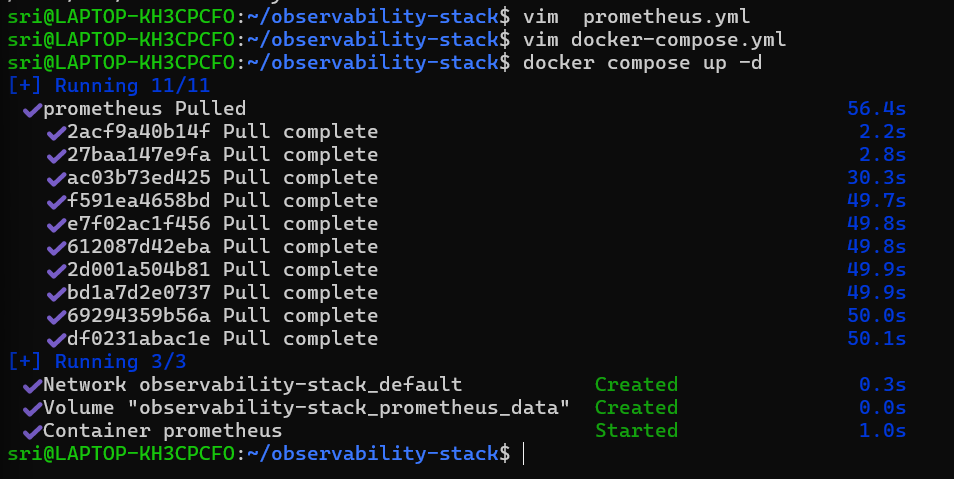

Open `http://localhost:9090` in your browser. You should see the Prometheus web UI.

**Verify:** Go to Status > Targets. You should see one target (`prometheus`) with state `UP`.

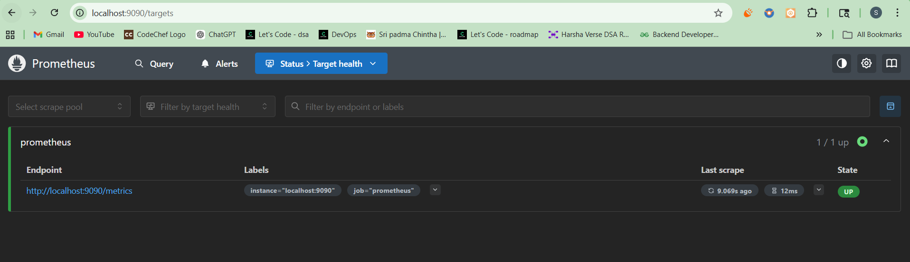
---

### Task 3: Understand Prometheus Concepts
Explore the Prometheus UI and understand these concepts:

1. **Scrape targets** -- endpoints that Prometheus pulls metrics from at regular intervals (pull-based model)
2. **Metrics types:**
   - `Counter` -- only goes up (total requests served, total errors)
   - `Gauge` -- goes up and down (current CPU usage, memory in use, active connections)
   - `Histogram` -- distribution of values in buckets (request duration: how many took <100ms, <500ms, <1s)
   - `Summary` -- similar to histogram but calculates percentiles on the client side
3. **Labels** -- key-value pairs that add dimensions to metrics (e.g., `http_requests_total{method="GET", status="200"}`)
4. **Time series** -- a unique combination of metric name + labels

Go to the Prometheus UI graph page (`http://localhost:9090/graph`) and run these queries:

--- 
# How many metrics is Prometheus collecting about itself? 
count({__name__=~".+"})

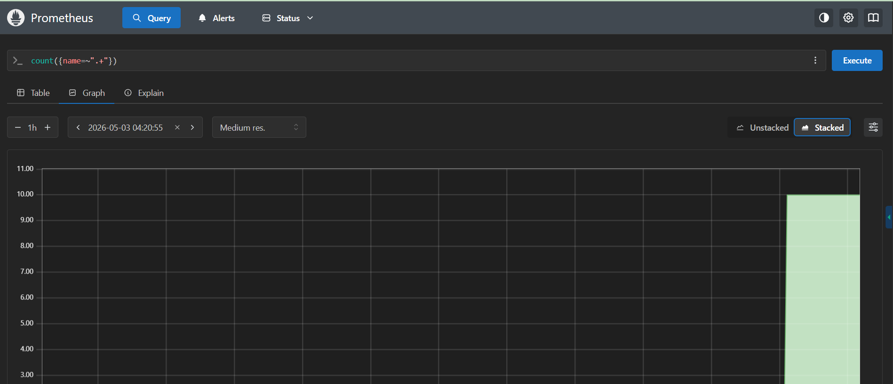

# How much memory is Prometheus using?
process_resident_memory_bytes

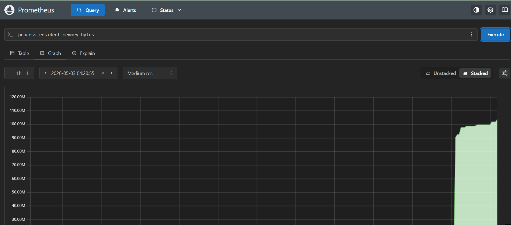

# Total HTTP requests to the Prometheus server
prometheus_http_requests_total
- `61`

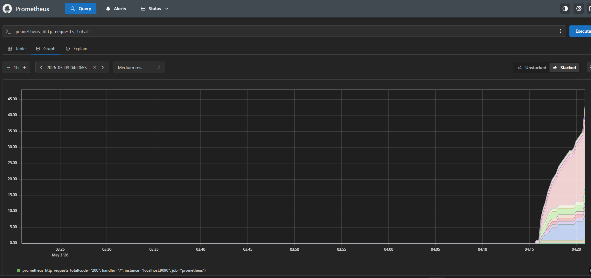

# Break it down by handler
prometheus_http_requests_total{handler="/api/v1/query"}

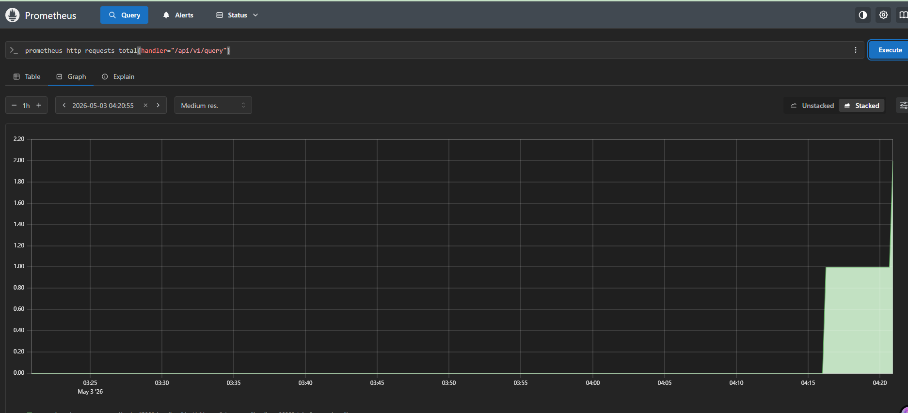


**Document:** What is the difference between a counter and a gauge? Give one real-world example of each.

- `Counter:` A metric that only increases over time
  - `Example:` `http_requests_total` — counts how many requests your server (e.g., Nginx, API service) has handled since it started

- `Gauge:` A metric that can go up or down, showing a current value
  - `Example:` `memory_usage_bytes` — current memory usage of a container or VM

---

### Task 4: Learn PromQL Basics
PromQL (Prometheus Query Language) is how you ask questions about your metrics. Run these queries in the Prometheus UI:

1. **Instant vector** -- current value of a metric:
```promql
up
```
This returns 1 (up) or 0 (down) for each scrape target.

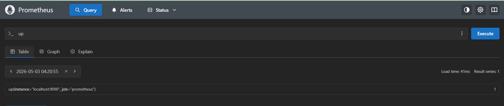

2. **Range vector** -- values over a time window:
```promql
prometheus_http_requests_total[5m]
```
Returns all values from the last 5 minutes.

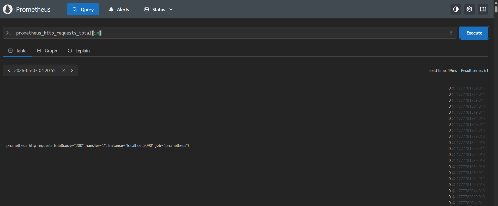

3. **Rate** -- per-second rate of a counter over a time window:
```promql
rate(prometheus_http_requests_total[5m])
```
This is the most common function you will use. Counters always go up -- `rate()` converts them to a useful per-second speed.

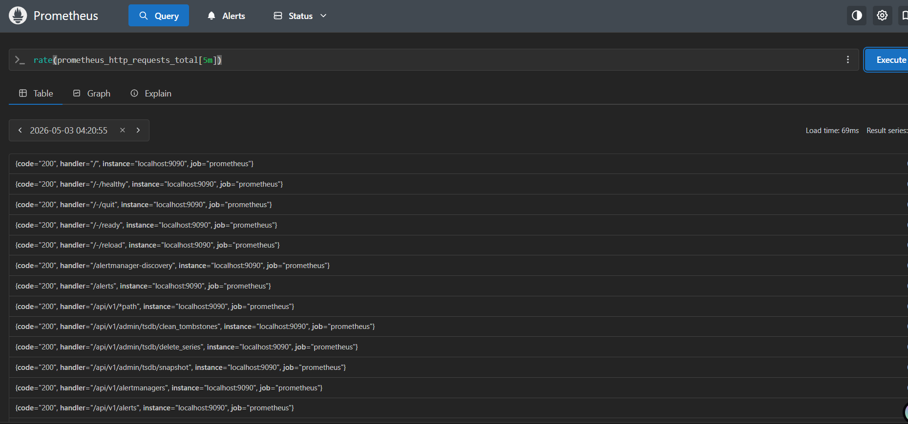

4. **Aggregation** -- sum across all label combinations:
```promql
sum(rate(prometheus_http_requests_total[5m]))
```

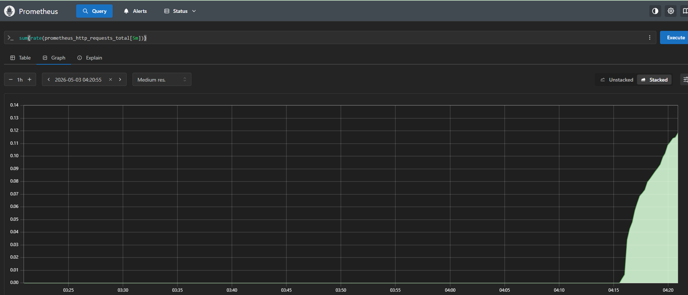

5. **Filter by label:**
```promql
prometheus_http_requests_total{code="200"}
prometheus_http_requests_total{code!="200"}
```

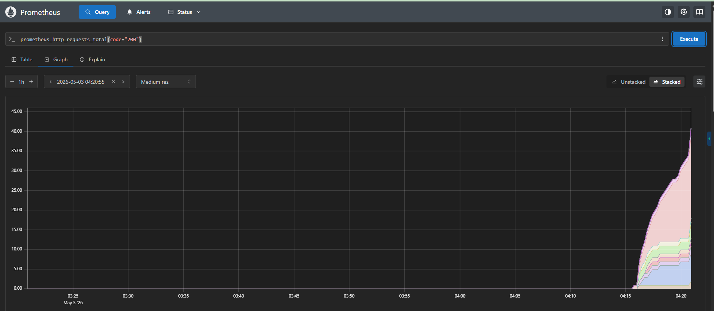

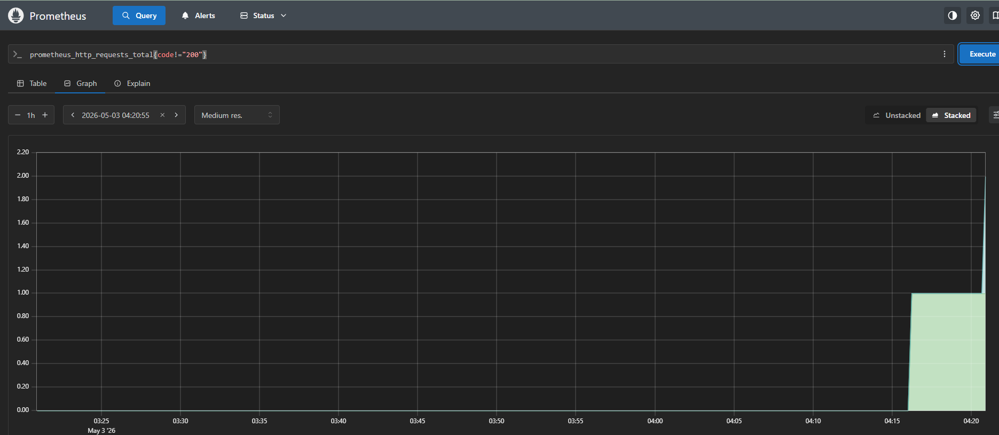

6. **Arithmetic:**
```promql
process_resident_memory_bytes / 1024 / 1024
```
This converts bytes to megabytes.

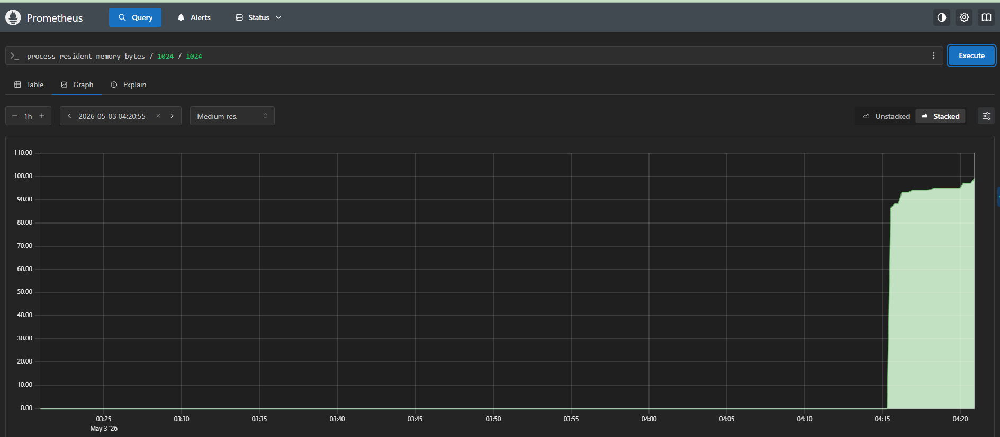

7. **Top-K:**
```promql
topk(5, prometheus_http_requests_total)
```
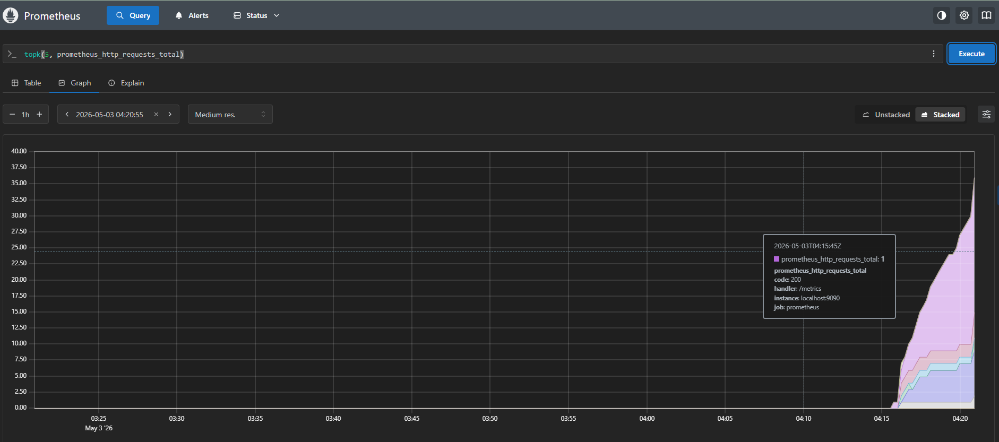

**Try this exercise:** Write a PromQL query that shows the per-second rate of non-200 HTTP requests to Prometheus over the last 5 minutes. (Hint: use `rate()` with a label filter on `code!="200"`)

- `rate(prometheus_http_requests_total{code!="200"}[5m])`


---

### Task 5: Add a Sample Application as a Scrape Target
Prometheus needs something to monitor. Add a simple metrics-generating service.

Update your `docker-compose.yml` to include a sample app that exposes Prometheus metrics:
```yaml
services:
  prometheus:
    image: prom/prometheus:latest
    container_name: prometheus
    ports:
      - "9090:9090"
    volumes:
      - ./prometheus.yml:/etc/prometheus/prometheus.yml
      - prometheus_data:/prometheus
    command:
      - '--config.file=/etc/prometheus/prometheus.yml'
    restart: unless-stopped

  notes-app:
    image: trainwithshubham/notes-app:latest
    container_name: notes-app
    ports:
      - "8000:8000"
    restart: unless-stopped

volumes:
  prometheus_data:
```

Update `prometheus.yml` to scrape the app:
```yaml
global:
  scrape_interval: 15s
  evaluation_interval: 15s

scrape_configs:
  - job_name: "prometheus"
    static_configs:
      - targets: ["localhost:9090"]

  - job_name: "notes-app"
    static_configs:
      - targets: ["notes-app:8000"]
```

Restart the stack:
```bash
docker compose up -d
```

Go back to Status > Targets. You should now see two targets. Generate some traffic to the app:
```bash
curl http://localhost:8000

```

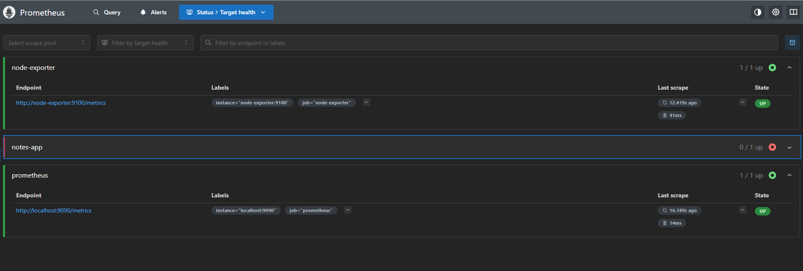

**Note:** Not all applications expose Prometheus metrics natively. In later days you will learn how Node Exporter, cAdvisor, and OTEL Collector act as metric exporters for systems that do not have built-in Prometheus support.

---

### Task 6: Explore Data Retention and Storage
Understand how Prometheus stores data:

1. Check how much disk space Prometheus is using:
```bash
docker exec prometheus du -sh /prometheus
```

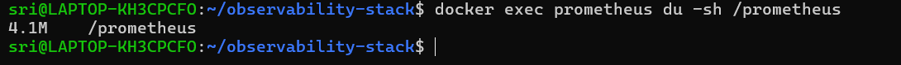

2. Prometheus stores data in a local time-series database (TSDB). Default retention is 15 days. You can change it:
```yaml
command:
  - '--config.file=/etc/prometheus/prometheus.yml'
  - '--storage.tsdb.retention.time=30d'
  - '--storage.tsdb.retention.size=1GB'
```

3. Check the TSDB status in the UI: Status > TSDB Status

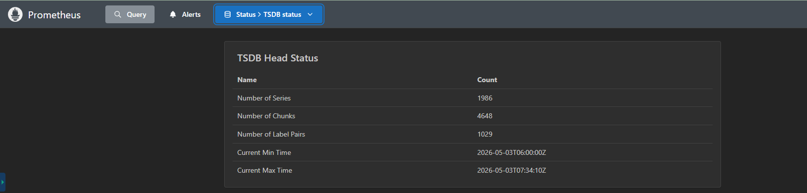

**Document:** What happens when retention is exceeded? Why is a volume mount important for Prometheus data?

**Retention exceeded**
- Old metrics are automatically deleted, keeping only recent data within the retention period.

**Why volume mount matters**
- It ensures Prometheus data is **persisted**. Without it, all metrics are lost when the container restarts or is removed.

---