# Day 78 -- Introduction to Helm and Chart Basics
---

## Challenge Tasks

### Task 1: Understand Helm Concepts
Research and write notes on:

1. **What is Helm?**
   - A package manager for Kubernetes (like apt for Ubuntu or yum for RHEL)
   - Packages Kubernetes manifests into reusable, versioned units called **charts**
   - Supports templating -- one chart, many environments

2. **Core concepts:**
   - **Chart** -- a collection of files that describe a set of Kubernetes resources (Deployment + Service + ConfigMap + Secret = one chart)
   - **Release** -- a running instance of a chart in a cluster. You can install the same chart multiple times with different release names
   - **Repository** -- a place where charts are stored and shared (like DockerHub for images)
   - **Values** -- configuration that customizes a chart for each deployment (replicas, image tag, resource limits)

3. **Why Helm over raw manifests?**
   - Look at the AI-BankApp's `k8s/` directory -- 12 separate YAML files. To change the image tag, you edit `bankapp-deployment.yml`. To switch environments, you manually update ConfigMaps and Secrets. Helm solves this:
   - Templating: one chart serves dev, staging, and prod with different values
   - Versioning: charts have version numbers, you can rollback to previous versions
   - Dependencies: a chart can depend on other charts (your app chart depends on a MySQL chart)
   - Community: thousands of pre-built charts for common software (MySQL, Redis, Prometheus, ArgoCD)

---

### Task 2: Install Helm and Explore the AI-BankApp
You need a running Kubernetes cluster. Use any of these:
- **Kind** (recommended for this block): Use the AI-BankApp's Kind config
- **Minikube**: `minikube start`
- **Docker Desktop Kubernetes**: enable in settings

**Set up a Kind cluster using the AI-BankApp's config:**
```bash
git clone -b feat/gitops https://github.com/TrainWithShubham/AI-BankApp-DevOps.git
cd AI-BankApp-DevOps

kind create cluster --config setup-k8s/kind-config.yml
```

This creates a cluster with 1 control plane and 2 worker nodes.

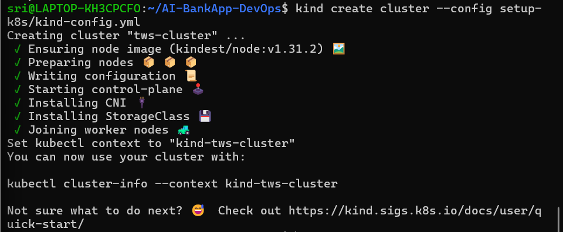

**Install Helm:**
```bash
# macOS
brew install helm

# Linux (script)
curl https://raw.githubusercontent.com/helm/helm/main/scripts/get-helm-3 | bash

# Verify
helm version
```
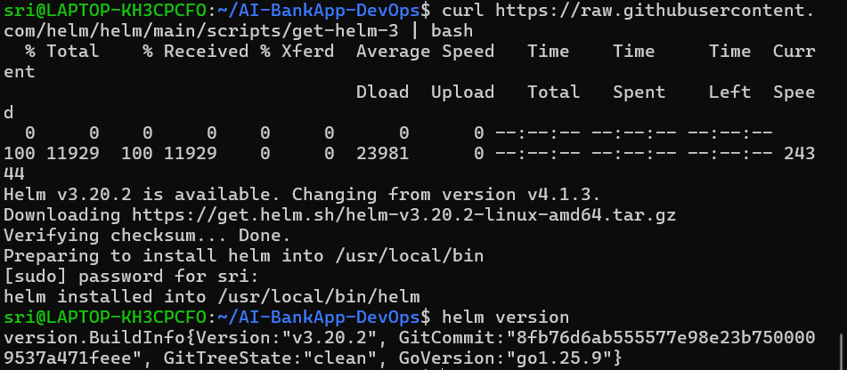

Confirm Helm can talk to your cluster:
```bash
kubectl cluster-info
helm list
```
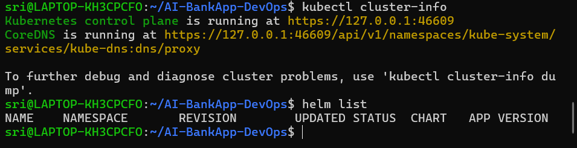

**Explore the raw manifests you will eventually replace with Helm:**
```bash
ls k8s/
```


```
bankapp-deployment.yml   configmap.yml   gateway.yml   mysql-deployment.yml
namespace.yml   ollama-deployment.yml   pv.yml   pvc.yml   secrets.yml
service.yml   hpa.yml   cert-manager.yml
```

12 files -- Deployments, Services, ConfigMaps, Secrets, PVCs, HPA, and more. All hardcoded values. On Day 79, you will convert these into a Helm chart.

---

### Task 3: Deploy MySQL Using a Helm Chart
The AI-BankApp needs MySQL. Instead of applying raw YAML like `k8s/mysql-deployment.yml`, deploy it with Helm.

> **Note on Bitnami Charts:**
> Bitnami officially moved most of its versioned container images and Helm charts to a **restricted/paid tier** starting **August 28, 2025**. Free pulls are now rate-limited, and many previously open tags require a Bitnami subscription.
>
> For **learning purposes**, this guide uses `stable/mysql` from the legacy Helm stable repository (`https://charts.helm.sh/stable`) instead of `bitnami/mysql`. The `stable/mysql` chart is **deprecated and no longer maintained**, but it remains freely accessible and is sufficient for understanding Helm concepts like install, upgrade, rollback, and values files.
>
> **For production workloads**, consider:
> - A Bitnami subscription for access to maintained, up-to-date charts
> - The official [MySQL Operator for Kubernetes](https://github.com/mysql/mysql-operator)
> - Community-maintained charts on [Artifact Hub](https://artifacthub.io/)

Add the Bitnami chart repository:
```bash
# helm repo add bitnami https://charts.bitnami.com/bitnami
helm repo add stable https://charts.helm.sh/stable
helm repo update
```
Search for MySQL:
```bash
# helm search repo bitnami/mysql

helm search repo stable/mysql
```

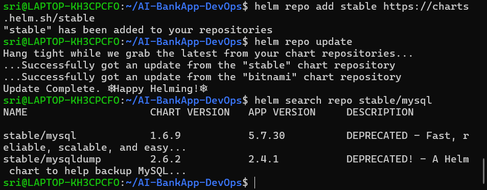

**Deploy MySQL with the same config the AI-BankApp expects:**
```bash
# helm install bankapp-mysql bitnami/mysql \
#   --set auth.rootPassword=Test@123 \
#   --set auth.database=bankappdb \
#   --set primary.resources.requests.memory=256Mi \
#   --set primary.resources.requests.cpu=250m \
#   --set primary.resources.limits.memory=512Mi \
#   --set primary.resources.limits.cpu=500m \
#   --set primary.persistence.size=5Gi


helm install bankapp-mysql stable/mysql \
  --set mysqlRootPassword=Test@123 \
  --set mysqlDatabase=bankappdb \
  --set persistence.size=5Gi \
  --set resources.requests.memory=256Mi \
  --set resources.requests.cpu=250m \
  --set resources.limits.memory=512Mi \
  --set resources.limits.cpu=500m 
```

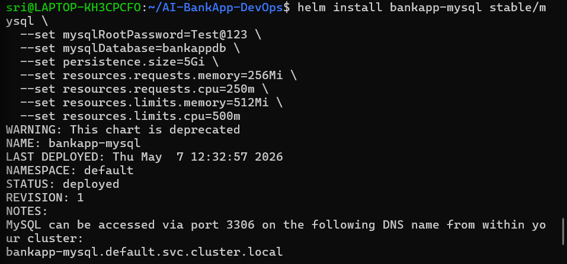

Compare this single command to the raw manifest approach which needs `mysql-deployment.yml` + `secrets.yml` + `pvc.yml` + `pv.yml` + `service.yml`. Helm handles all of it.

Check what was created:
```bash
helm list
# kubectl get all -l app.kubernetes.io/instance=bankapp-mysql
# kubectl get pvc -l app.kubernetes.io/instance=bankapp-mysql
# kubectl get secret -l app.kubernetes.io/instance=bankapp-mysql

kubectl get all -l app=bankapp-mysql
kubectl get pvc -l app=bankapp-mysql
kubectl get secret -l app=bankapp-mysql
```

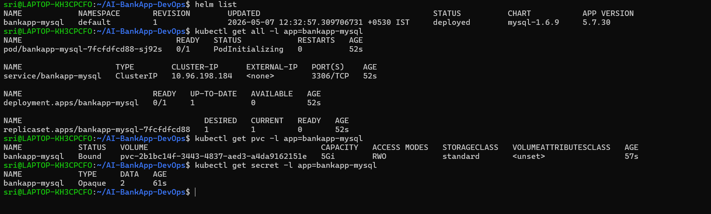

Verify MySQL is running:
```bash
# kubectl exec -it bankapp-mysql-0 -- mysql -uroot -pTest@123 -e "SHOW DATABASES;"

kubectl exec -it pod/bankapp-mysql-849f6c989f-w2gdf -- mysql -uroot -pTest@123 -e "SHOW DATABASES;"
```

You should see `bankappdb` in the output.

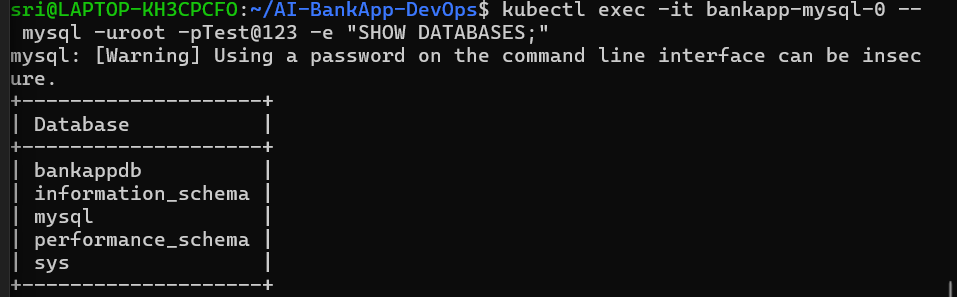
---

### Task 4: Customize a Deployment with Values Files
`--set` works for quick overrides, but real projects use values files.

Create `mysql-values.yaml`:
```yaml
# auth:
#   rootPassword: Test@123
#   database: bankappdb
# primary:
#   resources:
#     limits:
#       cpu: 500m
#       memory: 512Mi
#     requests:
#       cpu: 250m
#       memory: 256Mi
#   persistence:
#     size: 5Gi
#     storageClass: ""
# metrics:
#   enabled: true
#   serviceMonitor:
#     enabled: false
```
```yaml
mysqlRootPassword: Test@123
mysqlDatabase: bankappdb
resources:
  limits:
    cpu: 500m
    memory: 512Mi
  requests:
    cpu: 250m
    memory: 256Mi
persistence:
  size: 5Gi
  storageClass: ""
metrics:
  enabled: true
  serviceMonitor:
    enabled: false
```

Deploy with the values file:
```bash
# /helm install bankapp-mysql-v2 bitnami/mysql -f mysql-values.yaml

helm install bankapp-mysql-v2 stable/mysql -f mysql-values.yml
```

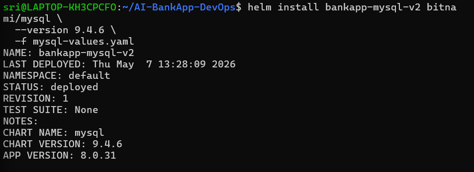

**To see all configurable values for a chart:**
```bash
# helm show values bitnami/mysql | head -80
helm show values stable/mysql | head -80
```
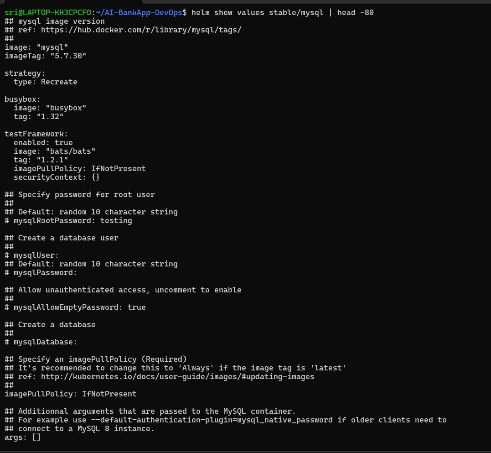

This is your reference for every knob you can turn. Notice how the chart supports metrics, replication, custom init scripts, and dozens more options -- all through values.

**Clean up the second release:**
```bash
helm uninstall bankapp-mysql-v2
```
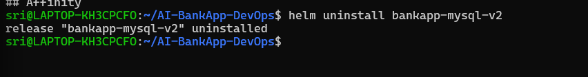
---

### Task 5: Manage Releases -- Upgrade, Rollback, Uninstall
Helm tracks every change as a **revision**. This lets you upgrade and rollback safely.

**Upgrade MySQL to enable metrics:**
```bash
# helm upgrade bankapp-mysql bitnami/mysql \
#   --set auth.rootPassword=Test@123 \
#   --set auth.database=bankappdb \
#   --set metrics.enabled=true

helm upgrade bankapp-mysql stable/mysql \
  --set mysqlRootPassword=Test@123 \
  --set mysqlDatabase=bankappdb \
  --reuse-values

```

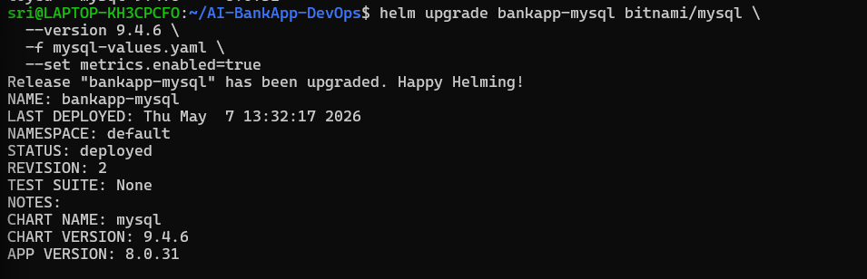

Check the revision history:
```bash
helm history bankapp-mysql
```

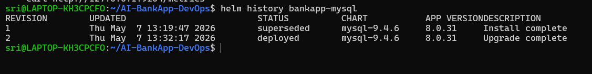

You should see revision 1 (original) and revision 2 (metrics enabled).

**Rollback to the previous version:**
```bash
helm rollback bankapp-mysql 1
```

Check history again:
```bash
helm history bankapp-mysql
```

Revision 3 appears -- a rollback to revision 1.


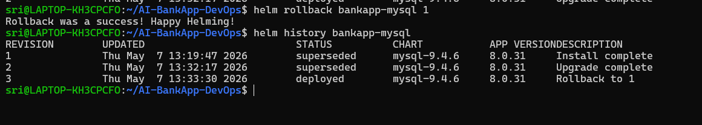

**Compare this to raw manifests:** With `kubectl apply`, there is no built-in rollback. You would have to `git revert` or manually re-apply old YAML. Helm gives you `helm rollback` out of the box.

---

### Task 6: Explore a Chart's Structure
Before building your own chart for the AI-BankApp tomorrow, understand what is inside a Helm chart.

Pull the MySQL chart locally:
```bash
helm pull bitnami/mysql --untar
ls mysql/
```

You will see:
```
mysql/
  Chart.yaml              # Chart metadata (name, version, description)
  values.yaml             # Default configuration values
  charts/                 # Subchart dependencies
  templates/              # Kubernetes manifest templates
    primary/
      statefulset.yaml    # StatefulSet template with Go template syntax
      svc.yaml            # Service template
    _helpers.tpl          # Reusable template helpers
    NOTES.txt             # Post-install message shown to the user
    secrets.yaml          # Secret template
```
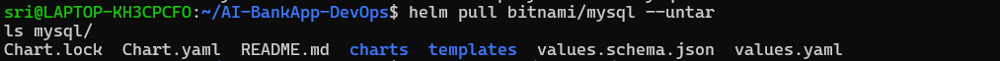

Open `templates/primary/statefulset.yaml` and look for Go template syntax:
```yaml
replicas: {{ .Values.primary.replicaCount }}
image: "{{ .Values.image.repository }}:{{ .Values.image.tag }}"
```

`{{ .Values.primary.replicaCount }}` pulls from `values.yaml`. When you pass `--set primary.replicaCount=3`, it overrides this value.

Open `Chart.yaml`:
```yaml
apiVersion: v2
name: mysql
description: A Helm chart for MySQL
version: 12.2.1      # Chart version (chart structure changes)
appVersion: "8.0.40"  # Version of MySQL inside the chart
```

**Now compare the Helm chart approach to the AI-BankApp's raw manifests:**

| Aspect | AI-BankApp `k8s/mysql-deployment.yml` | Bitnami MySQL Helm Chart |
|--------|---------------------------------------|--------------------------|
| Secrets | Hardcoded base64 in `secrets.yml` | Generated and managed by Helm |
| Storage | Manual StorageClass + PVC files | Configured via `persistence.size` value |
| Replicas | Hardcoded in YAML | `primary.replicaCount` value |
| Metrics | Not included | `metrics.enabled: true` |
| Rollback | Manual | `helm rollback` |

**Document:** What is the difference between `version` and `appVersion` in Chart.yaml?

- **version (Chart version)**
    - This is the version of the Helm chart itself.

- **appVersion (Application version)**
    - This is the version of the application being deployed.

Clean up:
```bash
helm uninstall bankapp-mysql
rm -rf mysql/
```
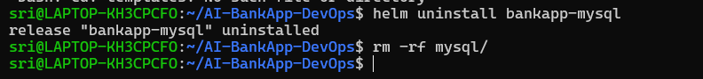
---

### Why AI-BankApp’s 12 YAML files are better as a Helm chart

**Problem with raw YAML files:**

* You have to run `kubectl apply -f` for each file separately
* No easy way to undo changes (no rollback)
* Updating passwords means manually editing files
* Many values are hardcoded in different files
* Hard to share or reuse across teams
* For different environments (dev/staging/prod), you must manually change ConfigMaps and Secrets

---

### Why Helm is better:

* One command installs everything (`helm install`)
* Easy rollback to previous versions
* Secrets and passwords can be managed dynamically
* Values can be changed without editing files
* Chart can be reused and shared easily
* Same chart works for dev, staging, and production using different values files


---